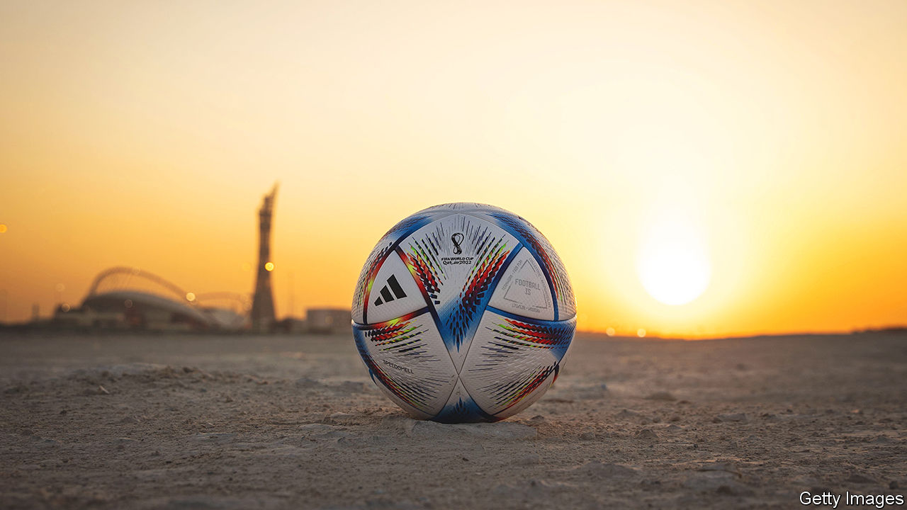
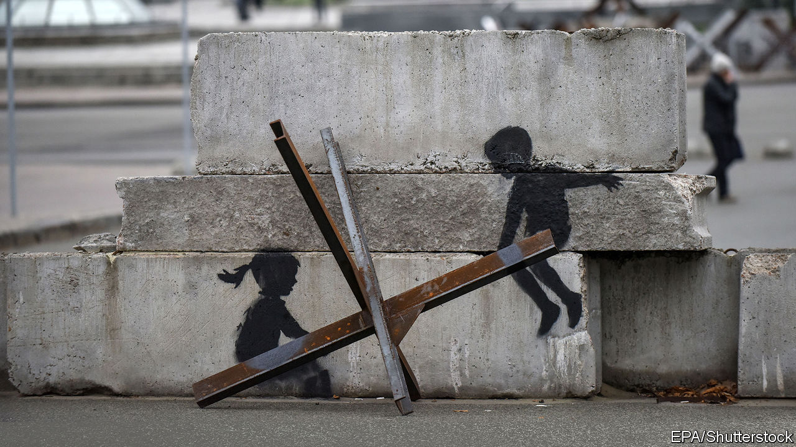
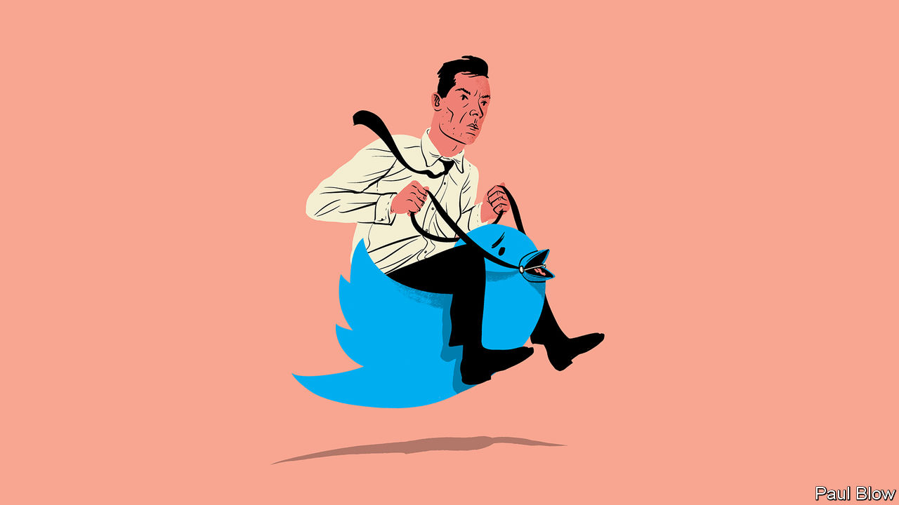
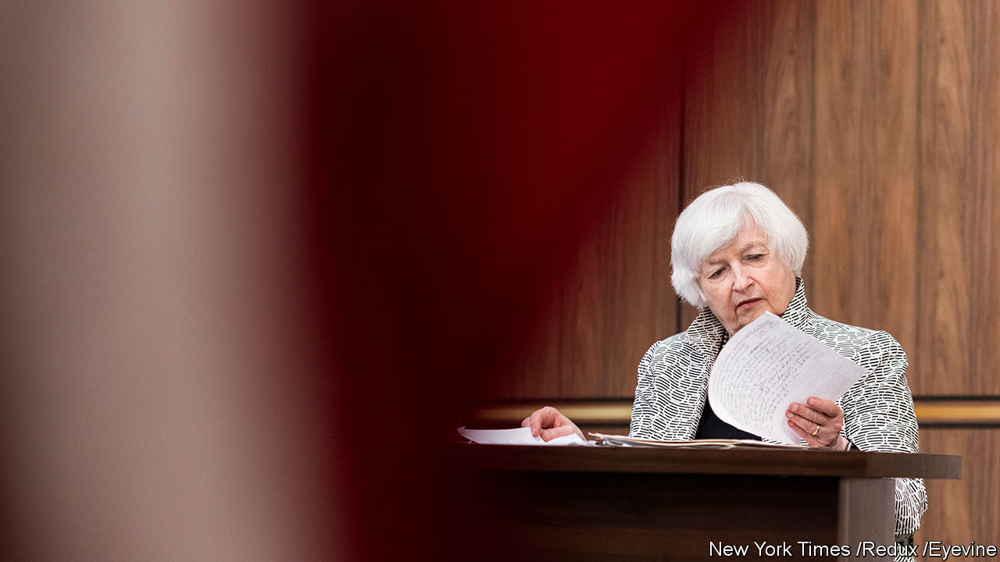
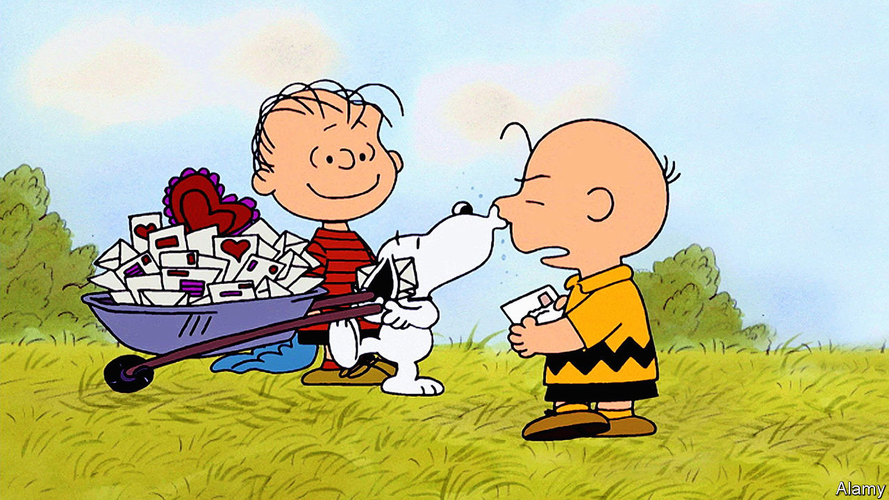

###### On Qatar and the World Cup, Ukraine, Elon Musk, Janet Yellen, “Peanuts”

# Letters to the editor 

##### A selection of correspondence 

 

> Dec 1st 2022 


Ready for kick-off

Your defence of Qatar hosting the football World Cup was essentially that other countries that are deemed unpleasant by the standards of Western democracy have also hosted large sports tournaments, so we shouldn’t complain about this one (“”, November 19th). Pointing to inconsistency and hypocrisy from the West on this issue is just whataboutism, and has nothing to do with the merits, or lack thereof, of Qatar as a World Cup host. 

Moreover, you think that the bribery associated with winning the bid to host the cup “says more about FIFA”, the body that governs international football, than Qatar. I think there is more than enough blame to spread across both parties. And Qatar isn’t “a den of homophobia”? Fans who simply wear rainbow colours are being told to remove them before they are allowed to enter stadiums in Qatar. As for migrants being “sometimes” mistreated, it is well documented that the labour laws in Qatar systematically mistreat migrant workers. 

Galen Stops


Do we really want to say to minorities that we strongly believe that they must be treated equally, provided that doing so does not conflict with football?

David Terry


It was a bad choice to give the event to Qatar. It is the smallest country ever to host the cup, and was also the least prepared. Hundreds of billions of dollars have been spent, and yet the organisers still encouraged fans to stay beyond Qatar’s borders and shuttle in for matches. Imagine asking Chicago to host 64 matches in one month, swelling the city’s population by half, but not allowing people to stay in the suburbs because the infrastructure doesn’t exist. 

Adam Shaffer

 

If FIFA wants to avoid the criticisms over the decision to award the World Cup to Qatar (and, as you say, to any number of unsavoury regimes) maybe it could come up with a set of social criteria that governments need to include as part of their bids. 

Graham Willett


Your leader suggested that criticism of Qatar is unfair or perhaps hypocritical, given that previous hosts of the cup include Vladimir Putin’s Russia and the junta-led Argentina of 1978, neither of which received this kind of flak. But maybe issues like human rights and the plight of migrant workers are now taken more seriously than they once were. Is that not a development  welcomes?

Paul Moss


In order to defend Qatar as a “perfectly good choice” for hosting the World Cup, you pointed to how bad the Argentine junta was in 1978 because it “threw critics out of helicopters”. That bar is, perhaps, too low.

Patricio Gallardo


 


Make Russia pay

You take it for granted that Western governments and private investors will have to finance Ukraine’s rebuilding after the war through a kind of Marshall Plan (“”, November 12th). However, under international law, and universal principles of compensation for wrongdoing, it is Russia that must provide reparations for the wanton damage to public and private property, as well as the deaths and injuries, caused by its unlawful aggression. Its conduct of military operations is in breach of the most elementary rules of the law of armed conflict.

The United Nations Compensation Commission, established by Security Council resolution 687 in 1991 to compensate losses suffered by Kuwait and private individuals because of Iraq’s invasion, is a good precedent. The commission has recently concluded its work after paying out more than $52bn, thanks to a compensation fund financed by a percentage of the proceeds of oil exports from Iraq.

In the case of Russia’s aggression, the assets of Russia and the oligarchs who support Vladimir Putin could be put into a fund. The owners of these assets have been blocked from tapping them because of sanctions. It would be revolting to give them back to the original owners once the war is over. They should be handed as compensation to Ukraine, or instead finance an internationally established multilateral fund, such as after the first Gulf war, to provide for its reconstruction.

Giorgio Sacerdoti

Emeritus professor of international law

Bocconi University


 


It’s in the BHAG

I certainly hope Bartleby is wrong, and that Elon Musk’s mercurial, erratic and impulsive approach to “management” does not represent the future of this discipline (). Mr Musk’s greatest achievements lie in leadership, through his successful application of the BHAG principle advanced by Jim Collins in “Built to Last”. Mr Musk has used this Big Hairy Audacious Goal strategy perfectly. 

Through Tesla he is driving to save the planet through the electrification of transport. He has thrust SpaceX into a leadership role in space transport. With Starlink he has pursued the celestial connection of the planet while challenging oligopolistic competitors. The virtues of these undertakings counterbalance his managerial shortcomings.

The difference between vision and hubris is often the power of purpose. Mr Musk’s decision to take the helm at Twitter, a raucous, venomous social-media company, does not fit his renowned model of success. The BHAG of Twitter is more likely to stand for Bitterness, Haranguing, Anger and Grievance. A virtual town square driven not by outreach but by outrage. All his intelligence, energy and curiosity will be severely tested. 

James McSherry


 


Janet Yellen’s record

Your praise of Janet Yellen was uplifting, but conveniently skipped over her other “achievements” (“”, November 5th). The article did not mention that Ms Yellen was even more dovish than “helicopter Ben” Bernanke in the aftermath of the financial crisis of 2008, which has sown the seeds of income inequality for generations. Union workers are striking at the highest rate in three decades because they are fed up with waiting for that trickle-down effect from the asset-price inflation that Ms Yellen helped create. 

As recently as this spring Ms Yellen was convinced that inflation is “transitory” and not a problem that needs tackling. And her push for an oil cap has resulted in a policy no one really likes, no one believes will work and has allies scrambling to minimise its negative impact. 

Maxim Iakovlev


 


Good grief

Much has been made of the philosophy uttered by the characters in “Peanuts” (, November 19th). My favourite, much in need these days when people torture themselves with endless and pointless “what ifs”, is Charlie Brown’s advice to “dread one day at a time”.

Dean MacLaughlin


