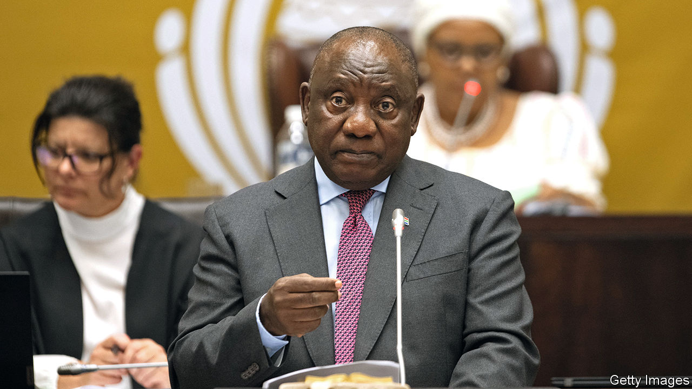

###### Ranch of government

# A sofa stuffed with cash imperils South Africa’s president 

##### Cyril Ramaphosa’s political future hangs in the balance 

 

> Dec 1st 2022 

Last month Cyril Ramaphosa was on a state visit to Britain, beaming under the chandeliers of Buckingham Palace. South Africa’s president was in a buoyant mood. He was being wooed abroad. At home he was the clear favourite to retain the presidency of the ruling African National Congress (ANC) at the party’s national conference beginning on December 16th—and thus, in all probability, leadership of the country for the rest of the decade. 

Mr Ramaphosa’s political fate now hangs in the balance. On November 30th an independent panel appointed by the speaker of South Africa’s parliament said that MPs could begin impeachment proceedings against the president (pictured). Its report, authored by a retired chief justice, found “prima facie” evidence that the president broke the law and violated the constitution, in an odd saga involving a score of buffalo, a Sudanese businessman and hundreds of thousands of dollars stolen (by unknown thieves) from a sofa. 

The verdict has shocked South African politics and is deeply serious for the man who pledged to clean up South Africa after the horrendous corruption under his predecessor, Jacob Zuma. If the findings lead to the president’s ouster, it will throw the country into yet another political crisis.

Mr Ramaphosa’s troubles began six months ago. On June 1st Arthur Fraser, a former spook, submitted evidence to the police  showed the president had broken various anti-corruption laws concerning the concealment and subsequent theft of large amounts of US dollars at Mr Ramaphosa’s game farm in the province of Limpopo. Opposition MPs seized on the claims and successfully asked the speaker to refer the matter to the independent panel—the potential prelude to impeachment. 

Mr Ramaphosa denies wrongdoing. His version of the story is that the cash taken from the sofa ($580,000, he says) came from the sale of 20 “substandard” buffaloes to a Sudanese businessman on Christmas Day in 2019. The money went in the sofa, he says, because it was thought to be safer than the farm’s safe. After learning of the theft a few weeks later, he reported the matter to his protection team, which is a branch of the police. The president also argues that, while he is the ultimate owner of the game farm, he is not involved in day-to-day operations, and therefore not in breach of constitutional rules regarding conflicts of interest.

The independent panel conceded that Mr Fraser’s allegations contained “hearsay”. Yet, after conducting its own preliminary inquiries, it concluded that there is sufficient evidence for MPs to investigate the case further via impeachment proceedings. Its report suggested that by seemingly combining the job of president with that of a game farmer, Mr Ramaphosa has violated the constitutional ban on cabinet ministers undertaking “paid work”. The panel found that Mr Ramaphosa should have reported the matter to the relevant police department, not just his security team. They argue that Mr Ramaphosa may have also abused his power by seeking the help of Namibia’s president in apprehending suspects who had fled South Africa. The panel concludes that there is “substantial doubt” about the source and amount of money stolen. 

In a statement after the report was published Mr Ramaphosa again professed his innocence. Its findings, he said, represented “an unprecedented and extraordinary moment for South Africa’s constitutional democracy”. Indeed it is: no South African president has been impeached before. 

What happens next will take place in two related arenas. The first is the National Assembly. MPs are due to discuss the panel’s findings on December 6th and will decide on whether to go ahead with hearings. Mr Ramaphosa may launch a legal challenge against the panel, a hitherto untested constitutional mechanism.

The second arena is the ANC itself. Under party rules championed by the president, officials are expected to “step aside” if facing criminal charges. Mr Ramaphosa has not been charged (though there is a separate police investigation), so may claim the standard does not apply in this case. Yet many in the party may use this opportunity to renew efforts to oust him at the conference this month, potentially replacing him with someone less keen on reform—or tackling corruption. 

The South African rand fell against the dollar as markets weighed up the potential for months of instability ahead. If Mr Ramaphosa does end up going, it would be a grim end for the man who came to power offering “a new dawn” for South Africa. The president promised to restore due process after the  of the Zuma years and to protect the constitution he helped shape in the 1990s. It would be a sad irony if the man who vowed to restore the rule of law was ousted for breaking it. ■

