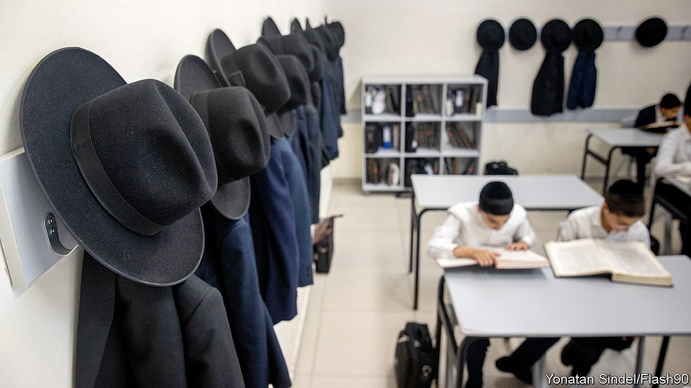
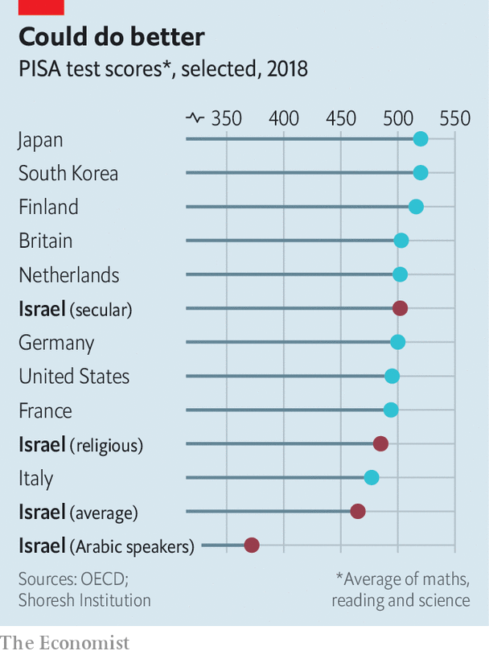

###### Numbers is just a book

# As religious schools in Israel grow, maths is neglected 

##### Some say Bible studies are more important 

 

> Dec 1st 2022 

“There are two myths about Israeli education,” says Haim Shaked, head of Israel’s forum of teachers’ colleges. “One is that Jews care deeply about education. That may have been true when we were in exile and needed to retain our Jewish identity. In Israel that’s no longer the case. The second myth is that because Israel is such a tech success, with , this means that Israeli education is excellent. What we have are islands of excellence surrounded by a failing system.” 

A report in October backed his gloomy prognosis. The number of trainee teachers had fallen by 38% compared with the previous year, as morale in the classroom plummeted. The government has raised teachers’ pay and made it easy to get into teacher-training college. But the number of teachers keeps falling. The profession lacks prestige. Bright young Israelis nowadays are keener to go into tech companies. 

Indeed, over 10% of Israel’s workforce is employed in the tech industry, perhaps the world’s highest proportion, but some doubt this will last, since Israeli children are scoring dismally in international tests. “We’re getting serious complaints from business, academia and even the military about the level of school graduates,” says Dalit Stauber, the education ministry’s director-general. Israel’s education system faces “a strategic crisis”. 

In the  (PISA), a test devised by the OECD and administered mostly to pupils in developed countries, Israel’s ranking for 15-year-olds has been steadily falling. By 2018 it was 29th out of 37 countries assessed, and even lower in maths (32nd) and science (33rd). 

 


Dan Ben-David, an economist at the Shoresh Institute in Tel Aviv, has studied the results and found still more cause to worry. If the tests applied only to Israel’s secular schools, the country would be in the rich world’s top ten. But its state-run religious schools lag far behind, and those serving Israel’s Arabic-speaking minority do even worse (see chart). “Even these figures are misleading,” he observes. “They don’t include Jewish, which don’t teach the national curriculum and aren’t tested by PISA.”

“We’re constantly seeing the gaps widening among our applicants,” says Yuval Elbashan, Dean of the Ono College, Israel’s largest private academic institution, which has large numbers of Arab and ultra-Orthodox students. “We’re having to devote major resources just to getting new students up to standard.” 

In 2020 a fifth of children started primary school in the ultra-Orthodox system. That proportion is set to grow, since the ultra-Orthodox have a high birth rate. Their political parties, which are part of the coalition that won Israel’s election on November 1st, have been promised by the incoming prime minister, , that their schools will receive government funds, even though they ignore the national curriculum and generally refuse to teach “secular” subjects such as maths and English beyond a rudimentary level—and for boys only to the age of 12. After that, pupils are obliged to take exclusively religious lessons.

Israel’s educational woes are not because of a lack of investment. National spending on primary and secondary education, at over 5% of GDP, is higher than in any other rich country. But its system of separate state-funded school networks for Jewish students of differing sects and for Muslim and Druze students requires a heavy and intrusive bureaucracy that hampers teachers and school heads. “Israel isn’t the only country with a shortage of teachers or wide social gaps,” says Adar Cohen of the Hebrew University’s School of Education. “But the way its state school system is split into different streams is unique—and a major source of its problems.”

This division means that curriculums, tests and teachers’ training are conducted separately. The level of funding per student in state schools, whether Jewish or Arab, is equal. But richer local authorities supplement their local schools’ funding. Wealthy parents make up for what their children do not get at school. “Nearly everyone goes to state schools, but there’s an entire hidden industry of private tuition, paid for by parents who can afford it, which is holding up the Israeli economy,” says Yoav Pridan, principal of a Tel Aviv high school who co-chairs the Manhigim (“Leaders”) organisation of head teachers. 

“The education ministers and director-generals are constantly changing and principals are unable to effect changes in their own schools, because we’re stuck with a politicised and centralised system,” says Mr Pridan. There have been seven education ministers in the past decade. 

Ms Stauber, appointed by the outgoing government, has sought to reform teaching methods. She has given teachers incentives just to stay in the profession and granted heads more independence. She has also offered ultra-Orthodox schools extra funds if they agree to teach maths, science and English to a higher level. But she is about to leave after just a year in the job. A new minister from Mr Netanyahu’s Likud party is bound to try setting a different agenda. The outgoing team’s attempt at reform has provoked right-wing and religious criticism for supposedly forsaking traditional Bible studies.

A new deputy minister representing the religious right will seek to ensure that ultra-Orthodox schools can carry on neglecting secular subjects such as maths and science. Meanwhile, the ultra-Orthodox are predicted to rise from around 12% of the population today to 25% by 2050. Without serious education reform, Israel could become a country where people know their Book of Numbers, but not their numbers or their books. ■

