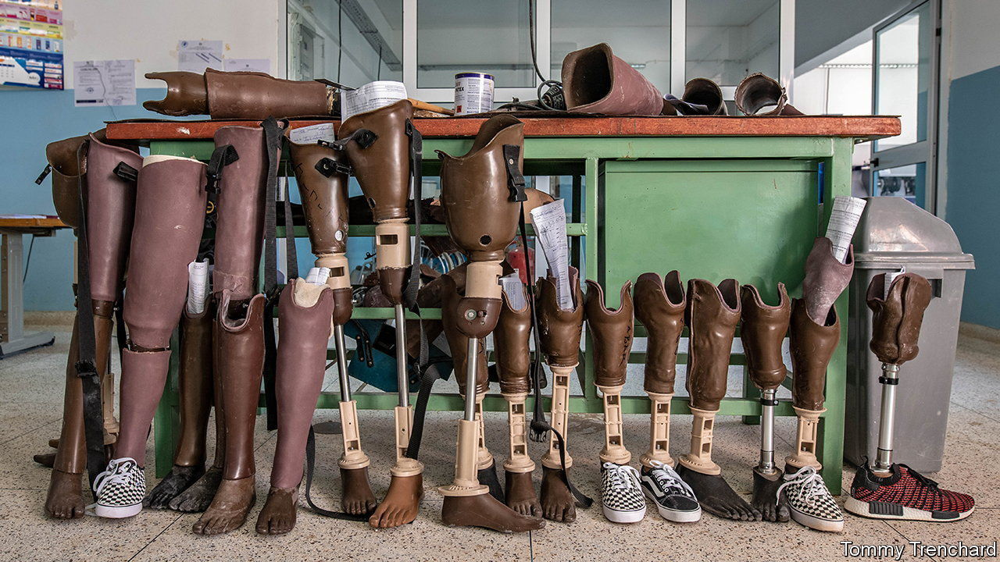

###### Mine craft

# How technology is helping reduce the menace of landmines 

##### Techniques deployed by the HALO Trust are saving lives 

 

> Dec 1st 2022 

In the remote village of Nancova, in southern , a team from the , a British mine-clearance charity, watches intently as a drone whirrs back and forth over a nearby hillside. It is searching the terrain below, using a thermal sensor to pick up temperature discrepancies that could spot the whereabouts of landmines laid decades earlier during the country’s devastating civil war.

“If there’s an object buried in the ground, it will heat up and cool down at a different rate compared with the soil,” says Michael Nevard, HALO’s head of research and development. “So if you take the imagery at the right time of day you can see a kind of heat shadow.”

Mine clearance is a painstakingly slow process that still relies on men and women with body armour and metal detectors methodically scouring the earth for signs of mines, a square metre at a time. It is a job that cannot safely be rushed. Angola has been at for over 20 years, yet there are still more than 1,000 uncleared minefields across the country that claim lives and stifle development. Clearing them could well take another 20 years.

But advances in aerial imaging now speed things up. Drones fitted with thermal sensors or with a facility for light detection and ranging (known by its acronym, Lidar) help pinpoint minefields and mines from the air. This makes it safer and quicker to clear them on the ground.

Different types of sensors suit different environments. The wide daily range of temperature in southern Angola lends itself to the thermal system, but tree cover can make it ineffective. Lidar sensors can see through the tree canopy to pick up vital clues from the ground below. “After 30 years, things like craters and trench lines can be almost invisible,” says Mr Nevard. “If you flew over this with a standard camera you wouldn’t see it at all. But Lidar will map it in 3D. That can give us a very strong idea of where the minefield is.”

Drones are not the only recent advance in de-mining. A new generation of ultra-sensitive metal detectors developed by gold-miners can spot mines buried deeper underground and those with a low metal content that might otherwise have gone unnoticed. Systems designed for the American army that combine metal detection with ground-penetrating radar are beginning to help de-mining, too. 

Other advances are less high-tech. A simple potato-harvesting machine is often ideal for removing anti-personnel mines from the ground. “There’s no silver bullet that works everywhere,” says Mr Nevard. “It’s all about matching the tool to the threat and the terrain. But in the right conditions you can double, triple, sometimes quadruple productivity.”

However sophisticated the equipment, humans with basic tools usually complete the task of uncovering and detonating the mines. Wooden sticks mark suspected mines; simple metal tools dig them out. 

For Angolans who have grown up under a constant threat of mines, anything that speeds up de-mining is welcome. “We won’t be free until the mines are gone,” says Donisa Kasanga, a farmer in her 70s who lost her leg by stepping on a mine on her way home from her fields. “It’s like we’re living in a cage.” ■

