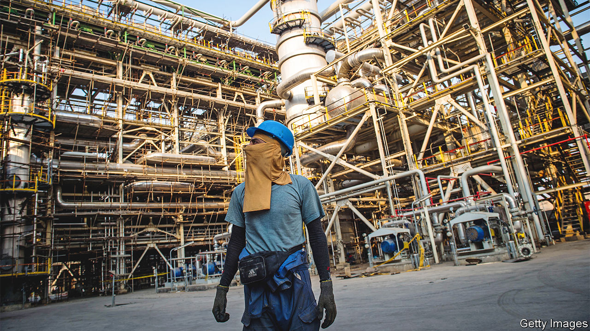
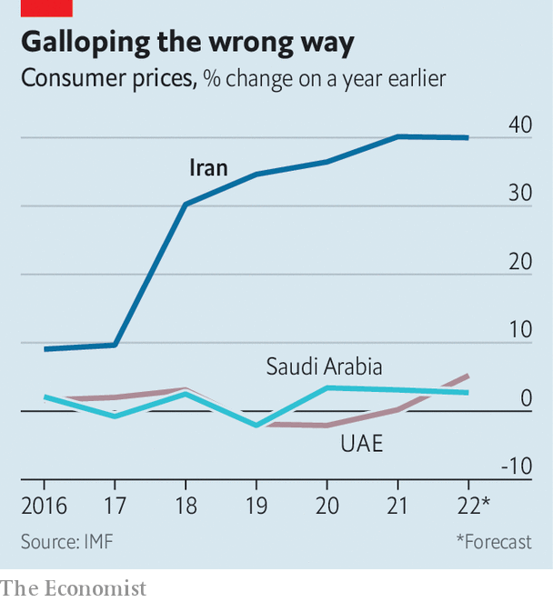

###### Rial trouble

# Iran’s regime is using threats, arrests and pay rises to silence workers 

##### In any case, Iranians are too poor to strike 

 

> Nov 29th 2022 

Calls for a general strike are all over Iranian social media. It is a nod to history. When oil workers went on strike in October 1978, Iranian oil output fell by two-thirds and the shah’s regime struggled to pay its bills. Subsequent general strikes brought the country to a standstill. The next year the monarchy was overthrown.

Protesters hope to harness similar energy this year, to oust the theocratic regime that replaced the shah all those years ago. In October, after weeks of anti-government protests across the country, staff at several oil-and-gas plants walked off the job. Workers burned tyres and blocked roads. 

Within weeks, however, the strikes fizzled out. Workers returned to their jobs; oil exports were not disrupted. The episode was a reminder of the obstacles that face both Iran’s labour movement and the broader opposition to the regime.

Nationwide  now in their third month, began after the death of Mahsa Amini, a young woman, in the custody of Tehran’s “morality” police, who had accused her of wearing her veil improperly. Instead of mass rallies, the protests have become more of a cat-and-mouse game with the authorities: small acts of defiance on city streets and university campuses, sometimes brutally repressed. More than 300 people, including 40 children, have been killed, according to the UN’s human-rights chief. A Norwegian monitor puts the toll at closer to 400.

Strikes have added to the turmoil. Beyond the October work stoppages, in a single week in November workers walked out of a diesel company near the capital, Tehran, and did the same at an aluminium factory in the south. Firefighters went on strike in the eastern city of Mashhad. Many shops in Tehran’s bazaar closed their doors for several days. Teachers and lorry drivers have organised their own stoppages.

Yet not enough workers have joined the fray to pose a serious threat to the regime. After a , life for many Iranians is hard. Official media acknowledge that the proportion of Iranians living on less than around $3 a day has doubled to 31% in recent years. Household spending for working-class families has dropped by 15% in the past decade. Even if many Iranians sympathise with the protesters, they simply cannot afford to strike.

As in 1978, oil and related industries are crucial to the regime’s survival. Despite American sanctions, Iran managed to ship around 800,000 barrels per day in October, most of it to China. Even sold at a discount, that provides vital hard currency for a country with few other lucrative exports.

But the oil-sector strikes have been short-lived. Police arrested dozens of organisers and threatened more repression. Bosses were hauled in by the authorities and told to get their workers in line. The threat of arrest and prison is not the only fear. More than half of the 205,000 workers in Iran’s petrochemical sector are on fixed-term contracts. Their jobs are precarious. They cannot easily find new ones if sacked.

Trade unions are a force in Iran. In mid-2018 they held scores of protests every week. Labour unrest in 2019 was the backdrop to  after the government announced a fuel-price rise. Now the government is cracking down on unions, arresting their leaders, crushing demonstrations and blocking sympathetic websites. And the unions are not as powerful as they were decades ago. Long-term economic changes have also weakened them. Researchers at the University of Tehran have estimated that 40-50% of Iran’s labour force works in the informal sector, with no trade bodies able to organise them.

 


Weak unions and a large grey market help the regime keep workers divided. Earlier this year it announced a boost in public-sector wages and doubled the salaries of army conscripts. Though most of these rises were gobbled up by stratospheric levels of inflation (see chart), the government later offered additional pay rises to civil servants and pensioners. That may be enough, for now, to head off the sort of strikes that paralysed the shah’s regime.

Some dissidents, in Iran and abroad, suggest setting up a strike fund to pay workers who walk out. Yet even if someone were to stump up the cash, the regime would make it hard for workers to collect it. Others think the diaspora could play a similar role through remittances. But this would probably require America to ease some of its sanctions on Iran, which cut off Iranian banks from the global financial system. It is unlikely to happen.

Thus the regime may stay afloat for some time. But it cannot afford to bribe key constituencies for ever. Printing money to pay higher wages will only fuel inflation. 

Even with higher oil prices and aggressive tax collection this year, the treasury is running a large deficit. In October a member of parliament’s budget committee said that Ali Khamenei, the supreme leader, had agreed to tap the sovereign-wealth fund to provide extra cash for the budget. So long as the regime has no good answers for the protesters in the streets or for the workers organising strikes, it will face a growing threat to its survival. ■

