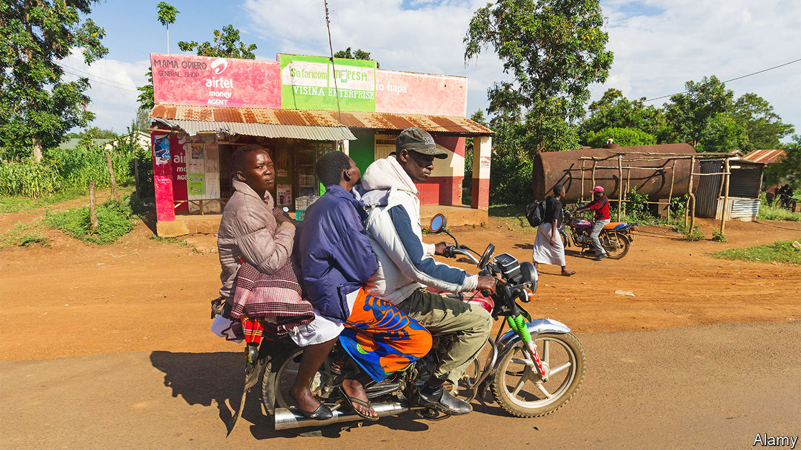

###### Brotherhood of bikers

# Kenya’s boda-boda taxis are unruly in life—and death 

##### They also illustrate changing customs and politics 

 

> Dec 1st 2022 

Death may mean eternal silence, but you can hear the funeral of a Kenyan boda-boda driver (a motorbike taxi man) from miles away. Music blasts from loudspeakers that have been mounted on the hearse (a flower-laden minibus), as the shouts of mourners compete with the honks of passing lorries and the toots of dozens of boda-bodas that make up the raucous procession. 

Such send-offs are common. Last year 1,634 boda-boda drivers and their passengers died in accidents on , according to official figures. Yet their rowdy funerals are not just a sign of the dangers they face (and cause). They also mark changes in Kenyan society that, among other things, are rejigging the conventional calculus.

Many older Kenyans, especially those in the countryside, keep to the old tribal ways of honouring their dead, often with the aim of pleasing ancestral spirits. Ethnic loyalty has long influenced how Kenyans have tended to vote. Governments were often in essence tribal coalitions, with leaders promising to funnel state resources into their own ethnic heartlands. Now, however, many young Kenyans are casting off old traditions and ethnic identities and are adopting new political allegiances as they move in ever larger numbers into the cities. 

Boda-boda drivers exemplify the trend. Cut loose from ties of village and kin, and often considered an unruly menace by the Kenyan middle class, they have formed a new brotherhood of their own. ‘‘We have no other community,” explains one taking part in the funeral procession of another driver he did not even know. “This is our community.” 

The brotherhood is growing fast. There may be between 900,000 and 2.4m motorcycle taxis serving  of around 55m, according to estimates by the government and industry. Car &amp; General, a Kenyan insurer, reckons they pull in fares worth 365bn shillings ($3bn) a year, equivalent to a shade more than 3% of gdp. So they are an economic force to be reckoned with. 

And they are gaining political heft, too. , elected president this year, campaigned hard to win their votes. He lionised them as epitomising the “hustler nation” he claims to represent. This may explain why boda-boda drivers were more inclined to vote for him than his opponents, who promised lower fuel prices and more welfare. 

Yet boda-boda drivers bring problems, too. They are often embroiled in turf wars and organised crime. Their fierce loyalty to one another can lead to violence. Last year hundreds of drivers stormed a hospital and killed two suspected motorbike thieves. Moreover, many are unlicensed and gleefully disregard road signs, according to a study by Kenya’s National Crime Research Centre. Many ride while they are drunk or high on drugs, contributing to the awful annual death toll on the roads—as well as to ever noisier funerals. ■

