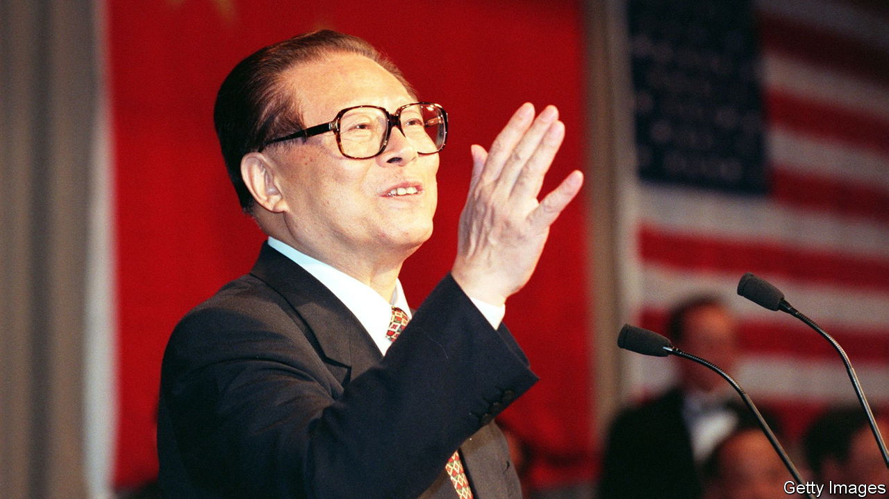

###### An unlikely strongman

# Jiang Zemin oversaw a wave of economic change, but not much political reform 

##### China’s party leader from 1989 to 2002 died on November 30th, aged 96 

 

> Nov 30th 2022 

Talking to Mike Wallace on “60 Minutes” in 2000, wagging his finger—and with his ever-mobile face fixed, briefly, in a stare—Jiang Zemin quoted from the Gettysburg address. He had committed it to memory as a student activist, before the Communist Party came to power in 1949. “Government of the people, by the people, for the people, shall not perish from the earth,” he said. His English was not great, but it brimmed with the confidence of a man who was delivering “for the people” all right: material progress on a scale and at a speed that history had not seen before. And it had started on his watch. 

His own rise had been remarkable, too. In 1949 he was just an engineer in a food factory in Shanghai that had once produced one of China’s most popular brands of ice-cream, “Beautiful Woman”. (Appropriate, that, for a man who seldom missed a chance to eye up a pretty girl.) Had his skills not caught the attention of a visiting senior official that year, he might have stayed there. Instead he was groomed for leadership, at first in state-owned firms and then in politics. He seemed destined to be one of the “flower-vases”—all decoration, no action, just a low-key technocrat. 

So it surprised him as much as anyone when he was appointed party leader in 1989, after the crushing of the Tiananmen Square protests. He was then an ordinary Politburo member, not a member of the innermost core. His selection looked like a compromise between the then-warring hardliners and reformists. He had shut down a liberal journal in Shanghai well before martial law was imposed in Beijing, so he was no soft touch on dissent. But as mayor and party chief of the city from 1985 to 1989, he also oversaw its awakening from the dark days of central planning. 

Few expected this rumpled, unpredictable figure to last long in the hurly-burly of Beijing politics. In any case, it was clear after Tiananmen that Deng Xiaoping was the man who really called the shots. But Mr Jiang listened to Deng’s critics too, which proved a mistake. In 1992 Deng publicly rebuked him, and he caved in, unleashing a wave of change.

For a while it became a free-for-all, with even government departments and the armed forces going into business. By 1994, with inflation soaring, Mr Jiang began hitting the brakes to stop the economy running out of control. But reform surged on. Tens of thousands of state-owned enterprises were closed down or sold, and millions of workers lost their jobs. In the late 1990s sweeping housing privatisation led to a huge transfer of wealth to urban households and the birth of a middle class. 

In 2002, in a huge U-turn, he rewrote the rules to allow private entrepreneurs to be members of the party. When conservatives said it would mean the party’s end, he closed down the journals they controlled. The press annoyed him in general; harassed once by reporters, he exploded that they were good at only one thing: “You always run faster than Western journalists.“

A pink swimhat

His power was hidden behind comedy. Uniquely in China’s ruling circle, he did and said whatever he thought. He would spice up diplomatic events by bursting into song: “Love Me Tender” with Fidel Ramos of the Philippines, or “O Sole Mio” at banquets. He once asked Condoleezza Rice to dance, and played the piano and the ukulele. His best-known affair, with a military singer, began when he passed her a slip of paper after a show: “Come and see your big brother when you’re in need.” Most famous was his public swim in Hawaii, in a pinkish-purple swimhat, which was unfavourably compared with Mao’s Great Swim across the Yangzi. Netizens often portrayed him as a toad, mocking his portly physique, square spectacles and improbably high-waisted trousers. It was water off a toad’s back.

Like Deng, he never really retired and remained far more influential behind the scenes than people realised. In theory he was succeeded in 2002 by Hu Jintao, a grey party apparatchik who lacked Mr Jiang’s eccentric self-confidence. In practice, it was still Mr Jiang who really called the shots. He remained commander-in-chief of the armed forces for two more years after handing over his positions as party general secretary and state president to Mr Hu. Even after giving up his military title, too, his power eclipsed Mr Hu’s. He would never let Mr Hu enjoy the most precious title accorded to him: that of being the “core” of the leadership.

He was still a strongman when Xi Jinping took over as China’s leader in 2012. He would boast of the political battles he had won, the Western countries he had visited, the foreign languages he spoke and how he had “seen it all”. His men still filled the Politburo. Under the pretext of waging war on corruption, Mr Xi attacked some of his closest allies, and in 2016 was declared the new core. At the age of 90, “the elder” became a political has-been. 

The interview with Mike Wallace, “a comfortable laugh and a chat”, remained a high point for him. He had told Mr Wallace that China had government “by the people”, too—it was just “different” from America’s. Many intellectuals in China privately scorned that notion: they wanted more than mere material progress. Workers laid off from state-owned enterprises could never forgive him for closing so many down. Even those who admired the reforms he oversaw usually (and with some justification) thanked others for them. 

Above all, Mr Xi is unlikely to shed tears. To him, Mr Jiang’s rule was a time of drift towards ruin, with the party eaten away by corruption and undermined by ideological laxity. Mr Jiang and Mr Hu had allowed it to disappear from most ordinary people’s lives; Mr Xi has made it his mission to restore the party’s centrality, and his own. His political world has had no room for elders such as Mr Jiang, carping from the wings. Staging his funeral will be politically complicated, in the midst of a surge in covid-19 and public discontent with lockdowns. But with Mr Jiang gone, Mr Xi will feel even more that this world is his. ■

