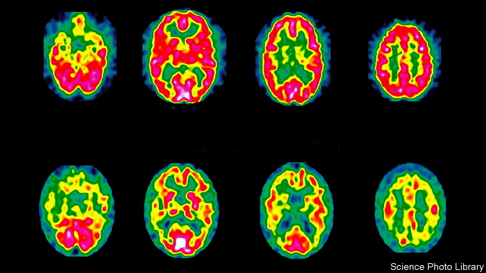

###### Treating dementia

# A drug for Alzheimer’s disease that seems to work 

##### It is not perfect. And it has side-effects. But it may be the real deal 

 

> Nov 30th 2022 

It is easy to be cynical about announcements of drugs that claim to slow the progress of Alzheimer’s disease, the most common form of . Lecanemab, however, may be the real deal. Results of a clinical trial, conducted by its makers, Eisai, of Tokyo, and Biogen, of Cambridge, Massachusetts, have just been announced in the . After 18 months, it had slowed the progress of symptoms by a quarter. 

The trial involved 1,795 participants who were, crucially, in the early stages of the illness. Half received the drug. The others, a placebo. It showed two things. One was that modest but measurable slowing of progression. The other was that an explanation of Alzheimer’s called the  seems correct.

Beta-amyloid is a protein which accumulates in plaques in the brains of those with Alzheimer’s. It, and a second protein, tau, are established signs of the illness. But whether either or both is a root cause of it has been much debated. The success of lecanemab, an antibody that attaches itself to beta-amyloid and then attracts immune-system cells which clear the protein away (and measurably did so in those receiving the drug), suggests beta-amyloid does indeed directly create problems associated with dementia.

This is a small first step. Some experts question whether the test used to show an improvement in symptoms is clinically meaningful. And lecanemab induced nasty side-effects—notably swelling and bleeding of the brain—in a number of participants. Also, diagnosing dementia this early is hard. Beta-amyloid can be detected by positron-emission tomography, but that requires a piece of expensive equipment. Or a sample of cerebrospinal fluid can be taken, which is unpleasant, and not something that could easily be turned into a routine screening programme. It is, however, a proof of principle. Now that the antibody approach has been shown to work, it can be followed up with other, similar, antibodies. Hope for more good news soon.■


