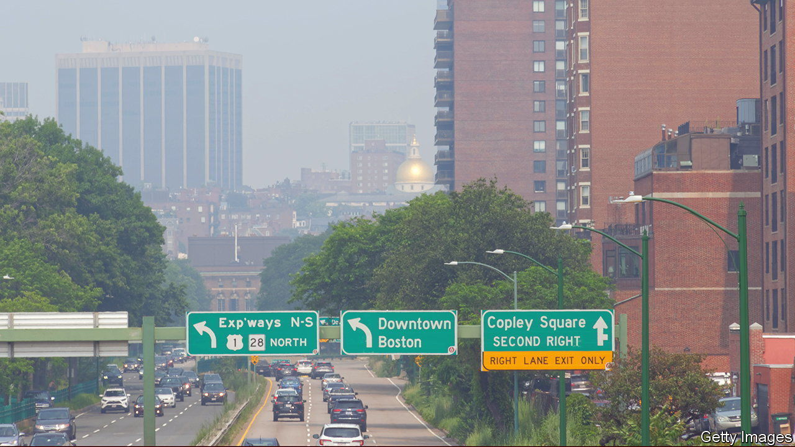

###### Pollution and suicide

# Air pollution can drive people to kill themselves 

##### The cause seems to be brain inflammation provoked by tiny, airborne particles 

 

> Nov 29th 2022 


Polluted air is bad for your health. It increases the risk of strokes, heart disease and a list of respiratory illnesses. It is linked, as well, to low productivity at work and poor scores on academic tests. And pollution may have a yet-more-sinister effect. It may also promote suicide.

Claudia Persico and David Marcotte of the American University, in Washington, DC, examined suicides throughout America between 2003 and 2010. They looked for a link between these and aerial levels of fine particulate matter known as PM2.5 because its particles are less than 2.5 microns across. These can enter the bloodstream via the lungs. They hypothesised that poor air quality worsens people’s moods, which in turn increases the likelihood of someone experiencing suicidal thoughts.

Suicide rates vary for many reasons, so the two researchers concentrated on correlating day-to-day changes in the number of suicides in particular places with fluctuating air-pollution levels caused by alterations in wind direction. In Boston, for example, north-easterlies blowing into the city from industrial areas bring air carrying around five micrograms per cubic metre more PM2.5 than westerlies from upstate Massachusetts. The researchers worked out these wind-related pollution patterns for every county in America, and matched them with daily suicide statistics. 

Their analysis was published as a working paper by the National Bureau of Economic Research, in Cambridge, Massachusetts. It found that an increase of one microgram per cubic metre in PM2.5 in a given place was linked to an average rise in daily suicide rates of just under 0.5%, and if that increased level was sustained for a month, hospital admissions connected with attempted suicides rose by 50%. 

An inflammatory conclusion

These results stood up even when controlled for temperature and cloud cover, which might feasibly affect mood and be related to wind direction. There was, however, geographical variation. Dr Persico and Dr Marcotte found that the impact of pollution on suicide rates was greatest in poorer counties, in those with more unemployment, and in those with liberal gun-ownership laws, since access to a firearm presumably makes it easier for a potential suicide to turn thought into deed.

To test directly the idea that poor air quality worsens mood they took data from surveys about mood and mental state and checked whether the answers were related to pollution levels in respondents’ home towns in the month leading up to the survey. They found that even a single additional day in a typical month during which PM2.5 levels were above 35 micrograms per cubic metre was associated with a small but consistent increase in how often people reported they felt depressed, had little pleasure in doing things or were tired and lacked energy. They also found an increase of around 1% in the number who had been told by a doctor that they had depression. 

Previous research has shown that PM2.5 pollution can cause an inflammatory response in organs, including the brain. Many researchers think inflammation disrupts normal operation of the brain’s reward pathways, which help regulate mood. Consistent with this, some trials have found that anti-inflammatory drugs improve mood in those with depression. Other work, meanwhile, shows that such people have consistently higher concentrations than others of proteins called cytokines, released during inflammation, in their blood, and that suicide victims, examined after death, have high levels of inflammatory cytokines in their brains. 

In America, average PM2.5 levels in populated areas are around twice the World Health Organisation recommended maximum of five micrograms per cubic metre. A study published in 2021 suggests meeting that figure might save 100,000 lives a year. In this context the 770 suicides which would, if Dr Persico and Dr Marcotte are correct, be avoided by this reduction are only a small extra saving. But suicide is such a tragic end to life that it would be a particularly welcome one. ■


