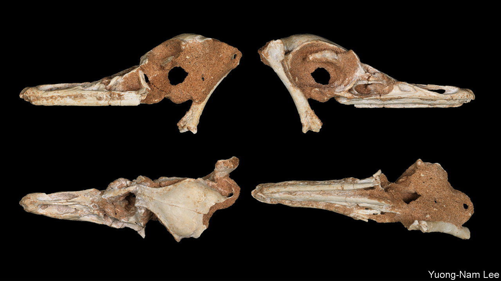

###### A diving dinosaur

# An amphibious dinosaur from the Cretaceous 

##### It looked like a cormorant but was not a bird 

 

> Dec 1st 2022 

In matters evolutionary, history really does repeat itself. This streamlined skull, dug from the Gobi desert in Mongolia along with parts of a skeleton that show an equally streamlined body, looks like that of a diving seabird such as a cormorant. It actually belongs to a Cretaceous dinosaur dubbed  by its discoverers, Lee Sungjin and his colleagues at Seoul National University, in Korea, who report their find in this week’s . 

Birds being dinosaurs, taxonomically speaking,  is not technically the first known diving dinosaur. But it is the first with no avian ancestry, so would have had to launch itself into the water from the shore, like that other non-flying (though avian) aquatic dinosaur, the penguin.■


