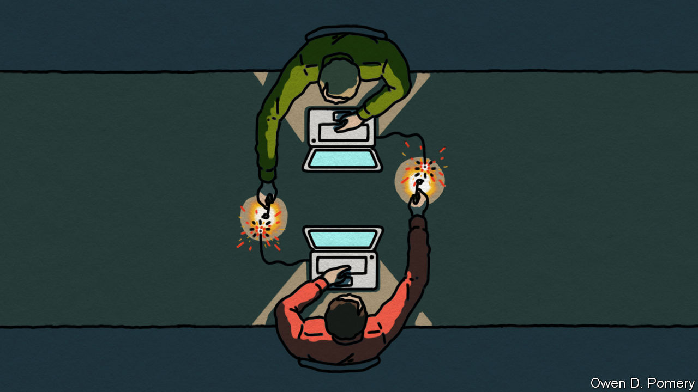

###### Cyberwar and cybercrime

# How cybercriminals have been affected by the war in Ukraine 

##### Many have volunteered, or “been volunteered”, for both sides’ war efforts 

 

> Nov 30th 2022 

Less extortion and theft, but more digital destruction. That is one of the ways in which the conflict in Ukraine is altering cybercrime. The shift, says Oleh Derevianko, chairman of ISSP, a Ukrainian computer-security firm, is striking. Recent years had seen a boom in the use of ransomware, which scrambles victims’ computer data until a payment is made. Now, Mr Derevianko says, the number of such attacks on ISSP’s corporate and government clients has dropped pretty-much to zero. Instead, many of those once involved in such enterprises seem to have been co-opted by Russia’s government and are focusing on  to damage Ukraine’s war effort by erasing whatever data they can reach. 

The same is true of attacks on Russian computers by Ukrainians, says Olga Khmil, a researcher at Molfar, an intelligence firm in Kyiv. Such hackers now care less about stealing money and “more about the damage they can cause to the aggressor”. 

This trend seems also to have spread beyond the borders of the countries involved. Resilience, a cyber-insurance firm in San Francisco, reports that prior to Russia’s full-scale invasion, which began in February, claims involving ransomware were the third most common category. Now, says Vishaal Hariprasad, Resilience’s boss, they are sixth or seventh.

Inflamed passions among hackers are but one reason for this. Guillermo Christensen, a partner in K&amp;L Gates, a law firm in Washington that specialises in such matters, says that Russian government agencies have recruited cyber-thieves onto their staffs and told them to direct their energies into disabling Ukrainian infrastructure instead. 

One hacker group over which the FSB, Russia’s domestic security service, has gained notable control, is Conti, an infamous gang of ransomware extortionists. Such, at least, is the assessment of a hacker in Bangkok calling himself “the Grugq”, who follows the action closely. Hours after Russian columns rolled into Ukraine on February 24th, Conti posted a statement offering “full support” for the invasion. “High emotions” in that and other groups, the Grugq says, sparked infighting and defections. Gangs soon repositioned themselves into pro-Ukraine and pro-Kremlin camps. Who says there is no honour among thieves?■


