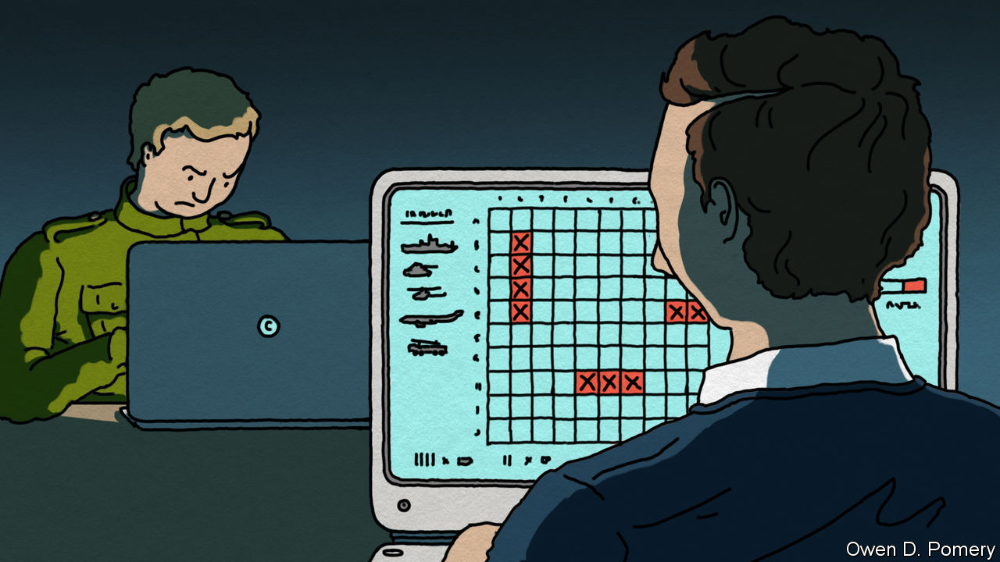
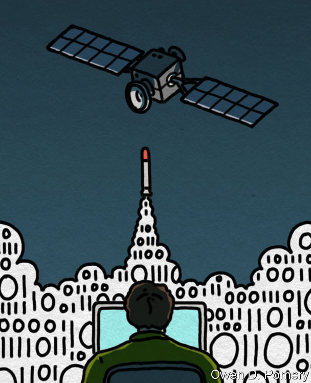

###### Cyberwarfare

# Lessons from Russia’s cyber-war in Ukraine 

##### It has been intense, but not always effective. Why? 

 

> Nov 30th 2022 

Shaping the battlefield. Darius, king of Persia, did it in 331BC, with caltrops strewn where he thought his enemy Alexander the Great would advance. The Allies did it in 1944, with dummy aircraft and landing craft intended to fool Germany’s high command into thinking their invasion of France would be in the Pas de Calais, not Normandy. And Russia attempted it on February 24th, when, less than an hour before its tanks started rolling into Ukraine—on their way, they thought, to Kyiv—its computer hackers brought down the satellite communications system run by Viasat, an American firm, on which its opponents were relying.

Victor Zhora, head of Ukraine’s defensive cyber-security agency, said in March that the result was “a really huge loss in communications in the very beginning of war”. A Western former security official reckoned it took “a year or two of really, really serious preparation and effort”. 

Win some, lose some. The Allies won. The D-day landings were successful. Darius lost, and lost his throne. Likewise, Russia’s advance on Kyiv was repelled. Its invasion force in that theatre was defeated. Despite the effort expended on trying, Russia could not generate a sufficiently thick fog of war through cyberwarfare. And that is interesting. Though cyberwarfare has been a hard-fought and important part of a conflict that has acted as a testing ground for this still-novel form of battle, it does not seem to have been the killer app, as it were, that some expected.

Bits in pieces

Russia’s attack on Viasat was not the only softening-up-by-software it directed at Ukraine in the run-up to the invasion. In January, and again on February 23rd, so-called “wiper” programs, designed to delete data, were spotted on hundreds of Ukrainian systems. Then, in April, as the forces that had threatened Kyiv fled, hackers working for Sandworm (suspected to be a front for GRU, Russia’s military-intelligence service), used malware called Industroyer2 to attack the country’s electricity grid. 

Assaults of this sort on civilian infrastructure are hard to keep quiet. But what is happening to military kit is a different matter. Ukraine’s armed forces have maintained tight operational security throughout the war, giving away nothing about how their own networks were penetrated or disrupted (which they were). Even so, the visible effects of Russia’s campaign have been surprisingly limited. “I think we were expecting much more significant impacts than what we saw,” said Mieke Eoyang, a senior cyber-official at the Pentagon, on November 16th. “Russian cyber-forces as well as their traditional military forces underperformed expectations.”

In the first days of the war, Ukraine stayed largely online. The lights remained on, even as fighting raged around the capital. The banks were open. Unlike 2015 and 2016, when cyber-attacks caused blackouts, electricity continued to flow. So did information. There was never a serious threat to Volodymyr Zelensky’s nightly presidential broadcasts to the Ukrainian people. If Russia’s aim was to undermine Ukrainians’ trust in their government and render the country ungovernable, it failed. 

The most important reason for that was Ukraine’s defence. Lindy Cameron, head of Britain’s National Cyber Security Centre (NCSC) reckons Russia’s onslaught was “probably the most sustained and intensive cyber-campaign on record”. But as Sir Jeremy Fleming, her boss at GCHQ, Britain’s signals-intelligence agency (of which the NCSC is part) observed in an  for  in August, Ukraine’s response was “arguably…the most effective defensive cyber-activity in history”. Ukraine had been a test bed for Russian cyber-operations for years. Industroyer2’s predecessor, Industroyer, for example, was the cause of the blackouts in 2016. That gave the government insight into Russian operations, and time to harden its infrastructure.

This meant that when the invasion began, Ukraine’s cyber-command had a contingency plan ready. Some officials dispersed from Kyiv to safer parts of the country. Others moved to command posts near the front lines. Crucial services were transferred to data centres elsewhere in Europe, beyond the reach of Russian missiles. Ukraine’s armed forces, aware that satellites might be disrupted, had prepared alternative means of communication. The attack on Viasat ultimately “had no tactical impact on Ukrainian military comms and operations”, insisted Mr Zhora in September, qualifying his earlier statement.

What friends are for

Western assistance was also crucial. In the prelude to war, one way NATO enhanced its co-operation with Ukraine was by granting access to its cyberthreat library, a repository of known malware. Britain provided £6m ($7.3m) of support, including firewalls to block attacks and forensic capabilities to analyse intrusions. The co-operation was mutual. “It is likely that the Ukrainians taught the US and the UK more about Russian cyber-tactics than they learned from them,” notes Marcus Willett, a former head of cyber issues for GCHQ.

Ukrainian resilience was helped, paradoxically, by the primitive nature of many of its industrial-control systems—inherited from Soviet days and not yet upgraded. When, for example, Industroyer hit electrical substations in Kyiv in 2016, engineers were able to reset systems with manual overrides within a few hours. When Industroyer2 took part of the grid offline in April, it came back on again in four hours. 

Private cyber-security companies have also played a prominent role. Mr Zhora singles out Microsoft and ESET, a Slovakian firm, as being particularly important for their large presence on Ukrainian networks and the “telemetry”, or network data, that they collect as a result. ESET provided the intelligence which helped Ukrainian cyber-teams parry Industroyer2. Microsoft says that artificial intelligence, which can scan through code more quickly than a human being, has made it easier to detect attacks. On November 3rd Brad Smith, Microsoft’s president, announced that his firm would extend tech support to Ukraine until the end of 2023 free of charge. The pledge brought the value of Microsoft’s support to Ukraine since February to more than $400m.

There is no doubt that Ukraine was a hard target. But there are those who wonder whether Russia’s cyber-prowess might have been overrated. Russian spies have decades of experience with cyber-espionage, but the country’s military cyber-forces are “very young” compared with Western rivals, notes Gavin Wilde, a former director of Russia policy on America’s national security council. America began integrating cyber-plans into military operations during wars in Haiti and Kosovo in the 1990s. Russia has thought about it for only around six years, says Mr Wilde. 

American, European and Ukrainian officials all say that there are many examples of Russian cyber-attacks synchronised with physical attacks, suggesting a degree of co-ordination between the two branches. But there have also been clumsy errors. Sir Jeremy says that, in some cases, Russian military strikes took down the same networks that Russian cyber-forces were attempting to infect—ironically forcing the Ukrainians to revert to more secure means of communication. 

 


Others paint Russia as a sloppy cyber-power—good at breaking things, but loud and imprecise. In April David Cattler, NATO’s top intelligence official, observed that Russia had used more destructive malware against Ukraine “than the rest of the world’s cyber-powers combined typically use in a given year”. But judging a cyber-campaign by the volume of malware is like rating infantry by the number of bullets fired. Daniel Moore, author of “Offensive Cyber Operations”, a recent book on the subject, says that every single one of Russia’s known attacks on critical infrastructure, in Ukraine and beyond, has been prematurely exposed, been riddled with errors or has spilled over beyond the intended target—as was the case with NotPetya, a self-spreading ransomware attack of 2017, which escaped from Ukraine to cause $10bn of damage around the world.

“There were significant operational failings in almost every single attack that they have ever carried out in cyberspace,” says Mr Moore. In contrast, he points to Stuxnet, an Israeli-American cyber-attack on an Iranian nuclear facility, first identified 12 years ago—technologically, ancient history. “That was far more complex than a lot of what we see from Russia today.” 

The physical and the virtual

Some Western spies thus say the war shows a gulf between American and Russian proficiency in high-end cyber-operations against military hardware. But others warn that it is too early to draw sweeping conclusions. Russia’s cyber-campaign may have been constrained less by incapacity than by the hubris that also afflicted its conventional armed forces. 

Western officials say that Russia failed to plan and launch highly destructive cyber-attacks on power, energy and transport not because it was unable to do so, but because it assumed it would soon occupy Ukraine and inherit that infrastructure. Why destroy what you will soon need? When the war dragged on instead, it had to adapt. But cyber-weapons are not like physical ones that can simply be wheeled around to point at another target and replenished with ammunition. Rather, they have to be tailored specifically to particular targets.

Sophisticated attacks, like that on Viasat, require huge preparation, including painstaking reconnaissance of target networks. In a paper published last year, Lennart Maschmeyer of ETH Zurich showed that GRU’s attack on Ukraine’s power grid in 2015 had taken 19 months of planning, while that in 2016 had required two and a half years. Launching such attacks also reveals to an enemy the tools (ie, code) and infrastructure (servers) being used, resulting in attrition of their effectiveness. 

After the war’s first week, therefore, as Viasat-like set pieces were used up, Russian cyber-attacks grew more tactical and opportunistic. Then, in April, as Russia turned from Kyiv to the Donbas, the volume of wiper attacks dropped precipitously. In November, researchers at Mandiant, a cyber-security firm owned by Alphabet, described how GRU was now attacking “edge” devices such as routers, firewalls and email servers to speed up attacks, even at the expense of stealthiness.

“What you’re seeing here is a production frontier,” says John Wolfram of Mandiant, referring to a graph in economic theory which shows the various combinations of two goods that can be produced with given resources. “You have a certain amount of expertise and capital, and you have to decide whether you spend it on one or two exquisite special operations—or 50 at lower cost.” Choosing the latter does not mean the former are beyond your capacity. “Russia is almost certainly capable of cyber-attacks of greater scale and consequence than events in Ukraine would have one believe,” notes Mr Cattler. The war “has not yet involved both sides using top-end offensive cyber-capabilities against each other”, agrees Mr Willett. 

If all this is true, those capabilities might yet be unleashed. The sabotage of the Nord Stream 1 and 2 pipelines in September, and missile attacks on Ukraine’s power grid, suggest that the Kremlin’s appetite for risk is growing. There are signs of this in the cyber-domain, too. One British official says that Russia, mindful of the NotPetya incident, was keen at first to confine its attacks to Ukraine, to avoid picking a fight with NATO. But that may be changing. In late September Sandworm launched the first intentional attack on targets in a NATO-country, with “Prestige”, a disruptive piece of malware that was directed at transport and logistics in Poland, a hub for arms supplies to Ukraine. 

There are also those who believe the power of cyberwarfare has been misunderstood. Cyber-operations have been “intense and important”, acknowledges Ciaran Martin, Ms Cameron’s predecessor at the NCSC. But the war has illustrated “the severe limitations of cyber as a wartime capability”, he says. Stuxnet, which infected Iranian systems that were “air gapped” (that is, physically disconnected from the internet), mechanically damaged machinery, yet remained undetected for months. Its success gave rise to a distorted view of cyber-attacks as wonder weapons, capable of substituting for bombs and missiles. In truth, argues Mr Martin, Stuxnet was the “Moon landing” of offensive cyber, an exquisite one-off that required superpower resources to execute rather than being a staple of cyberwars.

Nor is cyber “some magic invisible battlefield where you can do stuff you can’t get away with normally”, says Mr Martin. Not only is it difficult to cause severe harm to well-defended computer networks, but such attacks, contrary to conventional wisdom, would be “easily attributed”. Cyber-offensives are not consequence-free. “Despite all the hype,” notes Mr Martin, “Putin has not seriously troubled the West at all in cyberspace since the invasion.” 

Adjudicating these debates and drawing lessons will take time and perspective. Many intrusions may have gone unnoticed. An attack on the Lviv regional military organisation was caught only at a late stage, for example—and the Russian toolset went largely unnoticed by commercial security software. Detecting attacks is not a foolproof science, says one Ukrainian cyber-security official. Often, there is a legitimate login to the system, when someone’s password is compromised. You only see symptoms, not cause. “It’s like someone presents with a cough, or low blood oxygen. We only now know that it could be covid. Malware is similar. We rarely detect it when it penetrates the network, only when we see anomalies. In most cases, we catch things only some time in the middle.”

One further point is that the most destructive cyber-operations, like Stuxnet, are actually most useful in peacetime, when missiles are off the table. In war, munitions can often do the job more easily and cheaply. Probably, the most important wartime cyber-activity, on both sides, is that aimed at intelligence gathering or psychological warfare rather than destruction. 

A Ukrainian former politician in a position to know confirms that the most valuable contribution of the country’s cyber-forces is extracting secrets, such as details of European companies that are violating American sanctions on Russia. “There are some other things I can’t talk about, but it’s pretty impressive work,” he says. The Allied decryption of Germany’s Enigma cipher machines in the second world war did not come to light until the 1970s. The ultimate impact of cyber-operations in Ukraine may remain obscure for years. ■


