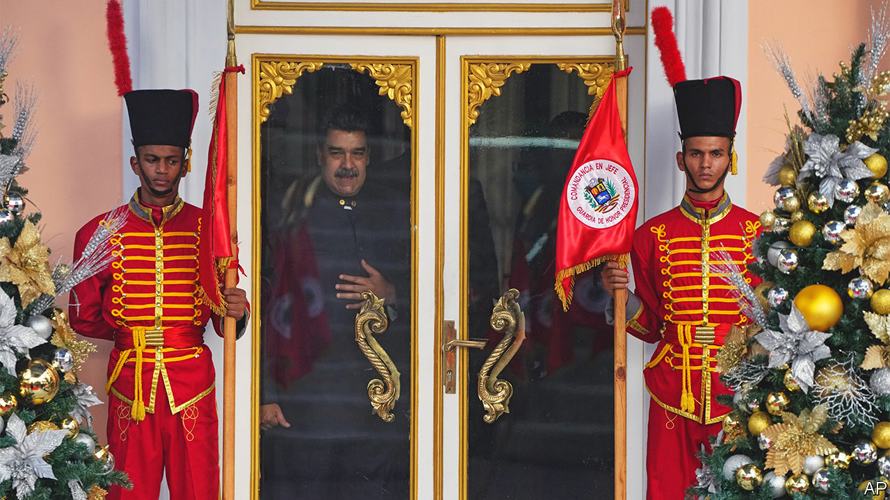
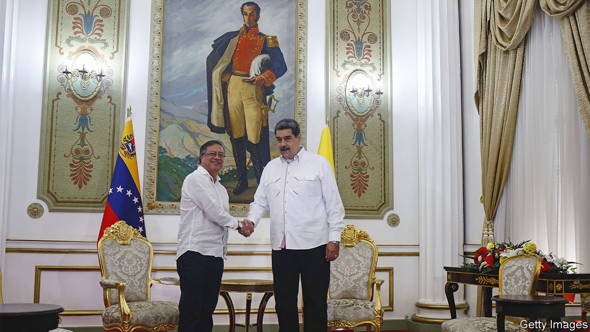
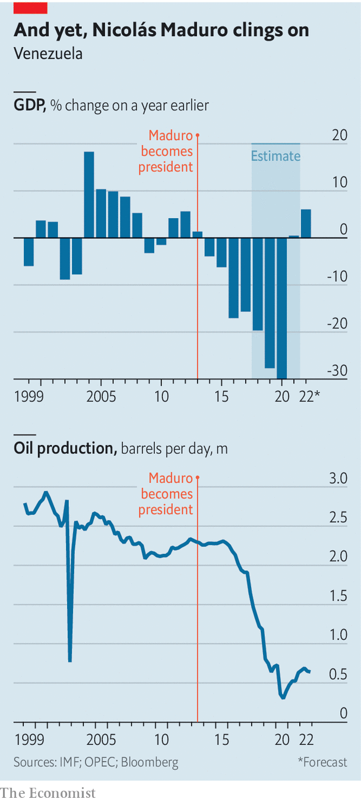

###### Oil be back

# President Joe Biden starts to lift sanctions on Venezuela 

##### Partly because of the war in Ukraine, the United States is rethinking its relationship with oil producers 

 

> Nov 27th 2022 

Things have , Venezuela’s capital. Traffic jams, absent for years, now clog up roads. Political posters, which used to loom over the city preaching grim mantras such as “socialism or death”, have been replaced by advertisements for whisky or cosmetic surgery. The buzz of a motorcycle, once something to fear in the notoriously violent capital, is more likely to herald the arrival of a food delivery than an armed robbery.

Residents, particularly the richer ones, make a sardonic observation: “Venezuela se arregló!” (or, the country “is fixed”, as someone may be with plastic surgery). But despite the veneer of better times, which followed the government’s decision in 2019 to relax price controls and allow trading in the American dollar, the country’s underlying troubles are far from solved. Over the past decade its GDP has shrunk by 70%, and around 7m people, or a quarter of the population, have left the country. 

Still, today Venezuela is very different from how it was in 2019. Back then Juan Guaidó, an opposition leader and head of the national assembly, was recognised as Venezuela’s acting president by the United States and several other democracies, on the grounds that Nicolás Maduro, an unpopular left-wing despot (pictured), had rigged an election. (In the absence of a legitimate president, the constitution allows the head of the national assembly to take the reins, pending new polls.) 

But Mr Guaidó and his backers misjudged the loyalty Mr Maduro and Hugo Chávez, his predecessor from 1999 to 2013, had bought from the military’s top brass. They underestimated the regime’s ruthlessness. And they have been wrongfooted by the war in Ukraine, which means that the United States is rethinking its relationship with . 

Today Mr Guaidó, although still referred to as “president” by the United States and Britain, wields no power. Better described as one of several opposition leaders, he spends most of his days fielding Zoom calls from a spartan office above a shopping centre. The constitutional basis for his claim to power is becoming weaker. The elected national assembly he led was replaced by one controlled by Mr Maduro’s regime after a dodgy vote in 2020. And his term as president of the assembly expires on January 5th. It looks unlikely that his opposition colleagues will elect him again.

By contrast, Mr Maduro is still very much in power after nine years. And in the past six months the pendulum of geopolitics has swung in his favour. Venezuela sits on 20% of the world’s proven oil reserves, more than any other country. The war in Ukraine has made everyone more nervous about oil supplies, and therefore made the cost of isolating Venezuela seem higher. After decades of mismanagement Venezuela’s oil industry is too run-down to make much difference to global oil markets in the short term, but the United States and others are thinking about the long term. 

Under Donald Trump, the United States imposed sanctions on Venezuela’s oil, banking and mining industries as well as more than 140 regime insiders. President Joe Biden, by contrast, is cautiously re-engaging with Venezuela. Mr Biden’s envoys have met members of Mr Maduro’s government twice in Caracas. In October, seven American citizens imprisoned in Venezuela were exchanged for two nephews of Mr Maduro’s wife, Cilia Flores. 

And on November 26th the Biden administration made a notable shift. It gave Chevron, an American oil firm which has four dormant joint ventures with PDVSA, Venezuela’s state-owned oil giant, a limited licence to pump and export oil to the United States again. There are strings attached. The proceeds are meant to pay down the billions of dollars of accumulated debt Venezuela owes Chevron. Payments of royalties or taxes to the regime, or any dividends to PDVSA, are prohibited.

Crude diplomacy

The quid pro quo is that the regime agreed to resume negotiations with the opposition, which it had suspended in October 2021. These restarted in Mexico City on the same day as the American announcement. Mr Maduro is not attending the talks himself (his son, Nicolás Maduro Guerra, is going). But they are another step towards easing Mr Maduro’s pariah status.

A display of that came in November, when Mr Maduro made a rare overseas visit. It was to the COP27 summit in Egypt, where Emmanuel Macron, France’s president, greeted him on the sidelines. The two men spoke for less than two minutes, but broke down years of barriers. Mr Macron addressed Mr Maduro as “president,” even though France does not officially recognise him as legitimate. Things “keep getting better”, beamed the Venezuelan.

Mr Maduro also managed to secure a brief conversation with John Kerry, Mr Biden’s climate envoy. This was a small victory for the Venezuelan autocrat, given that the United States has indicted Mr Maduro on charges of “narcoterrorism” and is offering a $15m reward for information leading to his arrest. The State Department later said he had caught Mr Kerry by surprise.

 


Events closer to home are also helping the tyrant come out of the cold. The victory of Luiz Inácio Lula da Silva in Brazil’s presidential elections means all the region’s main economies will soon be led by left-wing governments, which are generally less hostile to Mr Maduro than previous right-wing ones were. When Lula, as he is known, takes office in January, he is expected swiftly to resume diplomatic relations with Venezuela’s regime. 

Already , under Gustavo Petro, the new left-wing president, has begun to repair relations. On November 1st Mr Petro became the first Colombian leader in a decade to be received at the presidential palace in Caracas (he is on the left of the picture). “Colombia and Venezuela have a common destiny,” Mr Maduro said. He meant it as a compliment.

 


But foreign governments are taking a gamble by cosying up to Mr Maduro. For a start, Venezuela’s oil may be plentiful, but it is problematic. It is heavy and laborious to refine. After years of mismanagement and corruption much of the infrastructure of PDVSA is in ruins. Production this year is expected to average 650,000 barrels a day, a fraction of the government’s own target of 2m and less than a fifth of its pre-Chávez output of around 3m in 1998 (see chart). 

It will take until 2024 for a significant amount of oil to reach markets, says Ángel Alvarado, an opposition congressman who is now at the University of Pennsylvania. Even if Venezuela were to produce 1m barrels a day by 2025, that would only be about 1% of current global production. To achieve this other foreign firms such as Spain’s Repsol or Italy’s Eni would need to be able to operate without restrictions. 

It would also require a huge increase in foreign investment, which seems unlikely. Estimates vary widely but José Toro Hardy, a former director of PDVSA, thinks that $25bn a year would be needed for eight years for the company to produce as much oil as it did two decades ago. Given the regime’s record of stiffing creditors and mistreating investors, that is for now an implausibly vast sum. 

Second, Mr Maduro’s record also suggests that at the negotiating table he will not play fair. The deal being sought is, broadly, that the regime agrees to hold presidential elections with enough safeguards that they could be deemed free, and the opposition agrees to take part. The Biden administration could offer more of what it describes as “sanctions relief” if steps are made towards returning Venezuela to democracy. But Mr Maduro is unlikely to agree to an election clean enough that he might actually lose. 

Perhaps, though, he believes he could win a legitimate vote. Mr Maduro’s approval rating is 26%, according to Datanalisis, a pollster. That is low, but only slightly worse than the most popular opposition leader, Manuel Rosales, the governor of Zulia state, who is at 30%. And he is well above Mr Guaidó, who polls at 16%. The pro-regime governor of Carabobo state, Rafael Lacava, has a 40% approval rating, but has never indicated he will stand against Mr Maduro and could become an asset to the president’s re-election campaign. 

Another possibility is that the regime plans to go through the motions of being prepared to take part in a clean election, but will never submit itself to voters’ wishes. Mr Maduro is already playing hardball with the United States. On November 30th he said free elections would only be possible if “all sanctions” were removed. 

However, those who say that any discussion is better than a stand-off point to some non-electoral issues on which the two sides might agree. One is access to around $3bn of Venezuelan government assets, currently frozen in American and European banks. As the talks began in Mexico the two sides agreed to establish a United Nations-managed fund, initially focused on infrastructure improvements, including repairing the country’s electric grid and building schools.

An agreement on the format for elections is not expected to be settled in the first round of talks. But once that is decided, there remains the question of who will be the candidates. Mr Maduro is expected to stand uncontested from within the ruling PSUV party. On the opposition side, there are currently at least 20 candidates, including Mr Guaidó, on the shortlist. Originally there were more than 80. “That’s the trouble with the Venezuelan opposition: they all want to be president,” rues a diplomat in Caracas. 

The precise timing of the election is also a matter for debate. While the constitution stipulates it should be held six years after the previous one—so, in 2024—some in the government, including Diosdado Cabello, a powerful former national assembly chief, have hinted at the possibility it might be held within months. Such a decision would be made by the electoral council, which the regime still controls.

This could be part of a tactic to flummox an opposition which has yet to organise itself. But it would also help Mr Maduro and his cronies. Despite the Biden administration’s less hostile stance, the myth that “Venezuela is fixed” may be about to unravel. According to the regime’s own figures annual inflation reached 340,000% in February 2019. It was then tamed by the use of the dollar, but is rising again. It is now 155% year-on-year, the highest in Latin America. The black-market value of the bolívar against the dollar fell by 43% in the first four weeks of November, and the central bank is apparently running short of funds to prop it up. 

For years the opposition, backed by the United States, has been calling for early presidential elections. Mr Maduro might be tempted to call its bluff, and go to the polls before the bubble bursts. ■


