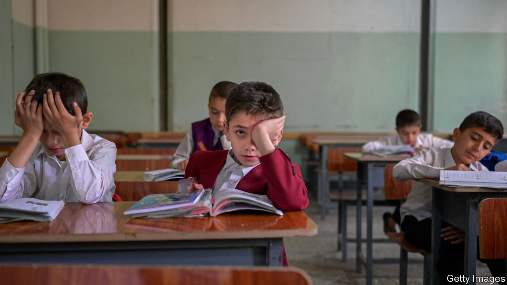
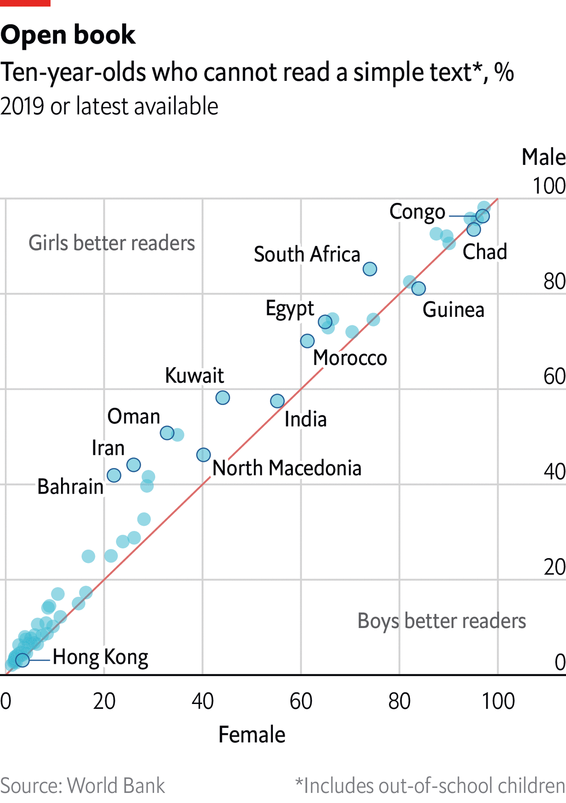

###### The Economist explains

# Why are boys doing badly at school? 

##### Peer pressure, poor schooling and biology may all contribute 

 

> Nov 23rd 2022 

AROUND THE world, girls are more likely than boys to . But once they are in a classroom, boys usually do worse. The gulf is widest in reading: in almost all countries that collect sufficient data girls are better readers than boys at ten years old. Boys also lag in international science tests, and have mostly given up a long-standing advantage in maths. Globally, colleges and universities now enrol just 88 men for every 100 women. These trends have long been starkest in rich countries, but are increasingly visible in poor ones, too—perhaps because the hurdles that long held schoolgirls back are gradually being knocked down. Why do boys do badly in school?

 


There is little evidence that boys are doing worse than they used to. Rather, high attainment by female pupils in recent years is showing that much more could be expected of their male peers. Some of the problems boys face are cultural. In workplaces around the world men still enjoy  over women, including  and greater likelihood of promotion. As a result men are less likely than women to think that excelling in school is the only way to obtain the future they desire. Meanwhile, popular culture rarely presents studying as a manly pursuit. Parents do not help, either—surveys suggest that they spend less time reading with sons than they do with daughters.

How schools are run matters, too. Boys often lack studious role models there—male teachers are in the minority in most rich countries. A shortage of male teachers is a particular problem in places with lots of single-sex schools, such as the Middle East. Boys there are often taught by male migrants from poorer countries, who do not easily earn pupils’ respect. Boys also report higher rates of bullying at school than girls, and are more likely to say that it involves being punched or kicked. And they are more often beaten by teachers: in Zimbabwe and Singapore, for example, staff are forbidden from hitting girls but are allowed by law to wallop boys. Fear of violence increases the risk that boys will skip school or give it up early.

Some observers think differences in the rates at which boys and girls develop in adolescence contribute to the problem. In his book “Of Boys And Men”, Richard Reeves of the Brookings Institution, a think-tank, cites research suggesting that parts of the brain associated with impulse control, forward-thinking and regulating emotions mature later in boys. Mr Reeves argues that boys would benefit from starting and ending their schooling a year later than girls, so that they are better prepared to succeed in early secondary school.

The costs of boys’ struggles are huge. They are more likely to repeat years of school, which is expensive and often counterproductive, because it increases the risk of pupils dropping out. Researchers in Australia estimate that the cohort of boys who ditch school early each year costs the country A$25.9bn ($17.2bn) over the boys’ lifetimes (for young women it is A$10bn). That is through both lost earnings and knock-on effects—for instance, boys who drop out of school are more likely to commit crimes. Countries with lots of uneducated men are also more likely to breed gangs and suffer from unrest. A study of the civil war in Sierra Leone in the 1990s found that boys and young men who had received no schooling were nine times more likely to become combatants than those who had completed primary school.

Many girls still face barriers to good schooling, especially in poor countries. Destitute parents will commonly pay for their sons to get lessons before their daughters. And girls are often required to leave school if they become pregnant or are forced into marriage. These evils are recognised by donors and are becoming priorities for governments. But concerted efforts to improve outcomes for boys are uncommon, even where their needs are dire. A recent report from UNESCO, a UN body, identified 19 countries where schoolboys are doing especially badly. Only four had come up with policies to turn things around. ■

