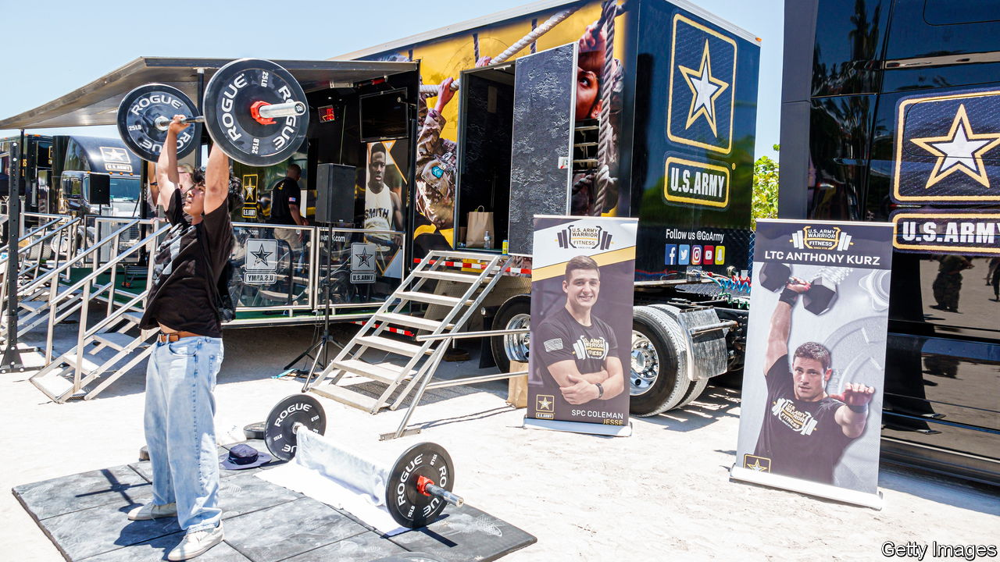

###### The Economist explains

# Why has America’s army recruitment plummeted? 

##### The pandemic is only one reason 

 

> Nov 29th 2022 

AMERICA’S ARMY is struggling to . Recruitment in the 2022 fiscal year, which concluded on September 30th, appears to have been the worst since the draft ended in 1973. The army brought in about 45,000 recruits; it had aimed for 60,000. Christine Wormuth, the Secretary of the Army, has warned that, barring a turnaround, members of the National Guard and Army Reserve will need to be put on active duty. It may also be necessary, she added, for the army “to trim [its] force structure”, which could mean shutting down units. This year’s air-force and  recruitment drives fared better, but partly because those services enlisted people from pools of “delayed-entry” recruits, who had already signed up. Even so, they, too, missed targets. What is going on?

The fallout from covid-19 is a big part of the problem. Lockdowns reduced eligibility by  and contributing to higher levels of . They also sharply limited face-to-face recruiting, most importantly in schools. Katherine Kuzminski, an expert on the armed forces and society at CNAS, a think-tank in Washington, says that men who , and thus spent less time with peers, are proving more likely to delay big life decisions, including going to college or joining up. Brian McGovern, deputy director of public affairs at the army’s recruiting command at Fort Knox, Kentucky, says that a growing “disconnect from society”, caused by the pandemic, has hampered recruitment: the proportion of eligible Americans who meet enlistment requirements has fallen from 29% in recent years to just 23%.

Although the drop is notable, those figures underline the fact that, even before the pandemic, only a small share of ostensibly eligible Americans met the army’s criteria. Recruits must be physically fit, pass a science, maths and language test, and be deemed “in good moral standing”, meaning that they have not committed a felony and do not have a serious problem with drugs or alcohol. In some cases those rules have not adapted to changes in the law. , for example, is now illegal in all circumstances in just four states, by one reckoning. But the army still considers marijuana use a disqualifier (though people who have quit can request a waiver).

On top of this, fewer Americans want to sign up these days. The army says “propensity to serve” (those who say they definitely or probably will) has fallen to 9% among eligible citizens, the lowest level since 2007 when anti-American violence in Iraq was rife. America’s  last year cannot have helped. Nor has the polarisation of its politics. On the left, a growing number of people claim that America is an imperialist power with a retrograde army that fosters belief in white supremacy. Others, on the right, believe that the armed forces are . This two-pronged assault is taking a toll on recruiting, says Mackenzie Eaglen of the American Enterprise Institute, a think-tank in Washington. The army’s mandatory covid-vaccination policy may also deter some recruits; more than a third of Americans aged 18 to 24 are not fully vaccinated against the virus.

With America’s , the army faces stiff competition from companies that have raised wages and offered bigger signing bonuses to entice applicants. It is responding by stepping up outreach in schools and offering incentives to new recruits, including a choice of first duty location and bonuses of up to $35,000 for those who can ship out within 45 days. It has relaxed policies on tattoos. In June it said that recruits who could ship out quickly would be eligible to do so without a high-school diploma—though it quickly back-tracked on that. As for whether Russia’s assault on Ukraine will boost recruitment, which soared after 9/11, Ms Eaglen reckons that would be unlikely. The threat to America, she says, would need to be more direct. ■

