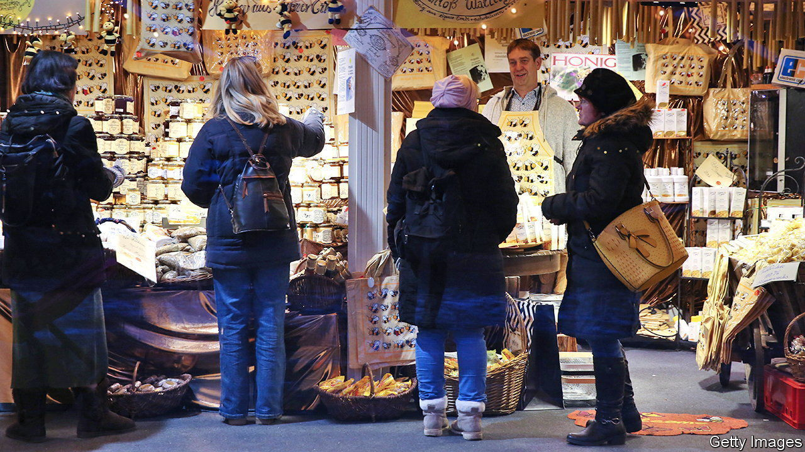
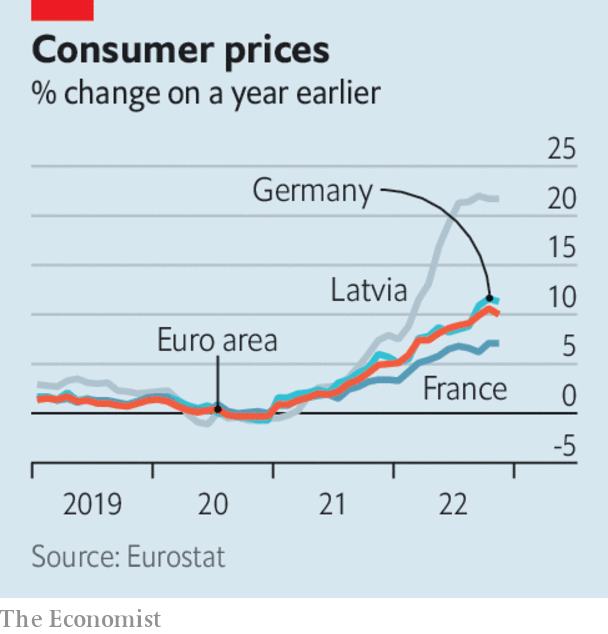

###### The world this week

# Business 

#####  

 

> Dec 1st 2022 

 


Annual  fell in November, to 10%. Energy prices also eased a little, as Europe’s mild autumn suppressed the demand for heating, dampening the wholesale market for natural gas. Those prices have started to rise again, as colder weather settles in. The average inflation figure masked regional variations. Inflation in Estonia, Latvia and Lithuania is above 21%. In Germany it is 11.3%, though that is also down on October. In Finland inflation jumped, to 9%. 

The bigger-than-expected fall in inflation sparked speculation about the European Central Bank’s next move on . Before the latest data came out, Christine Lagarde, the ECB’s president, said that the bank “is not done” raising rates. It meets on December 15th. 

In America Jerome Powell, chairman of the , gave a hawkish speech on the fight against inflation, but also suggested that the central bank will moderate the pace of rate increases when it next meets, on December 14th. Stockmarkets soared. 

 manufacturing purchasing managers’ index fell again in November, to 48, suggesting a deeper contraction in factory activity (above 50 indicates growth). Factory output has been curtailed by lockdowns and associated protests. The workers’ revolt at the  plant in Zhengzhou, which assembles the iPhone and other devices, could well affect Apple’s revenues, and break a run of 14 successive quarters in which sales have grown, year on year. 

 is reportedly slashing the salaries of 2,000 executives as it pivots to a period of slower growth. The Chinese e-commerce giant wants to improve conditions for its lowest-paid workers, following rumblings from the government about tech companies not doing enough to tackle inequality. 

Lady Luck at last smiled on the operators of , when the Chinese territory’s government agreed to extend their licences to operate for ten years. Battered by covid restrictions and the Chinese government’s increasing antipathy towards gambling, the casinos, some of which are run by American firms, such as Sands, are betting that the new licences will provide stability for investors. Their share prices jumped after the announcement. 

Flying green class

Rolls-Royce carried out the world’s first ground test of an aircraft engine that has been converted to run on  created by wind and tidal power. Hydrogen-powered planes can help the aviation industry cut its emissions, although passenger-carrying jets are still years away from entering service. Airbus, which has been aiming to introduce a hydrogen plane by 2035, warned this week that a lack of green hydrogen and associated infrastructure could delay its project. 

 published results, and said that the summer months had been a “record bounce back” from the covid era. The European airline reported that bookings for holidays over this winter were back to normal, and predicted that it will increase seat capacity from April to September next year. 

The collapse of FTX continued to reverberate around the world of cryptocurrency. , a platform offering a range of crypto services, filed for bankruptcy protection citing its “significant exposure” to FTX through reciprocal loans and credit agreements. , a cryptocurrency brokerage, was reportedly trying to avoid bankruptcy. 

 agreed to sell its business in Canada to , the country’s largest lender, for C$13.5bn ($10bn). It is Canada’s biggest-ever deal in banking. HSBC is under pressure from Ping An, a Chinese insurer and its largest shareholder, to focus entirely on its Asian business in order to boost its stock. It is also closing a quarter of its branches in Britain, its home country.

Almost 197m Americans shopped over the , according to the National Retail Federation, more than even pre-pandemic levels. More people shopped online than in store, although visits to bricks-and-mortar outlets grew by 17%, year on year, a sign that consumers are settling back into pre-covid behaviour. Retailers pray that the rest of the Christmas season will be as jolly, and that shoppers haven’t just brought forward their spending. 

Vive les misérables

A French court has decided that a consultant who was sacked for not being “fun” and avoiding  had been wrongfully dismissed. “Mr T”, as he is named in documents, was entitled to “freedom of expression” by not participating in social activities, said the court. Mr T claimed that he felt humiliated by his colleagues’ exploits, which included binge drinking and “mock sexual acts”. The ruling is good news for office workers dreading the start of the Christmas party season. 

