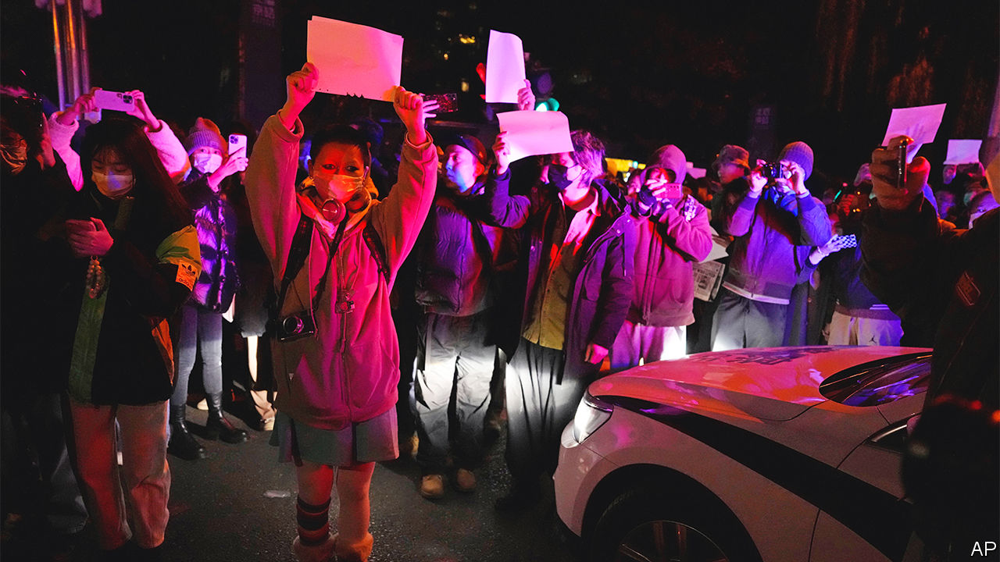
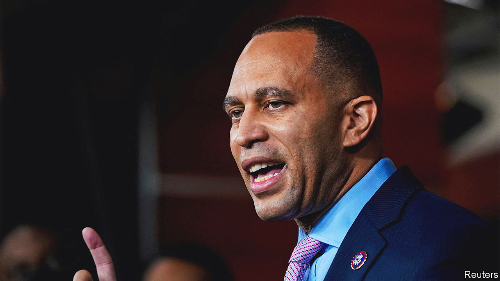

###### The world this week

# Politics 

#####  

 

> Dec 1st 2022 

 government was confronted with the boldest show of  in decades. The unrest began after a deadly fire in Xinjiang. Many Chinese blamed covid-19 restrictions for making it harder for victims to escape a blazing apartment block. Protests against the controls erupted in several cities. Some protesters risked jail by calling for Xi Jinping and the Communist Party to relinquish power. Extra police curbed the unrest in most cities. As the coronavirus spread rapidly in China, officials said lockdowns should be “imposed and eased quickly”. Efforts to vaccinate old people, long neglected, were stepped up. Mr Xi remained silent throughout. 

, the leader of China’s Communist Party from 1989 to 2002, died. Mr Jiang oversaw a wave of economic opening, but not much political reform. His colourful personality spiced up diplomatic events. In his later years he became something of a folk hero for younger Chinese, who made him the subject of viral internet memes. 

A fresh wave of attacks left much of Kyiv without power and water again. Although  engineers swiftly repaired much of the damage, rolling blackouts are still affecting most of the capital as energy companies struggle to ration supplies. A meeting of NATO foreign ministers pledged more help to fix infrastructure. Many more generators, and fuel to power them, will be needed.

Turkey’s foreign minister said that Finland and Sweden must do more to stifle Kurdish propaganda emanating from their territory if Turkey is to support their membership of . Hungary, the other holdout, has said it will ratify Finland’s and Sweden’s membership early next year. 

Foul play?

The foreign minister of  died suddenly. Vladimir Makei, 64, was rated by Westerners as one of the more approachable members of the Belarusian regime, though he backed the crushing of democratic opposition to it. He also brazenly denied that Belarus was an accomplice to Russia’s invasion of Ukraine, which was partly launched from Belarusian territory. 

Protests persisted in . The UN Human Rights Council voted to set up an investigation. Its rapporteur criticised Iran’s “campaign” of sentencing protesters to death. Four Iranians were condemned to die, supposedly for spying for Israel. Another was reportedly shot dead. Like many dissidents, he was celebrating Iran’s elimination from the football World Cup. 

A report said  president, , might have broken the law by not reporting cash kept in his game ranch, which came to light after unknown thieves stole it. Parliament will have to decide whether to impeach him. Mr Ramaphosa had been trying, often ineffectually, to clean up corruption. The pro-corruption wing of his party would love to oust him. 

At least 14 people were killed when security forces ended a siege at a hotel in Mogadishu,  capital, involving jihadists from al-Shabab, a rebel group. 

Officials in the  complained that a camp full of Russian mercenaries had been bombed. The Wagner Group, run by a pal of Vladimir Putin, has been helping the CAR’s government, which has a lot of precious minerals. The officials said the aircraft that bombed the camp flew back “to the north”, meaning to Chad, which has awful relations with the car. 

The prime minister of the island state of , the second-smallest member of the African Union by population, said there had been a coup attempt against his government. He released a video message to “reassure” the people that it had failed.

Two members of the Oath Keepers, a far-right group, were found guilty of  in relation to the storming of America’s Congress on January 6th 2021. They had helped organise the mob that tried to stop Joe Biden from being confirmed as president, after Donald Trump falsely claimed that his election was fraudulent. 

 


 was elected by  in the House of Representatives to be their leader, following Nancy Pelosi’s decision to step down. He is the first black person to lead a party in Congress. 

The American Senate passed a bill confirming the right of  to marry. The bill, passed with support from some Republicans, would render moot any hypothetical future challenge to the Supreme Court ruling in 2015 that made same-sex marriage legal everywhere in the United States. It is expected to become law this month.

In  a court upheld a ban on gay marriage, but offered hope to same-sex couples by also finding that the lack of laws to protect their families violated their rights.  parliament decriminalised gay sex, but tightened the law defining marriage as between a man and a woman. 

Protesters from a Christian fishing village in  state of Kerala clashed with police as they tried to stop construction of a new port. The villagers say the port will ruin their livelihoods. Hindu nationalists blame a church for the protests and have marched in support of the project. 

A suicide-bomber rammed a police vehicle escorting a polio-vaccination team in , killing four people. Islamic militants have long targeted vaccination workers, falsely claiming that they are sterilising Muslims. Pakistan and Afghanistan are the only two countries where polio, which paralyses children, is still endemic. 

Joe Biden started to lift American sanctions on . Chevron, an American oil giant, was granted a limited licence to start pumping and exporting oil to the United States. In exchange Nicolás Maduro’s autocratic regime agreed to resume talks with the opposition. America has warned that it will restore sanctions if Mr Maduro reneges on the deal.

Thousands of  rallied in support of Andrés Manuel López Obrador, the president. Many allegedly arrived on buses paid for with public money. Mr López Obrador had called for the march in response to a recent big protest by Mexicans who say he is trying to undermine the electoral system. 

It hasn’t gone away

The annual World AIDS Day was a reminder that, despite much progress, 650,000 people a year die because of . The latest weapons, prophylactic drugs, are now being rolled out, but 1.5m people a year are still being infected. 

