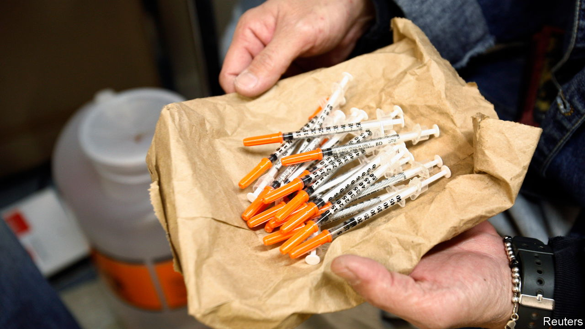

###### Academic sparring

# America’s syringe exchanges kill drug users 

##### But harm-reduction researchers are unwilling to admit it 

 

> Dec 1st 2022 

“These guys keep the costs down for me,” Flaco says. On a Friday evening the 52-year-old comes to collect needles and tourniquets from the syringe-exchange van parked beneath the west Bronx’s elevated train line. Flaco started using drugs at the age of six. The free needles keep him safe, he says, and make things just a little bit easier. 

The van Flaco frequents is run by OnPoint NYC, one of 185 syringe-exchange programmes across America. Having started as an underground effort by non-profit groups in the 1980s, such exchanges took off as the AIDS epidemic burgeoned. The logic was simple: if barriers to obtaining needles were removed, drug users would stop sharing them and rates of HIV infections would fall. The schemes were a test of “harm reduction”, the idea that de-emphasising abstinence and destigmatising drug use would improve outcomes for addicts.

Critics feared that harm reduction would encourage drug use. Upon launching a pilot needle-exchange programme in New York City in 1988 the city’s health commissioner was accused of running a genocidal campaign against black constituents. That same year Congress banned the use of federal funds for syringe exchanges. 

Decades of research prove that these programmes curtail disease. Junkies are in fact less prone to sharing needles when they get free ones. That sharply decreases rates of blood-borne illnesses. In 2014 an analysis found that every dollar spent on syringe exchanges spares the government around $7 in HIV-related health-care costs. Needle exchanges opened across America and Europe. For years no one detected the feared rise in substance abuse. 

That was before the opioid crisis plagued America and economists started looking into the trade-offs. A new study by Analisa Packham published in the  uncovers an uncomfortable truth: this particular harm-reduction tool does lots of harm. Ms Packham compares how drug users fared in counties that opened syringe exchanges between 2008 and 2016 with those in counties that did not. Before the clinics opened, upticks in HIV diagnoses or overdoses in one set of counties were mirrored in the other. Once a syringe exchange came to town, outcomes diverged. Rates of HIV fell by 15% in counties with the new programme. But deaths soared. On average syringe-exchange programmes led to a 22% spike in opioid-related mortality. 

Ms Packham notes that when fentanyl hit the market in 2013 the danger posed by needle exchanges increased. The synthetic stuff, which is 50 times more potent than heroin, is responsible for most American overdoses. Now that HIV is no longer a death sentence and opioids are more fatal than ever, the costs of drug addiction are far higher than they were—and the benefits of reduced HIV infections are lower.

Simply lowering the risks of getting sick—and the costs of paraphernalia, as Flaco from the Bronx articulated—could also incentivise drug use. Distributing PrEP, an HIV-prevention medication, has been shown to make gay men less inclined to use condoms during sex. So too could harm-reduction tools make addicts use drugs more incautiously. In a study published in 2018 Jennifer Doleac and Anita Mukherjee found that when states legalised naloxone, a medication that reverses overdoses, opioid abuse increased. Though lauded by public-health advocates, naloxone did not save lives as intended. In some regions, fewer addicts died; in others, more did. 

These works have been met with anger. Their findings upset harm-reduction defenders who consider their efforts already besieged by critics. The experience was so miserable that Ms Doleac, who studies crime, has decided never to write another health paper.

Leo Beletsky, a former drug dealer, now at Northeastern University, deems Ms Packham’s findings “nonsensical” and thinks her paper should not have been published. Don Des Jarlais, at New York University, argues that addicts do not respond to incentives like others do, making the moral-hazard effect inconceivable. Susan Sherman of Johns Hopkins University says she doubts that new evidence that harm reduction does more bad than good would convince her to disregard previous research demonstrating otherwise.

A barrage of complaints led the editors of the  to retract a meta-analysis that found that safe-injection sites, where users do drugs in supervised settings, did not decrease rates of deadly overdose. “Retractions used to be reserved for fraud,” says Keith Humphreys of Stanford University, a former drug-policy adviser for the Obama administration. No longer, it seems.

The economists aim to do no harm. They want to show which policies work. If syringe exchanges were better at referring addicts for treatment they could have more desirable outcomes, Ms Packham notes. Harm-reduction researchers admonish her for ignoring precedent. Disregarding the canon can indeed be dicey. But ignoring fresh evidence is worse. ■


