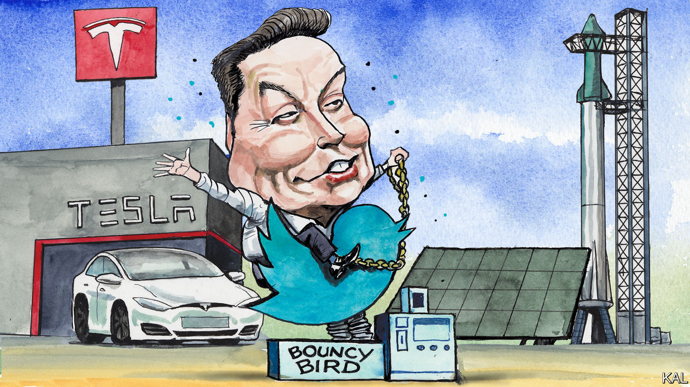

###### Lexington

# Elon Musk is showing what a waste of time Twitter can be 

##### He, and his critics, should remember the meaningful work he is capable of 

 

> Dec 1st 2022 

“Rub it out!” stormed Henry Ford when his sensitive son Edsel summoned the courage to present him with a proposal to modernise the Model T. It was 1924, and Edsel saw the threat posed by the stylish cars emerging from General Motors. General Motors, of course, would go on to become the world’s biggest carmaker and then the acme of sluggishness. To learn how to make better cars, it spent billions creating a new company, Saturn, and undertaking a joint venture with Toyota at a factory in Fremont, California. Both attempts to overcome inertia failed.

Yet now automakers not just in America but around the world are panting to transform the very nature of their vehicles. That is in no small part thanks to the company that paid next to nothing for the idle plant in Fremont and started making electric cars there. To the dismay of a short-selling multitude, Tesla proved to be the first successful startup in the American car industry since Chrysler, which was founded in 1925. 

Rapturous about internal combustion—they could veer toward poetry when discussing its roar and smell—American car executives used to scoff at electric vehicles. Their forays into the technology yielded mediocrities that they seemed to hope would disillusion the tree-huggers who bought them. By showing the electric car could be glamorous, Elon Musk changed the industry. 

Around that same time he was rejuvenating another doddering industry. Few experts thought SpaceX could succeed, either. They scorned the idea that anyone would entrust a satellite to a reusable rocket, a far cheaper option. Yet this year SpaceX, the low-cost ticket to orbit, is launching about a rocket a week. America is leading an industry it had all but ceded to Russia and is boldly planning ventures into the solar system once again.

You will read some of the less appealing bits about Mr Musk shortly. It seemed worthwhile first to note a couple of his achievements—he also helped lead what became America’s largest installer of solar panels—because of the condescension and even hate bucketing upon him from America’s left-leaning press these days. Sam Bankman-Fried may have built his reputation as a visionary upon sand, but it is Mr Musk who has become the face of capitalist perfidy. Yet has any other business person (or, let’s face it, journalist) done as much to combat climate change? Or to save democracy in Ukraine, where Mr Musk’s Starlink satellite network has kept the government, citizens and soldiers online?

The contempt for Mr Musk says something about the press and about Mr Musk, and a lot about Twitter. Twitter has never been among the most popular social networks, but since launching in 2006 it has been an efficient means for discovering links to important news and big ideas. Probably for that reason it has been disproportionately valued by those who traffic in such things, including politicians, politically minded celebrities and journalists. 

Yet Twitter has also proved to be a lousy medium for discussing important news and big ideas. It disdains nuance, amplifies misstatement and rewards conflict, cruelty and trolling. These are reasons Twitter’s most adept user was probably Donald Trump. (In “Confidence Man”, Maggie Haberman reports that an aide compared the moment Mr Trump first pecked out his own Tweet, rather than dictating it, to the scene in “Jurassic Park” when dinosaurs discover they can open doors themselves.)

Like Mr Trump, other politicians, celebrities and journalists discovered they could deploy Twitter best to market themselves, courting followers by applauding certain points of view and condemning others. As a result, within the chattering classes, Twitter has become a powerful enforcer of conformity. 

When Mr Musk took over Twitter in late October, a kind of mass hysteria seized those obsessed with the platform. Though bemoaning Twitter’s toxicity has been a staple of its habitués for years, many became convinced it turned venomous overnight. Then one evening in mid-November, the herd decided Twitter was about to collapse; many wrote poignant farewells, recalling the good times. As Twitter perversely endured, some denizens urged their “followers”—why does anyone embrace that label?—to flee to other platforms, even as they kept tweeting. Mr Musk’s decision to allow Mr Trump back onto the platform was the last straw for a few, though why Mr Trump was beyond the pale and Nicolás Maduro just fine was the kind of question Twitter had no time for. 

No way to save humanity

The grandiosity and superficiality make for classic Twitter. But it is less amusing that Mr Musk is exemplifying the foolishness. He is at risk of turning himself into a spokesmodel for everything shoddy and obnoxious about his product. There is a principled argument for giving Mr Trump another chance on Twitter, but Mr Musk did not make it. Instead he polled users. He has tweeted insults, sexist tropes and at least one conspiracy theory, and raised doubts even about his idea of free speech. He has delighted in trolling critics. That is understandable (just about everyone who is Twitter-famous does it), but it seems unwise for Twitter’s owner to act like just another of its tribal warriors. As Twitter has done to others, it may take his point of view—libertarian, contrarian—and make it harsher, more performative, much less interesting. 

Above all, Mr Musk is demonstrating what a frivolous distraction Twitter can be. “The point is to maximise the probable lifespan of humanity,” he once told a biographer, Ashlee Vance, in explaining why he was devoted to turning humans into a multiplanetary species. It would be arrogant to bet against Mr Musk, but if civilisational transcendence is the ambition, Twitter seems like a crazier moon shot than SpaceX or Tesla ever was. Maybe he will turn Twitter into the constructive public square he envisions, making it a truthful resource and revitalising America’s bloated, unreliable news industry. But, for now, Twitter seems like a waste of his time, even more than it is for everyone else. ■


 (Nov 17th)


