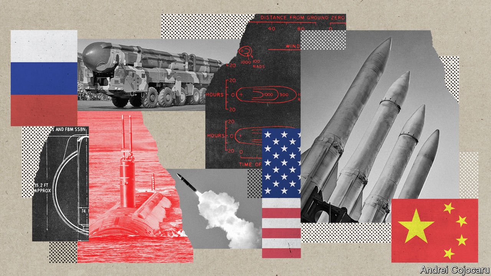
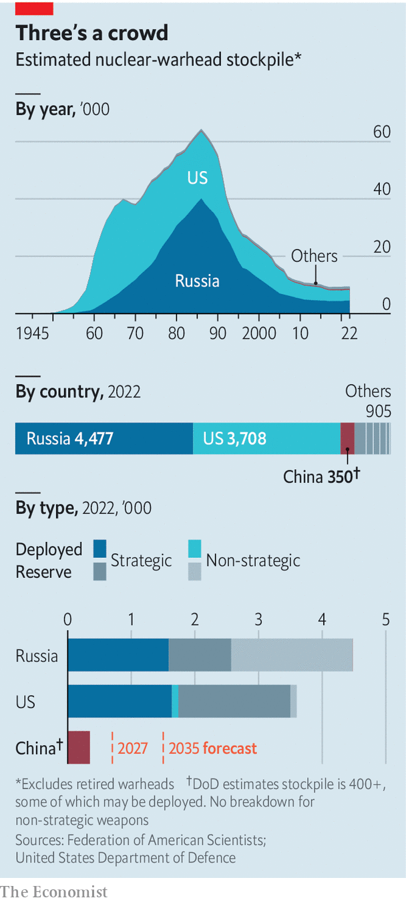

###### And then there were three

# How will America deal with three-way nuclear deterrence? 

##### It risks a new arms race, not only against Russia but also against China 

 

> Nov 29th 2022 

THE LANKY Minuteman intercontinental ballistic missile and its squat naval cousin, Trident, stand sentinel near Omaha, outside the headquarters of America’s Strategic Command, which is in charge of America’s fearsome nuclear arsenal. Inside, STRATCOM’s personnel say they have been at “battle stations” since the start of Russia’s invasion of Ukraine in February,  for any sign that Vladimir Putin might act on his threats to use nukes. For Admiral Charles Richard, the commander, the war in Ukraine marks a new era in which big powers use nuclear weapons to coerce rivals. But “this is just the warm-up,” he declared on November 3rd. “The big one is coming. And it isn’t going to be very long before we’re going to get tested.”

 


The “big one” is China, which is fast expanding its nuclear stockpile from about 200-300 warheads at the start of the decade to perhaps 1,500 by 2035, according to the Pentagon’s latest annual report on China’s , published on November 29th (see chart). Its arsenal would thus start to resemble those of America and Russia, whose long-distance “strategic” nukes are capped at 1,550 deployed warheads each under the New START treaty (though, unlike China, they have thousands more shorter-range nukes as well as warheads in storage).

The cold war, in which America and the Soviet Union menaced each other with tens of thousands of nukes, was scary enough. In the new age America confronts not just Russia but also China. New weapons—among them hypersonic missiles that are hard to detect and shoot down, and space and cyber weapons that threaten command-and-control systems—may unsettle the nuclear balance. Worse, decades of arms-control agreements may end by 2026. A new nuclear-arms race looms. Many think that it has already started.

Admiral Richard last year sounded the alarm that China was staging a “strategic breakout”. Now he warns that America is losing the military contest: “As I assess our level of deterrence against China, the ship is slowly sinking.” President Joe Biden says America faces a “decisive decade”. In a flurry of national-security policy documents this autumn his administration classifies Russia as the “acute” threat and China as the “pacing challenge”.

“By the 2030s the United States will, for the first time in its history, face two major nuclear powers as strategic competitors and potential adversaries. This will create new stresses on stability and new challenges for deterrence, assurance, arms control, and risk reduction,” declares the Nuclear Posture Review (NPR).

STRATCOM says it needs a new generation of theorists. Admiral Richard compares the conundrum to the three-body problem of astrophysics. The motion of two celestial bodies in orbit around each other is easily predicted by Newton’s mechanics. Add a third body, and their movement becomes chaotically unpredictable. Should America keep concentrating on Russia, whose nuclear arsenal still poses “an enduring existential threat”, and accord less priority to China, or vice versa? 

Like many nuclear powers, China long adhered to a form of minimum deterrence, whereby a few hundred warheads are deemed sufficient to ensure enough survive a surprise attack to inflict devastating retaliation. In the cold war America and the Soviet Union lived instead by the mad maths of “counterforce”, believing that nuclear war could be won with ever more weapons, many aimed at their foe’s nukes.

From 60,000-odd warheads in the mid-1980s, their stockpiles shrank through arms-control deals. New START now limits their “strategic” nukes, such as intercontinental ballistic missiles (icbms) with a range of 5,500km (3,420 miles) or more. Each can deploy 700 launch platforms (icbms, submarine-launched missiles and heavy bombers) and 1,550 warheads. 

Disarmament advocates want further limits. Some have called on America to adopt a policy of “no first use” akin to China’s declared stance. Mr Biden campaigned for a looser formulation, that the “sole purpose” of nuclear weapons is to deter nuclear attack. But the war in Ukraine and an outcry among allies—who feared a weakening of the American nuclear umbrella—put paid to that. The Biden team instead declared fuzzily that the “fundamental role” of nukes is to deter nuclear attack.

One reason the administration has not done more to reduce the role of such weapons is that China appears determined to increase it. Its nuclear triad is growing apace. It is digging three vast fields with at least 300 silos for icbms. America says its Jin-class submarines have now been armed with JL-3 missiles, able to reach the continental United States from protected waters close to China. China has also deployed the nuclear-capable H-6N bomber, equipped for air-to-air refuelling. Having long kept warheads separate from missiles, China seems to be shifting to rapid “launch on warning” of an incoming nuclear attack, as in America and Russia.

Admiral Richard argues that, with such “breathtaking” expansion, China is seeking to “confront and coerce other nuclear-capable peers”. But James Acton of the Carnegie Endowment for International Peace, a think-tank, questions whether China can produce fissile material as fast as the Pentagon forecasts. He argues that China’s behaviour may be caused by fear that its modest arsenal is vulnerable to America’s more capable spy satellites and missiles. 

The “security dilemma” of the nuclear world is such that one man’s defence is often the other’s offence. China’s test last year of a globe-circling hypersonic weapon may reflect an effort to ensure that any retaliatory strike can get through America’s missile defences; or it could be a step towards delivering a surprise first strike. 

Tong Zhao, of Princeton University’s Programme on Science and Global Security, notes that China’s policy has become more opaque and its language tougher, with talk of “strategic victory”. He argues that China, as it gains a military edge in its region, may worry that America could use nuclear weapons to defend . But Xi Jinping, China’s leader, may have a political aim, suggests Mr Zhao: to hasten the end of the Western-dominated order and force America “to accept peaceful coexistence with China and treat it with respect”. 

For now, China seems uninterested in arms control. It says it will talk about limits only when America and Russia bring their stockpiles down to Chinese levels. In any case, it dislikes the intrusiveness of US-Russia verification regimes. For all of Mr Putin’s nuclear threats, and American warnings of “catastrophic consequences”, the two sides still regularly exchange information about their strategic weapons. 

START anew

That is good. The bad news is that talks between American and Russian officials, who were due to meet in Cairo this week to discuss resuming mutual inspections, have been postponed. New START expires in 2026. It is the last major accord between the nuclear superpowers after America withdrew from the Anti-Ballistic Missile Treaty in 2002 (to pursue missile defences), the Intermediate-Range Nuclear Forces Treaty in 2019 (citing cheating by Russia) and the Open Skies treaty in 2020 (ending mutual reconnaissance overflights).

America wants any successor to New START to cover nukes that are currently excluded. Among them are esoteric strategic Russian weapons under development, such as a nuclear-powered torpedo, and thousands of “non-strategic” or  with a shorter range and usually a lower explosive power. 

Time is short. America and Russia are unlikely to resume nuclear talks while war rages in Ukraine. They could keep abiding by the terms of New START after it expires, but that may not last without a new accord in sight. A Republican president, if one is elected in 2024, may be disinclined to negotiate a narrow US-Russia deal.

Hawkish Americans think it is time to rebuild the nuclear arsenal. They include Franklin Miller, a former Pentagon official who helped slash America’s stockpile in the 1980s and 90s by shrinking the bloated target list and removing the “overkill” of using several warheads to destroy a single target. He thinks America should roughly double its arsenal to 3,000-3,500 deployed strategic warheads—within a treaty if possible or unilaterally if not. The aim is to ward off Russia and China simultaneously, because an alliance between the two cannot be ruled out, he says. 

Russia and China would surely respond with still more nukes. Little matter, retorts Mr Miller. If they decided to match or exceed America’s arsenal they would be wasting money on nukes that would only “make the rubble bounce”. Others muse that 6,000 warheads would deter smaller powers from trying to match big ones.

In contrast, Rose Gottemoeller, who negotiated New START, warns against throwing away the gains of decades of arms control. America and Russia remain each other’s most serious nuclear threat, and so have an interest in a new treaty. Russia, in particular, now faces an America that is modernising its triad and command system. China is a long way from parity, she notes, and America should not give up on seeking agreement with it. Rather than be drawn into a nuclear spiral, America should concentrate on competing in new areas of technology, such as quantum computing and artificial intelligence.

Team Biden says it does not need more nukes. Yet nuclear posture is in part political signalling, and politics may eventually  America to re-arm. The risk of Russia using nukes rises as it loses ground to Ukrainian forces. As China’s military force grows, so will America’s alarm. Some think America should already reload its nuclear bombers within the rules of New START. Once the treaty expires, both America and Russia can bring lots of stored weapons back into service. February 4th 2026, the last day of New START, may mark the start of a new nuclear race—this time one that is three-sided and perilously complex. ■


