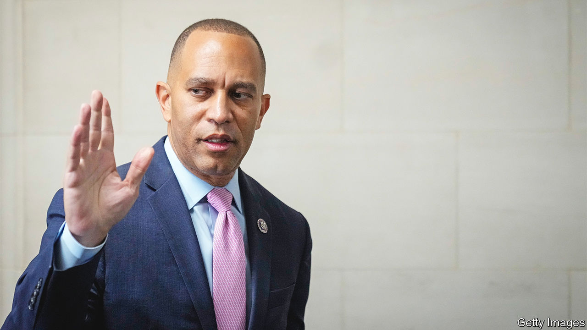

###### To the winners, the spoilers

# The Democrats muster an orderly leadership succession 

##### Despite losing the House, the party has avoided the visible divisions of the Republicans 

 

> Nov 30th 2022 

IN FOOTBALL, most managers have short tenures and are forgettable. Longevity is the key to legacy. So too when it comes to party management in Congress. In the 20 years since Nancy Pelosi took control as Democratic leader in the House of Representatives, more than 500 fellow party members have worked under her management. But that era is now closing. The first and current female speaker of the House will give up legislative coaching at the age of 82, choosing to stand down rather than take the demotion to minority leader, after  of the chamber in the midterm elections.

The orderly transition went as planned. Hakeem Jeffries (pictured), a 52-year-old congressman from New York, unanimously won an intra-party vote to succeed Ms Pelosi and become minority leader—with a historic claim in his own right. Mr Jeffries is the first African-American to lead a major party in Congress. He could also become the first African-American speaker if Democrats were to recapture the chamber on his watch. 

The rest of the gerontocratic guard is changing, too. In 2022 all three of the top Democrats in the House of Representatives were octogenarians. With Katherine Clark of Massachusetts taking over as second-in-command, and Pete Aguilar of California as third, the new leadership will be, on average, three decades younger. Unlike Republicans, who have term limits that keep rotation of important committee assignments fairly frequent, Democrats have been wedded to a system of seniority, which leaves junior members (including those with nearly a decade of experience) frustrated. Fittingly, Mr Jeffries has promised to reform that system.

Being leader of the minority party, which is largely disempowered in the parliamentary-style House, is at least an easier task than whipping the majority into shape. Even before their turn in power formally begins in January 2023, Republicans are already learning this lesson. , their current leader in the House, has been desperate for the job since he failed to obtain it in 2015. And the California congressman might fail again.

His first campaign fell apart after he admitted on Fox News that the explicit purpose of a Republican-led investigation into the attack on American diplomats in Benghazi, Libya, in 2012 was to damage Hillary Clinton (the party had different standards of decorum then). Whereas the previous two Republican speakers, John Boehner and Paul Ryan, have trouble containing their contempt for Donald Trump, Mr McCarthy recognised early on that the only path to power was acceptance. Having aligned himself closely with him, Mr McCarthy contemplated a change of heart after the attack on the Capitol on January 6th 2021, only to change his mind again and fly weeks later to Mar-a-Lago, the president’s Florida resort, and try to make up.

All the acting and auditioning means that, though most Republicans find Mr McCarthy perfectly agreeable, many do not respect him. Given the Republicans’ razor-thin majority in the new Congress, only five defections within his party would be needed to deny him the speakership. And five Republicans have already said they will not vote for him. Most are well to the right of the would-be speaker—despite Mr McCarthy’s decision to start courting them months ago (he has secured the endorsement of Marjorie Taylor Greene, a prominent, conspiratorial congresswoman from Georgia, for example).

That means that the start of the next Congress may be more dramatic than Mr McCarthy had hoped. One of its first acts is to elect the next speaker, who must win an absolute majority among the assembled representatives. If they cannot agree, the balloting continues with a limitless number of rounds, like the election of the pope but without the smoke. 

Congress has got stuck here before and chosen to simply go with the plurality-winner. In 1849 the House amended its rules after it was fruitlessly in session for 19 days. It did so again in 1856 after the first 129 tries failed. Were he so committed to wielding power, Mr McCarthy could revive this ancient precedent. The alternative, being passed over once again, might be too much to bear. ■


