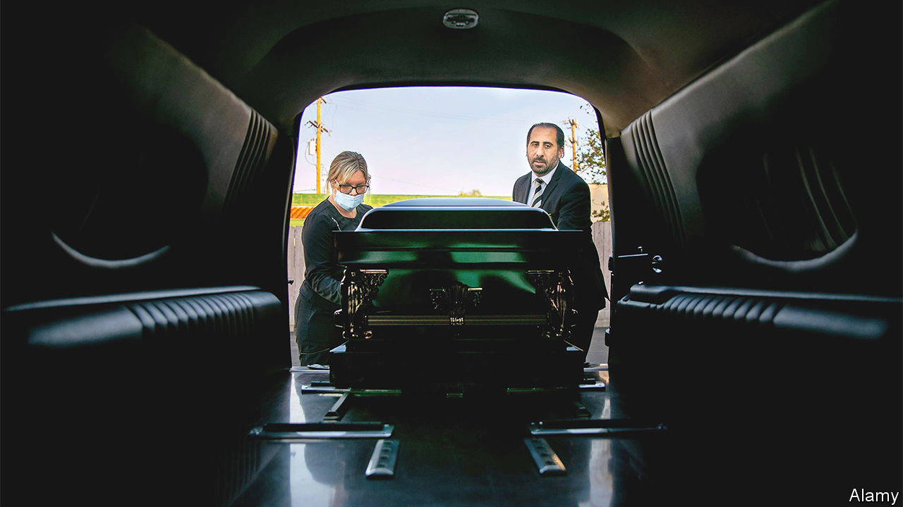

###### Morticians

# Women are revitalising America’s funeral-services industry 

##### A once-conservative industry has started to change 

 

> Dec 1st 2022 

NOT LONG ago one could admire Crystal Jovae Coratti’s handiwork from the audience at Chicago’s prestigious Goodman Theatre. Ms Coratti designed costumes and powdered actors with make-up. For “The Iceman Cometh” she distressed the trousers and clothes worn by a group of revellers looking for redemption at a bar in New York. These days Ms Coratti displays her talents in a less lively venue: a funeral home. To the surprise of family and friends she became a funeral director and embalmer, trading cadavers for actors. “Almost everyone was pretty gobsmacked because it was so out of left field,” she says.

Like graves in a forlorn cemetery, American burial traditions lay undisturbed for most of the 20th century. Interment was the standard practice, funeral homes were owned and run by families and most memorial-services directors were men. But traditions are changing. 

These days nearly 60% of Americans are opting for cremation, a cheaper and more flexible alternative to burial (in a costlier option, some firms let you launch your relative’s ashy remains into space.) Funeral homes also are withering: since 2010 more than 1,000 have closed, and between 2011 and 2018 enrolment in mortuary schools dropped by nearly 20%. And women are now revitalising the industry.

In 2021 accredited mortuary-science programmes churned out more than 1,500 embalmers and funeral directors. About 70% were women—and their share among first-year students is growing. “When we think about who is a funeral director, we typically think white male. That is no longer the case,” says Leili McMurrough, president of Worsham College of Mortuary Science in Illinois and chair of the accreditation board for mortician schools. It also is no longer the case that funeral services is an exclusive family trade. Ms McMurrough reckons only a tenth of Worsham’s graduates come from legacy funeral homes.

In many ways Ms McMurrough is the archetype of the new funeral director. An Iranian-American millennial, she was studying law when she first learned about mortuary work. “I had never gone to a funeral before,” she says. “I just didn’t even know how to pursue it.” She enrolled in mortician school. During the week she attended law lectures and over the weekend she embalmed bodies. She passed the bar and became a state-certified mortician the same year. Ms McMurrough now presides over a college where former bartenders, cosmetologists, nurses and even an erstwhile amusement-park employee study mortuary sciences.

What accounts for the sudden surge of women in America’s funeral parlours? The general explanation—offered by some morticians themselves—is that women are drawn to the work because they are more empathetic than men. That may be true to a certain extent, as studies support the generalisation, but empathy seems a better explanation for why women, having already opted to become funeral directors, are succeeding in the role. “You have to make a connection with people right away [because] you have a very small window of time to get a lot of information,” Ms McMurrough explains.

A more likely reason for the numbers entering the profession is that the job attracts women in their 20s and 30s who are seeking a vocational path that has a relatively low entry bar and promises a decent salary. Mortuary-sciences programmes are about two years long and cost less than $25,000. Job placement is almost guaranteed, especially since 60% of funeral-home owners plan to retire in the coming years. Online education is probably helping to change things, too. Mortuary schools arrived late to distance learning—under Ms McMurrough’s leadership Worsham started offering online classes in 2019—but last year nearly half of the graduates were online students.

Ms McMurrough says newcomers are revitalising the industry as they emphasise personalised services instead of offering a rote set of options. But some curmudgeons still express scepticism about whether women are fit for the job. Ms McMurrough often gets asked if they are strong enough to lift a body. “Yes,” she responds. “It’s all about training.” ■


