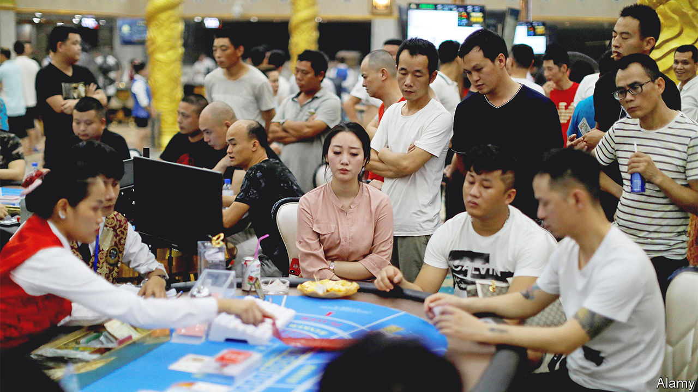

###### Cross-border gambling

# China’s ban on gambling is a cash gift to the rest of Asia 

##### But Xi Jinping wants to stop Chinese high-rollers rolling abroad 

 

> Dec 5th 2022 

James packer, an Australian casino tycoon, illustrated his industry’s biggest opportunity with a statistic: 80% of Chinese travelling abroad for the first time visit a casino. In a society that loves to gamble, the Communist Party has for decades bottled up demand by banning the practice, with the paltry exception of China’s state lottery. And as more and more Chinese have become rich enough to travel, that pent-up demand has burst across Asia and beyond. “China’s middle class will change the world,” Mr Packer predicted.

It has transformed Asia’s gaming industry. Most of the 340 or so casinos in South-East Asia were set up with the explicit aim of luring Chinese gamblers. And many have enjoyed a bonanza: an estimated 1trn yuan ($144bn) in gambling money leaves the Chinese economy every year.

Much of Asia’s gaming growth took place in Macau, which preserved its status as an offshore haven for Chinese gambling after its emergence from Portuguese rule in 1999. But the growth has been widespread. Ben Lee, head of iGamiX, a gaming consultancy, seems almost misty-eyed as he recalls the arrival in Australian casinos of the first high-rolling Chinese tourists: “All of a sudden the whales from South-East Asia were nobodies.”

Everyone wanted a piece of the action. Singapore legalised gambling and in 2010 opened two casinos, which raked in stratospheric profits. In 2016 Japan unbanned casinos, although its first new one will not open until the second half of the decade. Even Vladivostok devised plans to become a Russian Las Vegas for Chinese gamblers. Several Asian countries, meanwhile, took steps to protect their own citizens from the fleecing they planned for China’s; Japan and Singapore introduced rules to restrict access to the new gambling dens.

Yet the Chinese money tree looks increasingly imperilled, not only because, with the country’s borders still sealed, far fewer Chinese are travelling abroad. As well as offending Chinese puritans, gambling is responsible for an estimated fifth of illegal capital flight out of China. Under Xi Jinping, China is therefore trying with increasing vigour to extend its curbs on gambling to the cross-border variety.

Mr Xi has told Macau’s casinos to pivot to shopping and conferences. He has tightened money-laundering controls and squeezed the “junket” agencies that help gamblers dodge China’s strict capital controls. Anyone who helps a Chinese citizen gamble abroad faces up to ten years in jail. With Chinese gamblers now largely absent, Asia’s casinos are hoping to diversify. Ciarán Carruthers, the new boss of Crown Resorts, says it aims to lure more punters from Japan, Korea and South-East Asia.

But it is hard to control the Asian industry from Beijing. As laundering money in Macau has become trickier, Chinese-owned casinos have appeared in less-regulated places south of China. The number of casino licences granted in Cambodia grew fourfold between 2014 and 2019. The centrepiece of the Golden Triangle Special Economic Zone in northern Laos is the Kings Romans Casino, a vast building with Greek-god statues and chandeliers. It is owned by Zhao Wei, a Chinese citizen under American sanctions, accused of being a transnational crime boss. (Mr Zhao, who denies the charge, calls the sanctions a “hegemonic act of ulterior motives”.)

Kings Romans Airbase?

Not all casinos rely on Chinese foot traffic. Many Cambodian and Filipino casinos double as production studios for online gambling, targeting Chinese gamblers in their homes. They might, for example, sell the livestream of a baccarat game to a middleman, who places it on websites hosted in Hong Kong. By constantly changing the web address, such operators can stay ahead of China’s internet police.

Doing so requires recruiting an army of Chinese “telemarketers”, who sit on their phones dropping the latest web address into group chats and social-media comments, along with a glowing endorsement. More than 200,000 Chinese workers ply this trade in the Philippines, which legalised online gaming in 2016. Yet that supply of imported labour has dried up during the pandemic. Many Cambodian virtual casinos have therefore started virtual scamming: they recruit workers from countries other than China under false pretences and force them to commit cyberfraud.

The big question for Asia’s casinos is not merely how soon China will let its citizens travel abroad, but how far it will go to prevent them gambling there. It has already threatened to blacklist countries that allow Chinese visitors to gamble. This helped persuade Cambodia to stop issuing licences for online casinos in 2019. In September the Philippines, where the gambling boom has generated little tax revenue and a lot of crime, said it would close 175 e-gambling operations and deport 40,000 Chinese workers involved in them. China’s authorities are increasingly trying to get such Chinese expatriates arrested and deported. Last year they arrested 80,000 people in China deemed to be involved in cross-border gambling.

Yet not everything about China’s offshored gambling problem harms its interests, says Jason Tower of the United States Institute of Peace. With the benefit of great hotels, airports and other infrastructure, Chinese casino hubs could help China exert its influence in Asia more broadly.

On the Cambodian coast in Dara Sakor, for example, what was once thick jungle is now a vast Chinese gambling development. Cambodia has leased a fifth of its coastline for 99 years to a mysterious Chinese firm that has built several casinos, as well as a golf course and 3,400-metre runway. Who knows? One day it might make a splendid Chinese military base.■


