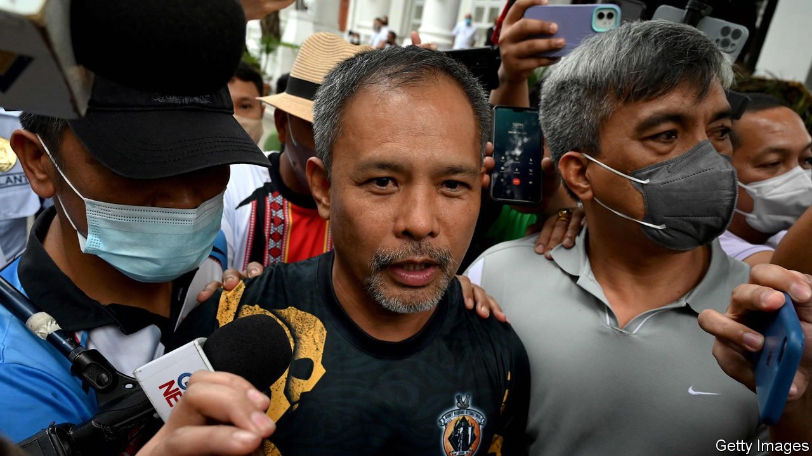

###### Killing journalists

# Dead convicts and a peculiar murder in the Philippines 

##### It may actually be solved 

 

> Dec 8th 2022 

Percival Mabasa’s murder on the outskirts of Manila on October 3rd, while the 63-year-old radio journalist was driving to work, was barely newsworthy. The Philippines is one of the deadliest places to be a journalist: 197 have been murdered in the country since it restored democracy in 1986. Unusually, however, the investigation into Mr Mabasa’s killing has produced an alleged culprit. Even more remarkably, the accused is a powerful official: Gerald Bantag, head of the national prison service. 

Mr Bantag, who was questioned by prosecutors last week though he denies the crime and has not been formally charged with it, is alleged to have ordered prisoners at the vast New Bilibid Prison to arrange the hit on Mr Mabasa, after the journalist suggested he was corrupt. One of the gunmen surrendered and confessed to carrying out the hit for a share of 550,000 pesos ($9,900). He claimed it had been arranged by a convict called Jun Villamor—who was then found suffocated with a plastic bag.

But the dead inmate had left a text message naming names. Mr Bantag, another warden and ten prisoners are accused of conspiring to commit one or both of the murders. Mr Bantag has been suspended by the recently elected president, Ferdinand “Bongbong” Marcos.

Media outlets in the Philippines are still recovering from the ravages of his father, Ferdinand Marcos, who shut them down, seized their assets and hounded journalists after he imposed martial law in 1972. Press freedom was enshrined in a new constitution after he was ousted. Yet the killing of so many reporters is only one sign of official disdain for that right. Less than 10% of the crimes have been solved. Bongbong’s predecessor, Rodrigo Duterte, said the slain reporters were to blame “because they extorted…or attacked their victims needlessly”.

Little better was expected of Mr Marcos (whose vice-president is Mr Duterte’s daughter Sara). But the investigation of Mr Mabasa’s killing has raised hope. It has also unearthed other scandals at New Bilibid, including caches of weapons, the corpses of 176 prisoners, rotting in a mortuary—and, most remarkably of all, a 30m-deep hole beside Mr Bantag’s residence at the jail, which appears to connect to a tunnel. Mr Bantag at first said the hole represented an effort to find a legendary hoard of treasure. On further questioning he said it had been intended for scuba-diving practice.

