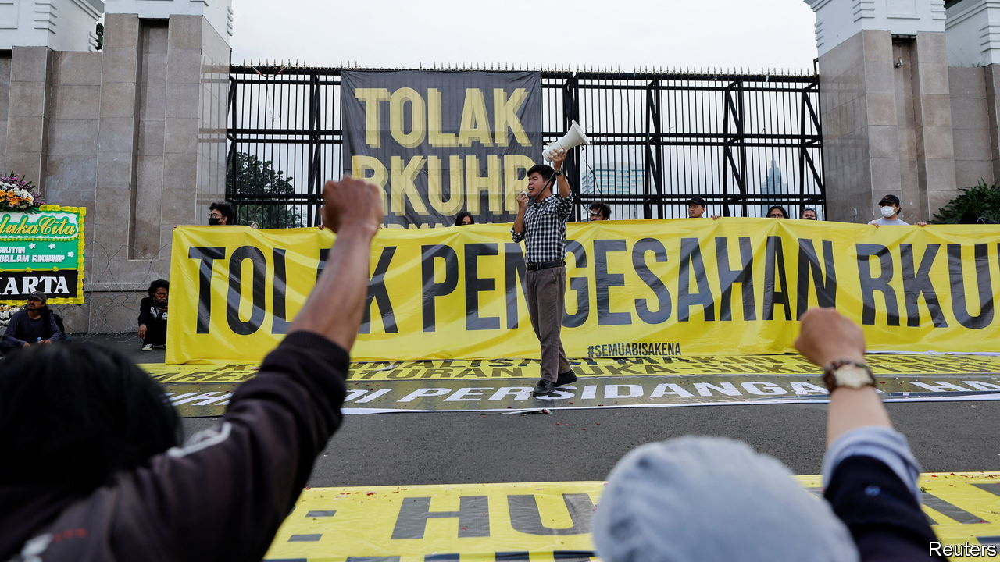

###### Bad news for Bali

# Indonesia’s ban on extramarital sex represents a turn for the worse 

##### Will Joko Widodo approve the appalling new penal code? 

 

> Dec 8th 2022 

The new criminal code that Indonesia’s parliament passed on December 6th is billed by the administration of President Joko Widodo as a “gift” to the nation—a revision of a century-old colonial code that is no longer fit for purpose. As a deputy minister puts it, the new code will bring the law “in line with Indonesian values”. Many Indonesians disagree. The provisions are so unpopular that demonstrations against them in 2019 led Jokowi, as the president is known, to shelve them.

A period of “socialisation” was supposed to have taken place before the new code could be reintroduced to parliament. Good luck with that: among its many harsh rules, the code criminalises cohabitation and sex outside marriage, expands the provisions for blasphemy and makes it illegal for Indonesians to leave their religion or persuade anyone to be a non-believer. It marks the most illiberal turn in Indonesia since the Muslim-majority country of 276m people embraced democracy in the late 1990s. Jokowi has yet to sign the new code into law, but has suggested he will.

 Not all of the code’s elements are retrograde. For example, it recommends that the death penalty should be used only as a “last resort”, and allows for death sentences to be converted to long prison terms in the event of good conduct. It also reinforces, for victims of rape, an exception to the existing ban on abortion: they will be able to seek an abortion within 12 weeks of conception instead of, as hitherto, six.

For the most part, though, the code represents a very sharp turn for the worse. Criminalising consensual sex outside marriage, with up to a year in prison for those found guilty, represents a gross invasion of privacy. It could especially imperil millions of indigenous Indonesians and rural Muslims whose marriages often lack certification. The new code’s defenders say it will ensure prosecutions only take place on the strength of a complaint brought by a close family member of the accused. But that creates endless opportunity for abuse. Andreas Harsono of Human Rights Watch, a pressure group, predicts the code’s harmful effects will be felt especially by women and lgbt people, due to husbands reporting wives for adultery (real or made up) and family members reporting gay relationships that they dislike.

The move undermines, to an extraordinary degree, the government’s stated priority of attracting “digital nomads” and international tourists—upon which parts of the archipelago such as Bali already depend. It also seems likely to produce an uptick in child marriages, as a preemptive measure undertaken by parents to stop their offspring having premarital sex. The new code also makes it much harder for ngos to dispense contraceptives and demonstrate how to use them, a move hardly in line with official efforts to combat the spread of hiv/aids. Other provisions criminalise sorcery and black magic.

The code also includes anti-defamation provisions against the president, state institutions and even Pancasila, Indonesia’s state ideology that supposedly emphasises humane consensus. And it recognises the importance of “living law”, whatever that might be. The best guess is that it refers to local sharia-type regulations forcing women to wear thefor instance, or encouraging girls’ genital mutilation.

Overseas, Jokowi, who recently hosted a successful g20 summit, is keen to be viewed as a tolerant, even secular, Muslim leader. Back home, that does not play at all well among Islamic conservatives, who represent an increasingly powerful voting block. Jokowi’s vice-president is a top Muslim cleric. True, the president has moved against radical Islamists, banning two big Islamist populist groups. Yet the new criminal code is itself a populist sop to conservative Muslim sentiment.

It is not due to take effect for three years, by which time Jokowi, who is forbidden by the constitution to seek a third presidential term, will not be in office. Yet his name, assuming he signs the new code into law, would be on it. It would be a disgraceful legacy.■

