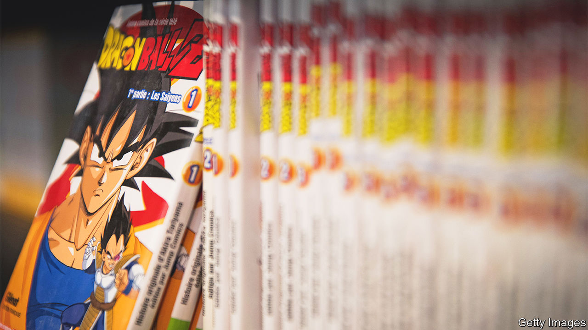

###### Toon wars

# Japanese Manga is being eclipsed by Korean webtoons 

##### The industry’s business model has hardly changed since the 1960s 

 

> Dec 8th 2022 

Lee hyun-seok grew up in South Korea addicted to Japanese  series such as “Dragon Ball” and “Slam Dunk”. As soon as he could, he emigrated to Tokyo to build a successful career as a artist and editor. Then in the early 2000s came “webtoons”, a South Korean cartoon innovation optimised for smartphones. Mr Lee was at first unimpressed. Compared with ’s inventive graphic styles and sophisticated plots, he found webtoons crude and superficial. “I thought: ‘Anybody can make this’.”

Yet Japanese  is being eclipsed by Korean webtoons. Last year the  print market shrank by 2.3% to ¥265bn ($1.9bn). The size of the global webtoons market was meanwhile valued at $3.7bn—and projected to reach $56bn by 2030.  is gravitating to digital slowly, in part because it is still designed for print, so awkward to read on smartphones. The letters tend to be too small and the way the panels are laid out requires constant zooming in and out. Seeing which way the wind was blowing, Mr Lee abandoned for the webtoon industry in 2014.

Though webtoons such as “Itaewon Class” and “Solo Levelling” have become popular among Japanese consumers, most Japanese publishers have stuck doggedly to . “The Japanese industry is very conservative,” sighs Mr Lee. “There’s a strong belief that it’s better to stick with precedent.” The  industry’s business model, in which stories are first published in weekly magazines and then in books, has hardly changed since the 1960s. 

Their format is also sacrosanct. Japanese  hew to unique templates which require special knowledge of readers, such as the order in which panels must be read. “The only people who know how to read are Japanese, Koreans and geeks across the world,” says Iwamoto Keita, who runs a cartoon studio. Webtoons have grown so fast, in part, because they can be read more easily and intuitively.

It is tempting to see the way  traditionalists are ceding the global cartoon market to South Korean innovators as symbolic of a broader malaise: the sluggishness and introspection of too many Japanese firms. Other recent South Korean exports, such as the Netflix sensation “Squid Game” and BTS, a boy band, have taken the world by storm thanks to the same combination of innovation and smart marketing behind webtoons. Meanwhile, the “Cool Japan” strategy of the government in Tokyo, intended to emulate that Korean success, has been a flop. Having run up huge losses, it may soon be abandoned. 

And yet, by sticking to what it does best, the  industry has at least maintained its strengths. Its complicated layouts can convey sophisticated narratives. And many  are artistic wonders, with designs manipulated at the millimetre level. Witness the intricate ink drawings in “Vagabond”, an epic martial-arts series, or the surrealist illustrations of “Berserk”, a medieval fantasy. By contrast, complex plots with dramatic twists are hard to convey in webtoons, which can display only a limited number of words. “I doubt webtoons would ever trump in terms of quality,” says Mr Iwamoto.

With its strong stories and craftsmanship,  maintains a loyal domestic audience, which gives publishers little motivation to innovate or change. Growth in their core business may be flagging; yet they can still find opportunities to boost revenues through  adaptations, or by collaborating with businesses that create-themed merchandise. Shueisha, the publisher that produced “Demon Slayer”, a recent hit  and , had record sales in 2021. “There’s not much of a sense of crisis among Japanese publishers,” observes Nakayama Atsuo, an entertainment-industry expert.

Some still fret about the future. Japan’s  fans are, like all its population, ageing. The average reader of the , a  anthology for children ( means “young boy”) launched in 1959, is now over 30. “could end up as old people’s culture,” warns Mr Lee. “Children these days are scrolling through webtoons on their smartphones. Why not make something that suits their taste?”■

