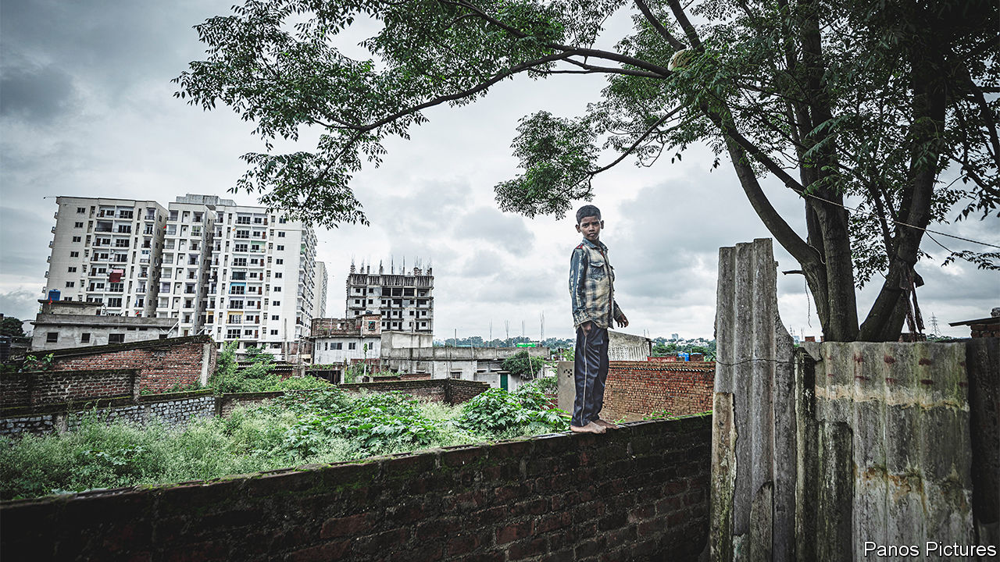
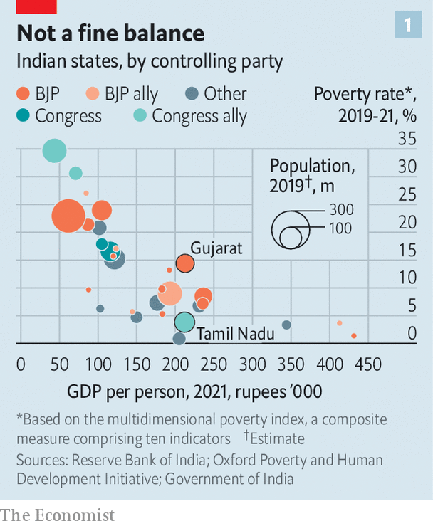
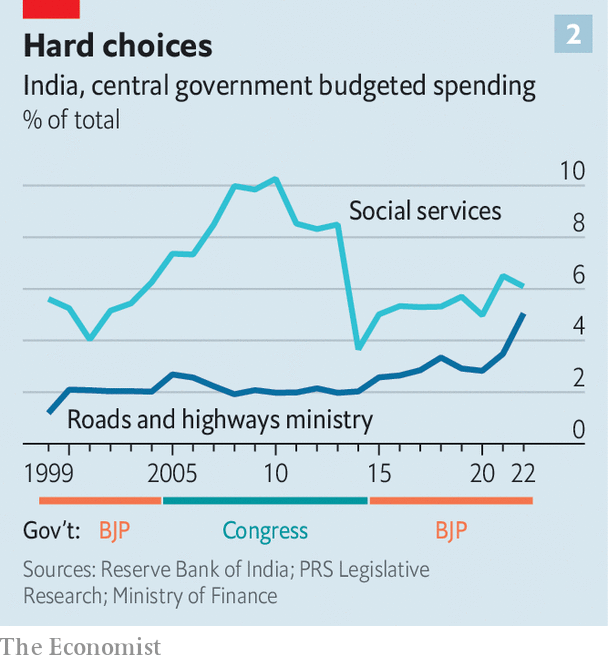

###### India’s development

# Narendra Modi’s tough medicine 

##### The Hindu-nationalist prime minister is governing India as he governed Gujarat 

 

> Dec 8th 2022 

Agashiye, a popular restaurant in Ahmedabad, serves only one thing: Gujarati . But the dish contains multitudes: curries, pulses, veggies and sweets, along with flatbreads, rice, salad, pickles, poppadums and more. Its fans say the  strikes the perfect balance. But that depends how it is consumed. Presented with a plate featuring greens next to fried delights and thick, sweet cream, few diners choose to gorge on cabbage. 

So it is with Gujarat’s strangely uneven development record. Ruled by Narendra Modi’s Hindu-nationalist Bharatiya Janata Party (BJP) since 1998, India’s westernmost state is a great success story overall. It is the sixth-richest state and accounts for 30% of exports. Its economy grew at an average annual rate of 11% between 2011 and 2021, the fastest in the country. 

It is this record that Mr Modi, after 13 years running Gujarat, stressed when he sought India’s top job in 2014. Just as the  contains a balance of fibre, protein and carbohydrates, his “Gujarat model” was said to be a perfect mix of good education, jobs, higher incomes and a “better life”. After a decade of welfarism, state meddling and graft under the Congress party, many Indians were hungry for it.

Critics of Mr Modi pointed to communal riots on his watch in 2002 that left over 1,000 Gujaratis dead, most of them Muslims. They also noted that the state was pro-business long before he showed up. And that Gujarat’s social indicators, which track changes in the lives of the poor, were far from perfect—indeed much worse than its economic ones. That seemed like a bad lookout for a country with more than twice as many very poor people as any other. Sure enough, eight years and two crushing election victories later, the hopes and fears for Mr Modi’s economic stewardship have largely been realised. He and his party have taken the Gujarat model India-wide.

 


In the state of 62m people, where the bjp won its seventh straight election this week, social indicators still trail economic ones. On a development index that accounts for life expectancy, education and income, Gujarat ranks 21st out of 36 states and territories. It is in the bottom half of states for underage marriage, child stunting, infant mortality, and school and college enrolment. Last year its gdp per head matched Tamil Nadu’s, but its share of people living in poverty, at 14%, was nearly four times bigger (see chart 1).

This reflects the Hindu nationalists’ priorities. Gujarat’s social spending is the lowest of all Indian states. It also directs a smaller share of its total expenditure to rural development and a larger portion to cities than the state average. Many of its rural districts lack basics such as secondary schools as a result. Meanwhile, its cities are thriving, as they like to illustrate with shiny new building projects. When the national government solicited proposals for urban-renewal plans in the early 2000s, most cities in Gujarat wanted funds for flyovers, says Himani Baxi of Pandit Deendayal Energy University in Gandhinagar, the state capital. Just one city proposed building an unglamorous but necessary sewage-treatment plant. 

After a number of false starts, India’s economy is also booming. On December 6th the World Bank upgraded its forecast for growth this year from 6.5% to 6.9%. If that is not as fast as Gujarat tends to grow, it is faster than any other big economy. Mr Modi’s highly publicised new mantra is “Together, for everyone’s growth, with everyone’s trust”. And ambitious infrastructure projects such as highways and digitisation are, as in Gujarat, a prominent part of his plan. Most large cities now have metro lines; over 10,000km of highways are being added each year, twice the rate the previous Congress-led government managed. The infrastructure push is helping households, too. Many more now have access to bank accounts and clean fuel. Internet penetration is rising rapidly.

bjp rule has been much less successful at improving Indians’ poor health and woeful education. Child-mortality rates are falling, but patchily. More than a third of children under five are stunted, a higher rate than in Bangladesh and Sri Lanka. In 2018 around half of all rural children in fifth grade could not read to second-grade levels. And after two years of school closures during the pandemic, the situation is unlikely to have improved.

 


These failures, again, reflect the bjp’s choices. It has been more generous to India’s poor than its government in Gujarat; the percentage of spending given to welfare schemes such as food and cooking-fuel subsidies is in line with the long-term average. Yet the Modi government is devoting a much smaller portion of India’s bumper tax revenues to social spending, including health care and education, than its predecessor (see chart 2). In 2018-19 government spending on health represented 3.2% of gdp, down from 3.9% the year before it came to power. Spending on education, at 3.1%, is far below its target of 6%. 

The poorest bits of the country are missing out most, largely because India’s growth is so unequally distributed. According to official figures, unemployment in Gujarat is 2.9%; in Uttar Pradesh (up), a poor northern state of 240m people, it is 7.1%. Yet the bjp has suffered little or no blowback in such places. This year it became the first party to win a second consecutive majority in up since 1985. Why? 

A lot of the answer is its Hindu chauvinism. In Gujarat, up and elsewhere, the bjp has successfully presented itself as a defender of high-caste Hindus, while mollifying the populous lower castes with hate speech against Muslims and just enough welfare. Yet it also seems that Indians like its spending priorities far more than would once have been imagined.

The long-abysmal state of public services—and proliferation of private alternatives—have downgraded Indians’ expectations of them. Less than a third rely on public health care. In an international survey in 2016, just 46% of Indians agreed that “the primary responsibility for providing school education rested with government”, the lowest of any country polled. Meanwhile, the bjp’s infrastructure projects, and relentless efforts to put Mr Modi’s imprimatur on them, have made the projects and prime minister alike powerful symbols of national progress.

As anyone who has tackled a knows, to eat is to choose. And so it is to govern. Not every element of the Hindu-nationalist development policy is good for Indians. But it is fuelling their growth and keeping them coming back for more. Mr Modi’s approval rating, at around 77%, may be the highest of any major world leader. His prospects of winning a third parliamentary majority in 2024 appear exceptionally strong.■

