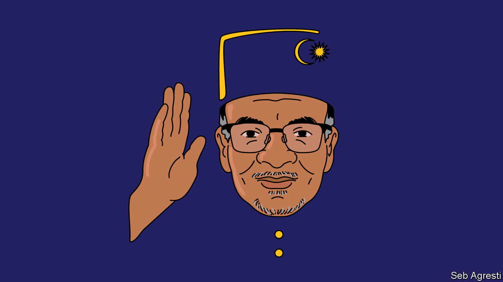

###### Banyan

# Which version of Anwar Ibrahim will govern Malaysia? 

##### Karma, karma, karma, karma, karma chameleon 

 

> Dec 8th 2022 

He was for so long Asia’s prime-minister-in-waiting, it takes an effort to grasp that Anwar Ibrahim has the top job in Malaysia at last. After a general election last month produced the country’s first hung parliament, its king tasked Mr Anwar with forming a government. The 75-year-old’s first cabinet meeting this week is the culmination of an extraordinary political odyssey.

Mr Anwar was being talked about as Malaysia’s future fully four decades ago. He had risen to prominence as a silver-tongued Islamist student leader. After joining the ruling United Malays National Organisation (unmo), he soared. By 1993 he was deputy prime minister and heir to Mahathir Mohamad, who dominated Malaysia’s post-independence story. To the delight of liberals in Malaysia and far beyond, Mr Anwar issued a manifesto, “The Asian Renaissance”, that stressed pluralism, tolerance and reform.

Malaysia seemed about to fall into his lap. But he had moved too soon. Dr Mahathir fired him and in 1999 threw him in jail on trumped-up sodomy and corruption charges. Mr Anwar was eventually freed and he returned as leader of a multiracial opposition, with a slogan of . umno hounded him again. By 2015 he was back in prison on a fresh charge of sodomy. From there he contested the 2018 general election in league with his nonagenarian sometime nemesis, Dr Mahathir, who had come out of retirement to bring down his former party. The pair accomplished that and Mr Anwar was pardoned. Dr Mahathir was to be prime minister for two years, before handing over to him. Instead, true to character, Dr Mahathir reneged on the deal, leading to the mounting political chaos that yielded last month’s election.

Mr Anwar’s struggle is inspiring. But it is not an entirely reassuring springboard for government. A martyr’s vanity helped him endure. So did a chameleon’s ability to match his message to whatever his audience wanted to hear. His readiness to embrace those who epitomised everything  was not created tensions even within his family. One of his two deputies, the president of a much-reduced umno, faces 47 corruption charges. And though he presides over a largely secular coalition incorporating Malaysia’s ethnic-Chinese and -Indian minorities, he is already throwing sops to the increasingly Islamicised Malay majority, such as cutting back the state lottery. To what end is he making such compromises?

His wider platform, which is big on gestures such as cutting ministers’ pay (though they can keep their lavish expenses), does not look like the  he once championed. And heaven knows the need for it still exists, given race-based policies favouring Malay businessmen, plummeting educational standards and an economy in a rut. Nor does appointing himself, even if temporarily, as his own finance minister scream reform—though perhaps it is better than that crucial position falling into the grubby hands of one of his coalition partners.

Mr Anwar’s fans are all too used to disappointment. But at least credit him for understanding that the election, as Bridget Welsh of the University of Nottingham Malaysia puts it, has done more to illustrate Malaysia’s deep problems than to resolve them.

The opposition Malaysian Islamic Party, which wants to replace the country’s Westminster-style government with an Islamic state, is now the biggest party in Parliament. Its unexpected surge has deepened a divide between conservative Muslim Malays and an alarmed alliance of urban middle-class Malays and minorities. The multiracial and tolerant societies of Sabah and Sarawak on the island of Borneo represent a new, third political pole, argues James Chin of the University of Tasmania. Many in those states deplore the rise of political Islam and are chafing under the federal system.

This is the broken ground that the new prime minister must pick a way through. It helps that he has declared his a “unity” government (his other deputy is from Sarawak, a first). It also helps that everyone from the king down is exhausted by the political chaos. Though the election campaign was vitriolic, power transferred peacefully. That is not nothing. Political elites on all sides have had to make painful compromises—starting with the king, no fan of Mr Anwar.

So his first months in office may be relatively calm—bread-and-butter issues, he says, will be his priority. After that, who knows? Yet it is possible to hope that this smooth-talking opportunist, once a liberal, could nudge Malaysia down a better, more tolerant path.■


