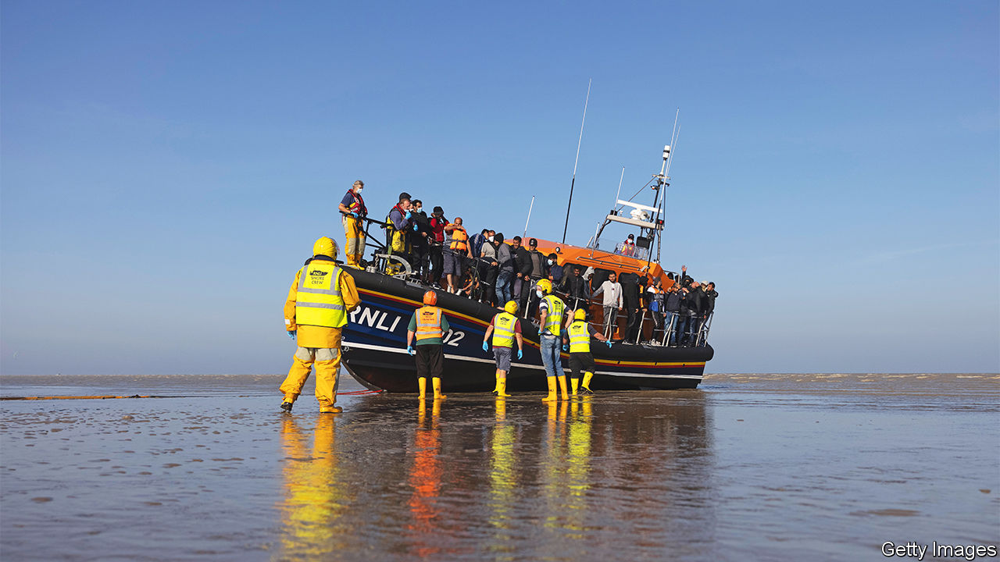

###### Traffic fights

# Asylum claims by Albanians spark debate over a landmark British law 

##### The Modern Slavery Act is caught up in the row over illegal immigration 

 

> Dec 8th 2022 


WHERE IS BRITAIN’S anti-slavery commissioner? The post was created by the Modern Slavery Act of 2015, which was designed to tackle trafficking and forced labour; the commissioner’s job is to oversee the law’s implementation. Seven months after Dame Sara Thornton, the previous commissioner, stepped down, she has yet to be replaced. “Parliament has said there should be an independent anti-slavery commissioner. Therefore the government should be appointing an independent anti-slavery commissioner,” she says.

Dame Sara, a former police officer, says she does not know what has caused the delay. The Home Office says a “recruitment campaign” is under way. But anti-slavery campaigners reckon that the absence of an authority on such matters makes it easier for politicians to voice exaggerated claims about illegal immigration. It could also, they fear, allow the Home Office to pass new laws with insufficient scrutiny.

When the Modern Slavery Act was introduced by Theresa May, then home secretary, it was hailed by many as model legislation, the first of its kind in Europe. The current home secretary, Suella Braverman, appears to loathe it. She has repeatedly said that economic migrants are abusing the law to stay in Britain. In October the Home Office transferred the slavery brief from the minister for safeguarding and listed it instead as one of the “illegal immigration and asylum” responsibilities of the minister for immigration. Anti-slavery campaigners respond that many of the victims protected by the act are British, from children recruited as drug runners to women forced into prostitution.

The Home Office points out, rightly, that immigration and trafficking are closely connected. In recent months, concerns about migrants who cross the Channel in  have focused on Albanians, nationals of a country the department deems “safe”. Between May and September they constituted 42% of those who entered Britain this way. More than 50% of Albanian asylum applications were successful in the first half of 2022; most other European countries grant asylum to significantly smaller proportions of Albanians.

Why the discrepancy? It is not clear how many Albanians granted asylum have been trafficked, and therefore protected by the act, but the proportion is likely to be high. Albanians are able to travel without visas into EU countries, but there are few legal routes into Britain to claim asylum, which puts asylum-seekers at the mercy of smugglers. Those who set out as economic migrants can become indebted to criminals in transit. The data suggest women are at particular risk. Though most Albanians who cross the Channel in small boats are male, the asylum-grant rate is much higher for women and children.

Champions of the Modern Slavery Act point out that the process by which victims of trafficking get leave to stay in Britain is distinct from the asylum process (though the two decision-making processes may inform each other). Victims of slavery and trafficking are identified by the National Referral Mechanism (NRM), a Home Office scheme; people cannot refer themselves. Referrals must come from authorised outfits like the police or the Gangmasters and Labour Abuse Authority, which regulates companies that supply agricultural workers. Between April and June this year, 1,130 Albanians constituted 27% of those referred. In 2021 91% of the 13,000 referrals to the NRM were recognised as victims of slavery, suggesting that the system works.

That casts doubt, say many, on Ms Braverman’s claim that Albanians are gaming the system. “Whenever we ask the Home Office for figures—how many people are abusing the system?—there is no answer,” says Andrew Wallis, chief executive of Unseen, an anti-slavery charity. Without that information it seems clear that Britain must continue to follow anti-slavery laws, both its own and international ones.

The government has said it plans to introduce a new Modern Slavery Bill to force firms with turnover of more than £36m ($44m) to publish statements on their efforts to eradicate slavery from their supply chains (firming up a requirement of the 2015 law). Campaigners against slavery say they worry the government may also be planning to withdraw some protections from victims of trafficking.

If it does so, it may be part of a broader crackdown on asylum-seekers, trafficked or otherwise. On December 5th the home secretary welcomed a report by a right-wing think-tank which called for some asylum-seekers to be put into indefinite detention. The Centre for Policy Studies said that, “if necessary”, Britain should withdraw from the European Convention on Human Rights to tackle the problem of small boats in the Channel. It, too, called for reform of the Modern Slavery Act. The author of the foreword? Ms Braverman. ■

