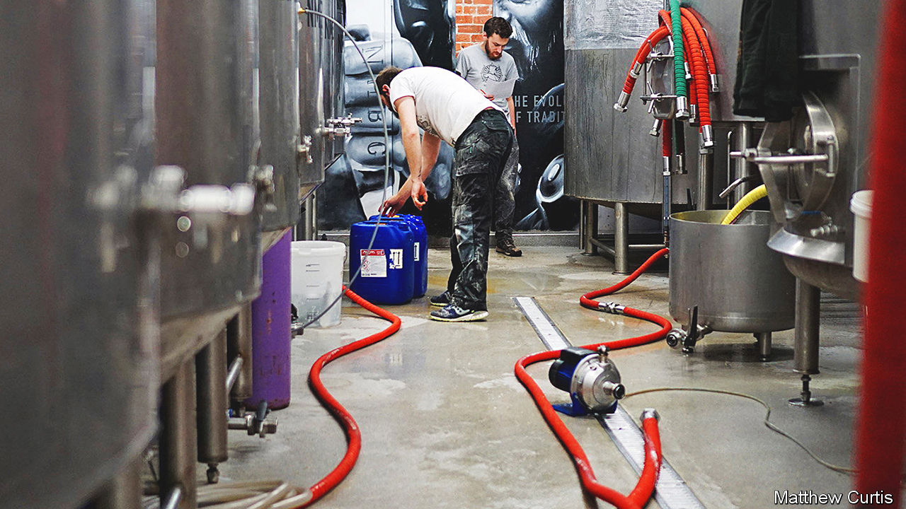

###### Beer and inflation

# Brewers pray for England to stay in the World Cup 

##### Well, English ones do anyway 

 

> Dec 8th 2022 


In the tap room at Northern Monk, a craft brewery, Russell Bisset’s immediate concern is the cocktail—beer, forest-fruit gin and fresh muddled raspberries—that will be sold at that evening’s football World Cup game. But his real worry is soaring costs. The brewing industry is particularly reliant on things that are getting pricier. Mr Bisset, who owns Northern Monk, says it costs about 26% more to brew a pint now than it did in 2021. BrewDog, the country’s largest craft brewer, reckons something similar. For comparison, annual consumer-price  is running at 11.1%.

The biggest problem is the cost of energy. It takes a lot of energy to heat water to steep malted grains; boil the wort (the sugary liquid created from the steeped grains); control the temperature of fermenting beer; and package the final product. In a survey of its members, the British Beer and Pub Association found that, even with the government’s price guarantee, brewers’ expected energy spending in 2023 will be as much as 140% higher than in the year before the pandemic. 

Expensive energy has secondary effects. Craft breweries use liquid carbon dioxide, a by-product of other industrial manufacturing processes, to store, move and carbonate beer. The largest supplier of carbon dioxide in England is a firm that owns fertiliser factories; spikes in the price of natural gas prompted these factories to stop production earlier this year because the bills were unaffordable. In August some brewers were being quoted carbon-dioxide prices 30 times higher than a year before (things have since steadied).

Other inputs are also getting pricier. The cost of grains like barley and wheat spiked in the spring and summer with the war in Ukraine. Prices have since fallen, but are still well above pre-pandemic levels. Craft beermakers import hops from America, where growers breed varieties with aromatic flavours like stone fruit and citrus. Mr Bisset reckons he spends 16% more on hops now than he did a year ago; about half of that rise is because of fluctuations in the sterling-dollar exchange rate. The price of aluminium for cans and glass for bottles is rising; labour, too. 

In better times, brewers might already have passed these costs on to drinkers. But that has been hard during a cost-of-living crisis, particularly after a planned freeze on beer duties was scrapped as part of the government’s  last month. The price of alcoholic drinks has risen more slowly than overall inflation. To preserve profits, brewers are getting creative—tweaking their processes to extract maximum flavour out of each hop, replacing carbon dioxide with cheaper nitrogen or propagating their own yeast. 

An extended run for the England team at the World Cup, allied to the usual end-of-year celebrations, would help (though perhaps not in Scotland). But a raft of planned railway strikes may hurt footfall. And once revenues fall back after the holidays, brewers are likely to start charging more. At Northern Monk, Mr Bisset plans a price increase of 11% in January. Oliver Robinson of Robinsons Brewery, a Stockport-based company, intends to raise prices in March; so does BrewDog. Britons will soon find it dearer to drown their sorrows. ■

