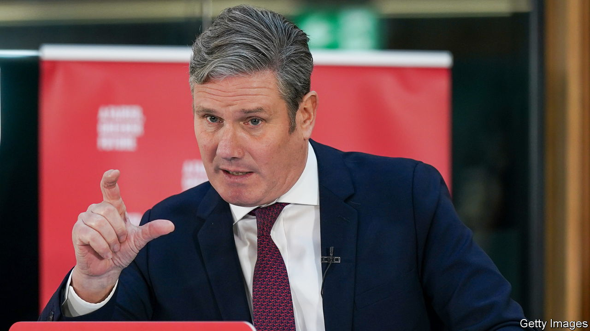

###### Left, right, left

# Britain’s Labour Party ponders a new generation of “social rights” 

##### Gordon Brown proposes rights to health care and housing. Will Sir Keir Starmer agree? 

 

> Dec 5th 2022 


SIR KEIR STARMER, the leader of the Labour Party, is a bit of a riddle. As a young lawyer in the 1990s, he was a rising star of the human-rights bar. He helped free death-row prisoners in Africa, won titanic free-speech trials and became the joint head of his cutting-edge chambers. 

As a politician, seeking to win over socially conservative voters, he has made more of his later years as a ramrod-straight public prosecutor. His speeches are plodding; his persona patriotic, . If he made it to Downing Street, would any glimmer of that young radical survive? A dense paper on constitutional reform, prepared for Sir Keir by Gordon Brown, Labour’s prime minister from 2007 to 2010, suggests it might. 

The paper, which was unveiled on December 5th, is meant to lay the groundwork for the party’s manifesto at the next election. It proposes scrapping the largely appointed  and replacing it with a new Assembly of the Nations and Regions. It recommends a deep clean of Westminster: a stricter political-ethics regime, tighter oversight of public appointments and a ban on MPs taking most external jobs. It has some sensible ideas for giving more power to local authorities. 

But the real radicalism lies in a proposal for a new generation of “social rights”. Free education and free health care are the things that first come to mind when Britons think about their citizenship, Mr Brown’s paper argues. Access to these things should be entrenched much like civil rights (“No person shall be denied emergency treatment”, for example, and “no person shall be left destitute”). 

A Labour government could go still further, Mr Brown suggests, and create rights relating to fair working conditions and culture. He floats the idea of a bold constitutional obligation to even out Britain’s patchy economy. Overseeing it all would be the newly empowered upper chamber of Parliament, protecting such statutes from being easily amended by MPs and thus creating a de facto written constitution. 

Sir Keir is not bound to adopt any of these proposals. But as Yuan Yi Zhu of Policy Exchange, a think-tank, notes in a forthcoming paper, delivering social change through sweeping and enforceable legal rights has been the work of the Labour leader’s career. Writing in , a journal, in 1995, Sir Keir called his goal the “distribution not only of political power, but also of economic power”. The fear that Britain would miss out on “next-generation rights” in areas like online privacy and the environment was one reason why he opposed Brexit. 

Left-wing  have tried entrenching “social rights” in constitutions; they are especially popular in Latin America. But they are not always effective. A right to emergency treatment does not of itself pay for hospital beds. Given the state of the National Health Service in particular, there would be plenty for would-be litigants to get their teeth into. Promising the public a constitutional right to a better deal is a cheap thing for a party in opposition to offer. It would be an expensive pledge to keep in office. Whether Sir Keir adopts the idea of social rights will help answer the question of how brightly the fire of radicalism still burns within him. ■

