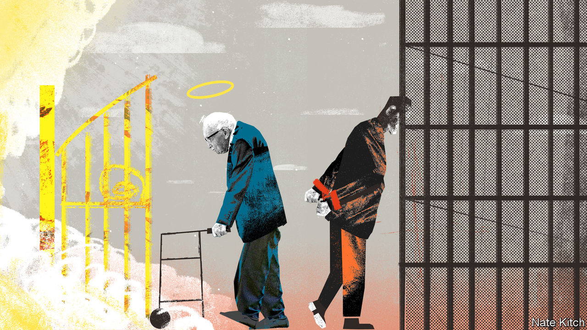

###### Bagehot

# Britain’s actual problem with free speech 

##### When being offensive is an offence 

 

> Dec 8th 2022 


At times, the rise of Captain Tom Moore felt like a fever dream. When Britain entered lockdown in March 2020, the 99-year-old veteran of the second world war began doing laps of his garden on a Zimmer frame to raise money for an nhs charity. He intended to raise £1,000 ($1,215); instead he managed £33m. The queen gave him a knighthood. An execrable rendition of “You’ll Never Walk Alone”, featuring Captain Tom, Michael Ball and a choir of nurses hit number one. A gin bearing his name was brought out. On New Year’s Eve that year, his image was plastered across London’s night sky by 300 glowing drones. 

But the oddest part of the story came after Captain Tom died, in February 2021. In response Joe Kelly, a Celtic fan from Glasgow, tweeted: “The only good Brit soldier is a deed one, burn auld fella, buuuuurn”. For that tweet, which was online for 20 minutes before he deleted it, Mr Kelly was charged and threatened with jail. He was eventually sentenced to 150 hours of community service and placed under supervision for 18 months. 

Being offensive is an offence in Britain. Under the Communications Act of 2003 anyone sending a “grossly offensive” or “indecent” message, whether in a tweet or on WhatsApp, can face jail. A law whose origins lie in attempts to stop perverted men panting down the phone at female telephone operators in the 1930s is now used to prosecute brainless tweets. The upshot is that it is, in effect, illegal to be rude on the internet. 

For a government that portrays itself as the protector of free speech, this is a sorry affair. Conservative ministers may despair at “” or the excesses of censorious students. Yet when it comes to something much more fundamental—restricting the ability of the state to jail someone for speaking out of turn—the government is happy to maintain a deeply illiberal status quo. 

A plan to ditch the clause that nearly sent Mr Kelly to jail has been scrapped. It was set to be replaced as part of a raft of wider reforms to online life. Under the proposal, only messages that caused serious distress would be punishable, rather than merely grossly offensive ones. The move was recommended by the Law Commission, a body that suggests legal changes. But the government ditched the idea in November after criticism from mps. Instead, the rotten old clause will remain on the statute book.

Cowardice over existing laws has been accompanied by hasty crackdowns on speech and protest elsewhere. After a statue of Winston Churchill was vandalised during protests in London in 2020, Conservative MPs demanded stricter rules. Anyone damaging a memorial, as sometimes happens during demonstrations, can face as much as a decade in jail.That may be popular. But it is not the mark of a self-confident society or of a government that is dedicated to free expression. 

Instead, a cartoonish version of the free-speech debate prevails, one which too often boils down to the middle-aged being annoyed with their teenaged children. The Conservative government is pushing through Potemkin legislation on freedom of speech in universities. Before the pandemic, 0.2% of events at universities featuring outside speakers were cancelled. Under the new law universities and student unions will be forced to allow what they already allow. The activities of a few students overshadow the far more egregious problem of the state jailing people for expressing an opinion. 

Labour, which has an authoritarian streak, is unwilling to touch the topic. Sir Keir Starmer, the Labour leader, started his career as a thrusting , fighting the jackboot of authority. Later he acquired a taste for boot-leather as Britain’s director of public prosecutions. Sir Keir was in the job when the Crown Prosecution Service pursued Paul Chambers, a harmless bonehead who tweeted an obviously insincere bomb threat at Doncaster airport and was prosecuted under the Communications Act. (His conviction was eventually overturned.)

Many of those in breach of the law deserve little sympathy. Earlier this year two police officers were sentenced to 12 weeks in jail for sharing appalling messages with Wayne Couzens, a police officer subsequently convicted of kidnap and murder. (An appeal is in process.) Had the conversations happened in private in one of their homes, it is likely that no charges would have been possible. Abhorrent behaviour that is legal in the real world should also be legal in a WhatsApp chat, a rambling private conversation in text form. Cardinal Richelieu once said: “If you give me six lines written by the hand of the most honest of men, I will find something in them which will hang him.” When laws are too broad, too many people end up on the rope. 

Tweet in haste, repent in jail

Freedom of speech is one of many areas where government rhetoric does not match reality. Sometimes this deficit is a good thing. The Tories have failed to reform or revoke the Human Rights Act, even though they first pledged to do so in 2010. Nor have they done anything about equalities legislation or asylum law, despite promising action for years. But when it comes to free speech, the government’s inertia is a problem. 

Others are taking action. With no domestic remedies available, Mr Kelly intends to challenge his conviction at the European Court of Human Rights. So far he has raised £18,000 to do so, helped by the Free Speech Union, a campaign group. It would be perverse if a government dedicated to defending free speech and promoting sovereignty removed an illiberal law only at the behest of oft-maligned “foreign judges”. People assume that freedom of speech is as British as queuing or the king, as if the country has always enjoyed its own version of America’s first amendment. But illiberal ideas on free speech have a greater hold on the national psyche. If the government is serious about protecting freedom of expression, it should start with its own laws. ■


 (Dec 1st)


