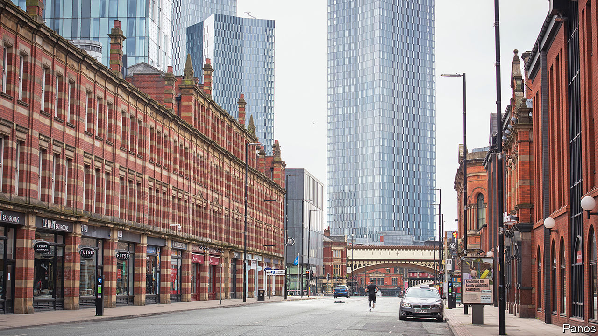
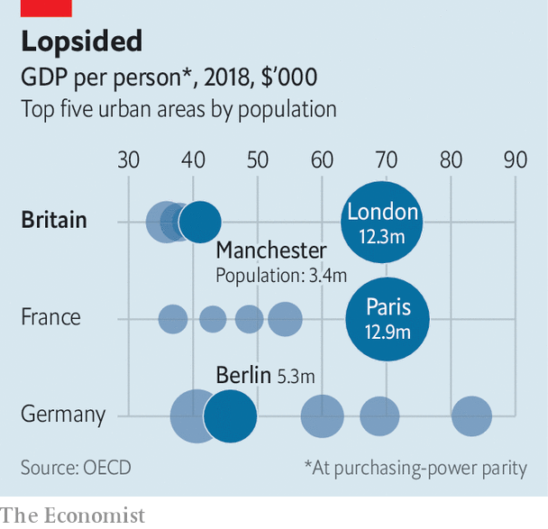
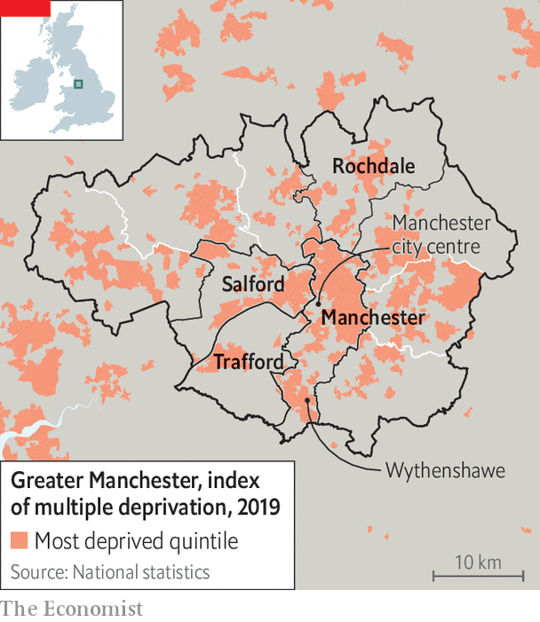

###### The sputtering engine of the north

# Manchester lacks the power to change its fortunes 

##### It is doing many things right but remains trapped in Westminster’s orbit 

 

> Dec 8th 2022 


To experience the full Manchester effect, you need to arrive from somewhere other than London. Compared with the capital’s crammed skyline, central Manchester’s burgeoning collection of tall towers looks gappy—closer to Croydon, in south London, than the City. Although its tram network is much more modern than the London Underground, Manchester’s seems quaint, and not nearly sufficient for such a large conurbation. Only by comparison with other northern or Midlands cities does the metropolis seem like a vision of urban prosperity. 

 


Its economy is strong—but, again, only by comparison with other northern English cities. Productivity in Greater Manchester, a cluster of ten boroughs centred on the City of Manchester, is nine-tenths of the British average, which is boosted greatly by London. International yardsticks are even less flattering. Whereas London is about as rich as Paris, Manchester is poorer than most secondary cities in France and Germany (see chart). 

Manchester is not a runaway success, then. But that is precisely why it is important. As the home of almost one in five people living in the north of England, it determines the fortunes of a huge chunk of the country. “”, the folksy term for regional economic rebalancing popularised by the last-but-one prime minister, Boris Johnson, is either driven by Greater Manchester or does not happen at all. 

It is also important because, more than any other English conurbation including London, Greater Manchester has plans for its future development, to which most local politicians have signed up. The contrast with Britain’s shambolic national government is plainer still. As , the mayor of Greater Manchester, delicately puts it: “We’re very clear about where we’re going, at a time when the government might not be.” Despite grabbing some powers from the centre, though, local leaders lack the means to get there. 

The city exploded in the 19th century, as its cotton mills sucked in workers from the rest of Britain and Ireland. The chaotic, disease-ridden metropolis shocked observers like Alexis de Tocqueville and Friedrich Engels, the scion of a German cotton family who was sent there in a failed attempt to shake his radical views. 

Cotton gave Manchester a distinct form and culture. By the end of the century the city centre was dominated by warehouses and showrooms. Railway lines radiated outward to nearby towns, where much of the spinning was done. The effects on the metropolis long outlasted the cotton industry. Manchester city centre was home to fewer than 1,000 people by the 1980s, according to the local council. And the conurbation never quite lost its sense of common purpose. That makes it different from other urban areas in Britain. 

In 2009 the ten boroughs formed a combined authority; in 2017 the whole area got an elected mayor. Collectively they have acquired some clout over planning, transport, health and adult education, as well as very limited tax-raising powers. The identity of the area seems to be strengthening. It is fine to describe Salford or Wigan as Greater Manchester. If you were to call Coventry “Greater Birmingham” or Bath “Greater Bristol” you would be run out of town. 

Because the post-industrial city centre was so thinly populated, there has been little to stop an eruption of high-rise housing and offices. The collective population of the two most central boroughs, Manchester and Salford, has risen from 640,000 to 822,000 over the past two decades, with the fastest growth in the urban core. 

Greater Manchester’s architects are following the dictum that cities should try to maximise “agglomeration effects”. As an independent review laid out in 2009, urban businesses thrive not primarily because they are near other firms in the same industry but because they can tap a deep talent pool. The goal is to create a dynamic centre and connect everywhere else to it. 

 


The cities of Manchester and Salford have plainly benefited. Salford has used the proceeds of development to stave off the worst effects of austerity, says its mayor, Paul Dennett. Manchester seems to be developing a more aspirational culture. Since 2010 gcse results in the city have gone from being much the worst of any borough in Greater Manchester to middling. Manchester now sends a higher proportion of young people to university than any borough except Trafford, which is much less poor (see map). 

The gradually expanding tram network connects outlying boroughs to the city centre, which has helped persuade people that their fortunes are tied to it. “Rochdale wants the city centre to boom,” says John Blundell, a councillor there. Its success causes people to “climb up the railway line” to his patch, where houses are cheaper. Officials across the metropolis are now trying to push people and jobs to the generally poorer northern boroughs. 

The metropolis is almost a one-party state, with eight of its ten boroughs controlled by Labour. Its leaders are strongly pro-development, and shed few tears when fields give way to housing. That irks some people. In Trafford, Marj Powner is campaigning to protect some soggy fields—which, although part of Greater Manchester’s green belt, are slated for 5,000 homes and warehouses. The politicians argue that a small reduction of green-belt land is needed for economic growth, she says. “Our premise is, let’s make a small net reduction in growth in order to protect the green belt.” 

Hers is a widespread view. In September   whether they would rather have more homes or more local planning control and protections for the countryside. They broke more than two-to-one for less development. But opposition in Greater Manchester is less fierce than it might be. Nine out of the ten boroughs have created a plan, called Places for Everyone, which accepts the government’s projection that 165,000 additional homes should be built by 2037. The plan allows boroughs like Trafford to build less than their fair share, and others such as Rochdale and Salford to build more. It may not survive exactly as written. Still, Greater Manchester seems more likely to get maximum development for minimum fuss than other metropolises. 

Politicians are also pulling hard on the other big lever available to them: transport. Like all English cities outside London, Greater Manchester has a mostly deregulated, privatised bus system. Next year it will become the first to introduce bus franchising. Officials will decide routes and timetables; private companies will run the services. Franchising ought to make public transport more co-ordinated and simpler to use—crucial in a metropolis where 31% of households lack a car. The trouble, however, is that Manchester lacks an Underground to cross-subsidise its franchised bus network, and has failed to bring in a congestion charge or a pollution charge. It is likely to depend on government grants. 

This pattern, of Greater Manchester furiously innovating and trying to change its fortunes but continuing to depend on Westminster, is evident in other areas. The metropolis has set a target of 2038 to reach net-zero carbon emissions, which is improbable. More realistically, Mr Burnham hopes that a scheme to build tens of thousands of new zero-carbon affordable homes and retrofit others could provide decent jobs for Mancunians and give them expertise that they could then sell to other cities. But that ambition too will probably require government funding. 

Its councils acquired some control over health in 2014, and set about trying to improve people’s diets and wean them off cigarettes. That may have had some effect: a recent study in the estimated that life expectancy in Greater Manchester rose by one-fifth of a year between 2014 and 2019, relative to similar places. Other locally designed, centrally funded schemes, known collectively as “Working Well”, seem to have improved the prospects of people prevented from working by illness. 

But the health system is now struggling with the same problems of high demand and insufficient staff that bedevil the entire National Health Service, with few powerful local tools available. Ill-health remains a huge economic problem as well as a personal blight. In October a review of the metropolis found that rates of recent physical and mental illness explain three-quarters of the neighbourhood-to-neighbourhood variation in the employment rate. 

Economic shocks tend to hit the people of Greater Manchester hard and reverberate for a long time. Before covid-19 struck, the metropolitan unemployment rate tracked the English rate almost precisely. It then jumped to more than one percentage point higher, where it has stuck. Now people are struggling with inflation. “I don’t think I’ve seen people so desperate as I do now,” says Sarah Woolley at the Benchill Community Centre in Wythenshawe, a giant council estate in south Manchester. She speaks with 28 years’ experience. 

Greater Manchester is ahead of others when it comes to devising clever solutions to social and economic problems. But the resources available to local politicians are not truly adequate to the task. One telling sign is that Mr Dennett, the mayor of Salford, says that a big advantage of Greater Manchester’s authorities working so well together is that they can more effectively lobby the government in Westminster. “We are one of the most centralised democracies in the Western world,” he says, by way of explanation. That tells you both why Manchester does comparatively well, and why it cannot soar. ■

