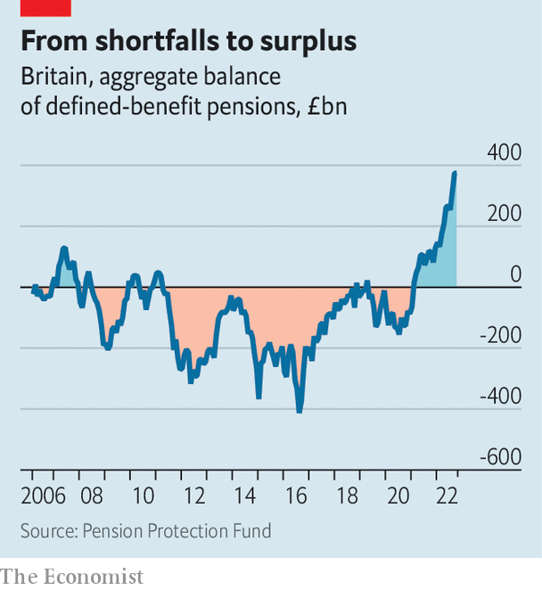

###### Britain’s growth crisis

# Small pension funds are Britain’s likeliest source of growth capital 

##### Defined-contribution schemes will only get bigger, and their members need returns 

 

> Dec 6th 2022 


Does britain take enough risk with its long-term savings? That may seem an odd question to ask just months after “liability-driven investment” (ldi), a previously obscure strategy pursued by some pension funds to improve returns, threatened to cause a meltdown in the country’s government-bond market. It is also an unavoidable one. Despite the tantalisingly large amounts of capital studded around Britain’s financial-services industry, investment in domestic firms and infrastructure is chronically poor. It is tempting to look first to the biggest pots of money as sources of . But the most promising is one of the smallest.

At first glance, capital seems like the least of Britain’s problems. The oecd, a club of mostly rich countries, puts Britain’s pension savings at $3.6trn, second in size only to America’s among the 38 members. The City of London, though losing importance as a global financial centre, remains home to a world-class cluster of insurers, which manage some £2trn ($2.4trn, or 90% of gdp). Britain’s fund managers oversee investments worth £11.6trn and its banks hold assets worth £8trn, putting Britain in second and fourth place globally for these respective sectors.

It may be hard to imagine Mayfair’s hedge-fund managers rushing, overcome by patriotic fervour, to invest in social housing in Hartlepool or a science park in Portsmouth. But it is less fanciful to think that Britons’ insurance and pensions savings might be put to use driving domestic growth. Until relatively recently, they were: in 1998, 73% of Britons’ pensions savings were invested in British equities. That proportion has since fallen dramatically. New Financial, a think-tank, estimated in April that just 12% of the £6trn held by retail investors, pension schemes, insurance funds and endowments were invested in Britain’s stockmarket. Less than 1% of pension and insurance assets were allocated to unlisted British equities; 90% of the money raised by venture and growth funds came from foreign investors.

 


Most eye-catching is the £1.5trn held by defined-benefit (db) pension schemes, which offer members a specified income once they retire. In 2008 a quarter of the assets held by such schemes were invested in British equities; by 2021 that had shrunk to 2%. This is largely because these assets no longer need to seek returns. Though plagued by underfunding for much of the period since the financial crisis of 2007-09, db pension funds are now £375bn in surplus (see chart). A decade of strong equity returns helped build up their assets; this year’s rise in gilt yields has improved scheme valuations. According to PwC, a consultancy, the sector’s assets are above its “buy-out value”, the lump sum insurers would demand to assume all its liabilities.

Schemes with big surpluses have little incentive to invest much in equities at all. Racier and more illiquid propositions, like early-stage firms or infrastructure projects, are definitely off the table, whatever their potential returns. And even for those funds still in deficit, growth assets are now harder to invest in. Many used ldi strategies to hedge their liabilities, freeing up capital to invest in equities and other risky assets. The inherent leverage and potential for sudden collateral calls in these strategies brought some schemes close to collapse in the autumn, when gilt yields shot up after  on September 23rd. Regulators are pushing them to maintain chunkier cash buffers, reducing their scope to provide growth capital. The increased conservatism of DB pension schemes may well be the most lasting effect of Trussonomics.

Newly announced reforms to Solvency II, rules that govern how much capital Britain’s insurers must have, may offer a better chance of driving domestic investment. Announced by the Treasury last month, these proposed reforms are friendly to insurers, reducing the buffer that is required in case their liabilities rise. The Association of British Insurers, an industry group, hailed the reforms as having the potential to unlock up to £100bn of investment. But allowing insurers to earmark less capital for future liabilities gives them many options: to invest in British projects or foreign ones, or to return cash to their shareholders as dividends or share buy-backs. Much of the £100bn may well go elsewhere.

The best source of long-term growth capital may lie within a smaller pool of savings. Defined-contribution (dc) pensions, which are, in effect, segregated savings accounts for each individual enrolled, accounted for £500bn of savings in 2021. They are now the most common form of workplace pension and are growing quickly; DC assets are set to hit £1trn by 2030. Unlike db schemes, dc ones do not promise a specified income in retirement. Instead, the value of each individual’s pot determines how much they can draw down or use to buy an annuity after reaching 55. Such funds have a strong incentive to seek high returns. That pushes them towards listed equities, although not necessarily towards Britain’s . 

With help, it could also prompt them to invest in unlisted ones. A study in 2019 by Oliver Wyman, a consultancy, and the British Business Bank suggested that a 22-year-old entering a dc scheme and allocating 5% of it to venture-capital or growth-equity funds could expect to increase their total retirement savings by between 7% and 12% (compared with the mix of listed equities and bonds in a default scheme). In practice, this is currently difficult or impossible for many schemes. A cap of 0.75% per year on fund-management fees, put in place to protect savers from outsize charges, limits them to less than most venture-capital funds demand. It also prevents payment of additional fees to reward high performance, commonly levied by such funds. Many DC funds offer daily dealing, which is inappropriate for illiquid assets as sudden withdrawals can fuel fire sales.

These hurdles are not insurmountable. The Treasury has been exploring ways to raise the fee cap to drive investment in early-stage firms and infrastructure. The Department for Work and Pensions, which formerly resisted these attempts, is now consulting on how to implement them. dc schemes tend to offer daily dealing not due to regulation or necessity, but because this feature was popular in their early days. Priming them to invest in startup firms and infrastructure would inevitably result in capital flowing towards foreign investments as well as British ones. Yet retail savers show an increasing fondness for investing in causes that promise good social outcomes. They might grab the chance to support domestic regeneration, too. ■

