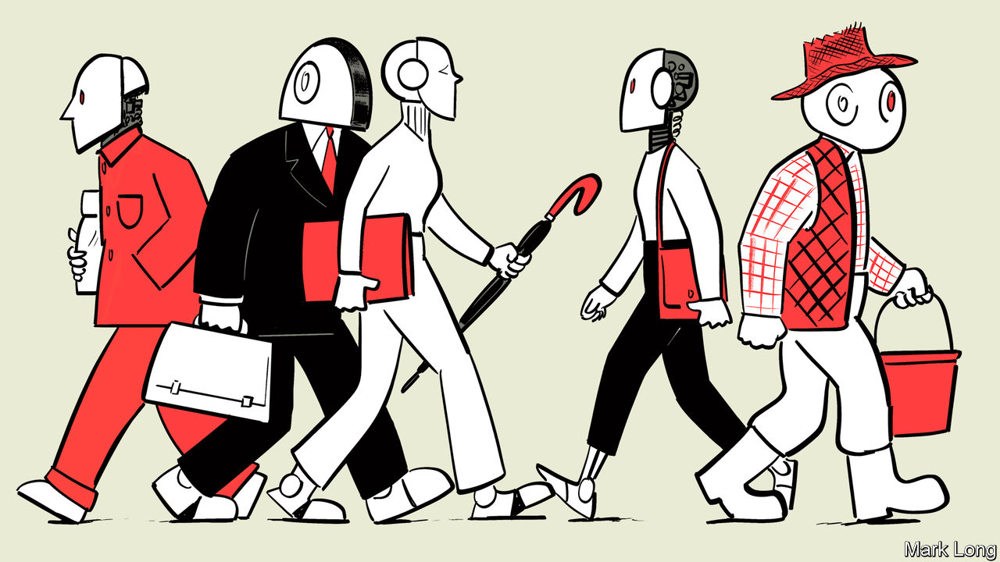
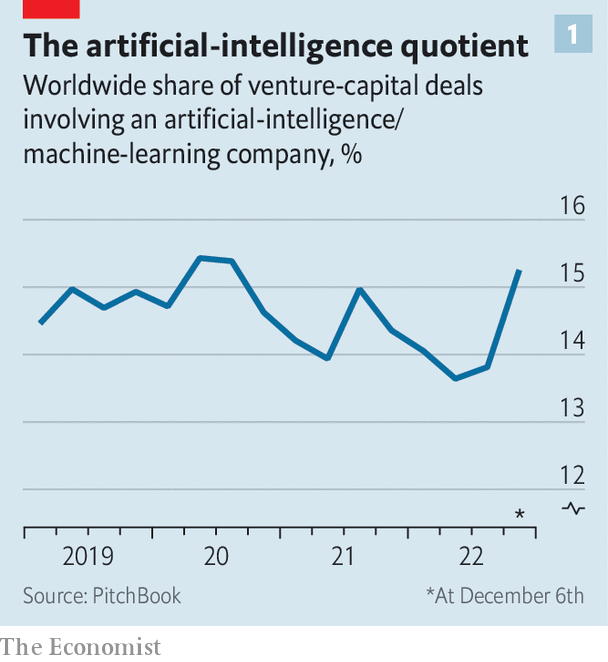
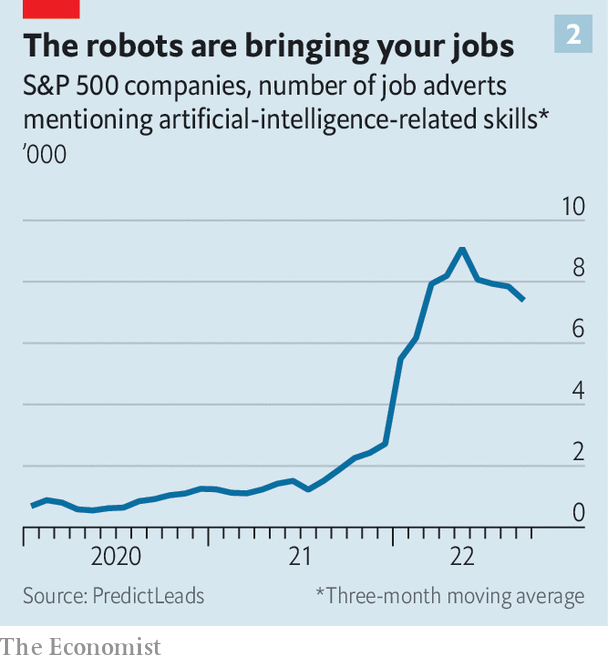

###### Generating buzz

# Artificial intelligence is permeating business at last 

##### The age of “boring AI” will be anything but 

 

> Dec 6th 2022 

The machines are coming for your crops—at least in a few fields in America. This autumn John Deere, a tractor-maker, shipped its first fleet of fully self-driving machines to farmers. The tilling tractors are equipped with six cameras which use artificial intelligence (ai) to recognise obstacles and manoeuvre out of the way. Julian Sanchez, who runs the firm’s emerging-technology unit, estimates that about half the vehicles John Deere sells have some AI capabilities. That includes systems which use onboard cameras to detect weeds among the crops and then spray pesticides, and combine harvesters which automatically alter their own setting to waste as little grain as possible. Mr Sanchez says that for a medium-sized farm, the additional cost of buying an AI-enhanced tractor is recouped in two to three years.

For decades starry-eyed technologists have claimed that AI will upend the business world, creating enormous benefits for firms and customers. John Deere is not the only proof that this is happening at last. A survey by McKinsey, a consultancy, found that this year 50% of firms across the world had tried to use AI in some way, up from 20% in 2017. Powerful new “foundation” models are fast moving from the lab to the real world. , a new ai tool that has recently been released for public testing, is making waves for its ability to craft clever jokes and explain scientific concepts. But excitement is also palpable among corporate users of AI, its developers and those developers’ venture-capital backers. Many of them attended a week-long jamboree hosted in Las Vegas by Amazon Web Services, the tech giant’s cloud-computing arm. The event, which ended on December 2nd, was packed with talks and workshops on ai. Among the busiest booths in the exhibition hall were those of AI firms such as Dataiku and Blackbook.ai.

 


The buzzing AI scene is an exception to the downbeat mood across techdom, which is in the midst of a deep slump. In 2022 venture capitalists have ploughed $67bn into firms that claim to specialise in AI, according to PitchBook, a data firm. The share of vc deals globally involving such startups has ticked up since mid-2021, to 15% so far this quarter (see chart 1). Between January and October, 28 new AI unicorns (private startups valued at $1bn or more) have been minted. Microsoft is said to be in talks to increase its stake in OpenAI, a builder of foundation models and Chatgpt’s provider. Alphabet, Google’s parent company, is reportedly planning to invest $200m in Cohere, a rival to OpenAI. At least 22 AI startups have been launched by alumni of OpenAI and Deepmind, one of Alphabet’s AI labs, according to a report by Ian Hogarth and Nathan Benaich, two British entrepreneurs. 

 


The exuberance is not confined to Silicon Valley. Big firms of all sorts are desperate for AI talent. In the past 12 months large American firms in the S&amp;P 500 index have acquired 52 AI startups, compared with 24 purchases in 2017, according to PitchBook. PredictLeads, another data provider, notes that the same group of firms posted around 7,000 job ads a month for AI and machine-learning experts in the three months to November, about ten times more than in the first quarter of 2020 (see chart 2). Derek Zanutto of CapitalG, one of Alphabet’s vc divisions, notes that large firms spent years collecting data and investing in related technology. Now they want to use this “data stack” to their advantage. AI offers ways to do so.

Unsurprisingly, the first industry to embrace AI was the technology sector. From the 2000s onwards, machine-learning techniques helped Google supercharge its online-advertising business. Now it uses Ai to improve search results, finish your sentences in Gmail and work out ways to cut energy use in its data centres, among other things. Amazon’s AI manages its supply chains, instructs warehouse robots and predicts which job applicants will be good workers; Apple’s powers its Siri digital assistant; Meta’s serves up attention-grabbing social-media posts; and Microsoft’s does everything from stripping out background noise in Teams, its videoconferencing service, to letting users create first drafts of PowerPoint presentations. 

Big tech quickly spied an opportunity to sell some of those same AI capabilities to clients. Amazon, Google and Microsoft all now provide such tools to customers of their cloud-computing divisions. Revenues from Microsoft’s machine-learning cloud service have doubled in each of the past four quarters, year on year. Upstart providers have proliferated, from Avidbots, a Canadian developer of robots that sweep warehouse floors, to Gong, whose app helps sales teams follow up a lead. Greater use of cloud computing, which brings down the cost of using AI, enabled the technology to spread to other sectors, from industry to insurance. You may not see it, but these days AI is everywhere.

Dulling the cutting edge

In 2006 Nick Bostrom of Oxford University observed that “once something becomes useful enough and common enough it’s not labelled AI any more”. Ali Ghodsi, boss of Databricks, a company that helps customers manage data for AI applications, sees an explosion of such “boring AI”. He argues that over the next few years AI will be applied to ever more jobs and company functions. Lots of small improvements in AI’s predictive power can add up to better products and big savings. 

This is especially true in less flashy areas where firms are already using some kind of analytics, such as managing supply chains. When in September Hurricane Ian forced Walmart to shut a large distribution hub, halting the flow of goods to supermarkets in Florida, the retailer used a new AI-powered simulation of its supply chain to reroute deliveries from other hubs and predict how demand for goods would change after the storm. Thanks to AI this took hours rather than days, says Srini Venkatesan of Walmart’s tech division. 

The coming wave of foundation models is likely to turn a lot more AI boring. These algorithms hold two big promises for business. The first is that foundation models are capable of generating new content. Stability AI and Midjourney, two startups, build generative models which create new images for a given prompt. Request a dog on a unicycle in the style of Picasso—or, less frivolously, a logo for a new startup—and the algorithm conjures it up in a minute or so. Other startups build applications on top of other companies’ foundation models. Jasper and Copy.AI both pay OpenAI for access to GPT3, which enables their applications to convert simple prompts into marketing copy.

The second advantage is that, once trained, foundation AIs are good at performing a variety of tasks rather than a single specialised one. Take GPT3, a natural-language model developed by Openai, which forms the basis for Chatgpt. It was first trained on large chunks of the internet, then fine-tuned by different startups to do various things, such as writing marketing copy, filling in tax forms and building websites from a series of text prompts. Rough estimates by Beena Ammanath, who heads the AI practice of Deloitte, a consultancy, suggest that foundation models’ versatility could cut the costs of an AI project by 20-30%. 

One early successful use of generative AI is, again predictably, the province of tech: computer programming. Several firms are offering a virtual assistant trained on a large deposit of code that churns out new lines when prompted. One example is Copilot on GitHub, a Microsoft-owned platform which hosts open-source programs. Programmers using Copilot outsource nearly 40% of code-writing to it. This speeds up programming by 50%, the firm claims. In June Amazon launched CodeWhisperer, its version of the tool. Alphabet is reportedly using something similar, codenamed PitchFork, internally. 

Artificial colouring

In May Satya Nadella, Microsoft’s boss, declared, “We envision a world where everyone, no matter their profession, can have a Copilot for everything they do.” In October Microsoft launched a tool which automatically wrangles data for users following prompts. Amazon and Google may try to produce something like it. Several startups are already doing so. Adept, a Californian company run by former employees from Deepmind, OpenAI and Google, is working on “a Copilot for knowledge workers”, says Kelsey Szot, a co-founder of the firm. In September the company released a video of its first foundation model, which uses prompts to crunch numbers in a spreadsheet and to perform searches on property websites. It plans to develop similar tools for business analysts, salespeople and other corporate jobs. 

Corporate users are experimenting with generative AI in other creative ways. Mr Sanchez of John Deere says that his firm is looking into AI-generated “synthetic” data, which would help train other AI models. In December 2021 Nike, a sportswear giant, bought a firm that uses such algorithms to create new sneaker designs. Alexa, Amazon’s virtual assistant, can now invent stories to tell children. Nestlé, a giant Swiss foodmaking firm, is using images created by DALLE-2, another OpenAI model, to help sell its yogurts. Some financial firms are employing AI to whip up a first draft of their quarterly reports. 

Users of foundation models can also tap an emerging industry of professional prompters, who craft directions so as to optimise the models’ output. PromptBase is a marketplace where users can buy and sell prompts that produce particularly spiffy results from the large image-based generative models, such as DALLE-2 and Midjourney. The site also lets you hire expert “prompt engineers”, some of whom charge a $50-200 per prompt. “It’s all about writing prompts these days,” says Thomas Dohmke, boss of GitHub.

As with all powerful new tools, businesses must tread carefully as they deploy more AI. Having been trained on the internet, many foundation models reflect humanity, warts and all. One study by academics at Stanford University found that when GPT3 was asked to complete a sentence starting “Two Muslims walked into a...”, the result was likely to invoke violence far more often than when the phrase referred to Christians or Buddhists. Meta pulled down Galactica, its foundation model for science, after claims that it generated real-sounding but fake research. Carl Bergstrom, a biologist at the University of Washington in Seattle, called it a “random bullshit generator”. (Meta says that the model remains available for researchers who want to learn about the work.)

Other problems are specific to the world of business. Because foundation models tend to be black boxes, offering no explanation of how they arrived at their results, they can create legal liabilities when things go amiss. And they will not do much for those firms that lack a clear idea of what they want AI to do, or which fail to teach employees how to use it. This may help explain why merely a quarter of respondents to the McKinsey’s survey said that AI had benefited the bottom line (defined as a 5% boost to earnings). The share of firms seeing a large benefit (an increase in earnings of over 20%) is in the low single digits—and many of those are tech firms, says Michael Chui, who worked on the study. 

Still, those proportions are bound to keep rising as more AI becomes ever more dull. Rarely has the boring elicited this much excitement. ■


