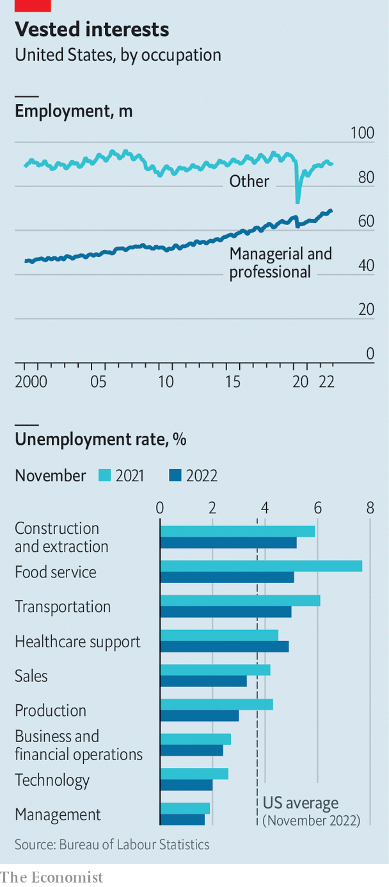

###### Axeing questions

# Is a white-collar recession looming? 

##### Don’t despair for the Patagonia-vest set just yet 

 

> Dec 4th 2022 

On december 2nd America’s Bureau of Labour Statistics (BLS) reported that the number of workers on non-farm payrolls rose by 263,000 in November, fewer than the 284,000 in October but hardly a sign of wide retrenchment. Labour markets remain , with 1.7 job openings for every unemployed American in October, the latest figure available. Many businesses are still contending with  in factories and restaurants.

Meanwhile, in a seemingly parallel universe, American tech firms have  88,000 workers this year, according to Crunchbase, a data provider. Banks have also been showing staff the door. Wells Fargo has reportedly cut hundreds from its mortgage division. Barclays fired around 200 workers last month. Wall Street stalwarts, including Goldman Sachs and Citigroup, have also made cuts. Retail titans such as Amazon and Walmart have trimmed corporate headcounts, but not jobs in warehouses and supermarkets. On December 5th the  reported that PepsiCo is laying off “hundreds” of workers at its headquarters.

All this has prompted much hand-wringing about a “white-collar recession” (or, given the cohort’s sartorial tastes, a Patagonia-vest downturn). In an inversion of the usual pattern, this argument goes, the axe is falling mostly at the top of the corporate pecking order. Just how worried should America’s white-collar set be?

 


On the surface, there is plenty of room for axe-swinging. In recent decades America’s economy has become ever more top-heavy. Managerial and professional occupations now make up 44% of total employment, up from 34% in 2000, according to the BLS (see chart). Partly that reflects faster growth in industries like tech and finance. But even within industries the share of white-collar jobs has grown. In manufacturing it has risen to 35% today from 29% in 2002; in retail it has gone up to 15%, from 12% two decades ago. Automation and offshoring have meant fewer technicians and cashiers, but lots more business analysts and systems architects.

Some of those workers indeed now find themselves in the crosshairs. Still, talk of a white-collar recession seems overblown. For one thing, desk-jockeying jobs remain plentiful. Payrolls in finance are roughly at pre-pandemic levels. The tech industry employs 10% more staff today than in January 2020, according to the Computing Technology Industry Association (CompTIA). Even after Meta, a social-media giant, loses the 11,000 workers it laid off last month, it will still employ nearly 70% more than it did before the pandemic. 

Sacked techies should not struggle to get work. Lots of old-economy firms need their skills. Walmart, despite its lay-offs, keeps snatching up data scientists and other hypernumerate types. Already 59% of tech professionals work outside the tech sector, reckons CompTIA. On the whole, demand for highly paid white-collar personnel is as hot as ever. Unemployment rates for financiers, technologists and managers are even lower than America’s overall rate of 3.7%, and have fallen further over the past 12 months.

Demographic changes will mean that rich-world firms find it increasingly hard to recruit workers, regardless of the colour of their collars. In America the share of the population aged between 20 and 64 tipped from 60% in 2010 to 59% in 2020, and by 2030 will fall to 56%, according to the World Bank. In Britain and the euro area the share is expected to fall from 58% to 56%, and 59% to 56%, respectively, between 2020 and 2030. Younger generations are now more likely to be studying and less likely to be working during their early 20s, adding to the squeeze on labour supply.

Falling immigration compounds the problem. In 2019 net migration into America was 595,000, the lowest in over a decade, thanks in part to the policies and rhetoric of Donald Trump’s administration. The pandemic pushed it down further, to 247,000 in the year to June 2021. In Germany immigration surged in the mid-2010s as the country opened its doors to Syrian and other refugees, but it fell in subsequent years. A temporary spike from Ukrainian refugees this year will not be enough to resolve persistent  in many areas. Britain’s government, meanwhile, has declared itself “fully committed” to bringing net migration down.

Barring big changes to immigration or retirement ages, in the coming years firms will have to shift their focus to doing more with less. For the agile project managers and programmers who can help engineer such productivity improvements, the good times may be just starting. ■


