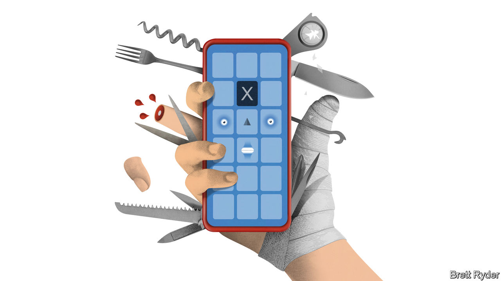

###### Schumpeter

# The rise of the super-app 

##### The race to build a do-everything platform heats up 

 

> Dec 8th 2022 

Is Elon Musk bored of the town square already? A month after completing his acquisition of Twitter, his iconoclastic gaze appears to be trained on the entire city. Mr Musk wants to build a super-app. Whether called “Twitter 2.0”, “The everything app” or “X”, his plans are still super-vague. A series of slides containing hardly any information tweeted on November 26th did little to shed light on his plans. Doting references to Tencent’s WeChat provide some clues—earlier this year Mr Musk described the Chinese super-app as “Twitter, plus PayPal, plus a whole bunch of other things, and all rolled into one with actually a great interface”. What is clear is that Mr Musk will face obstacles in his path.

A Twitter super-app would join a growing field. Launched in 2011, WeChat rode the wave of Chinese smartphone adoption. Today it boasts 1.3bn users and stunning ubiquity. Adding payments, e-commerce and gaming capabilities on top of its messaging platform made the app wildly popular. The launch of “mini programs”, the millions of third-party applications which exist within WeChat-proper, in 2017 cemented the platform as the real operating system of the Chinese internet. There is no shortage of super-app-building across other developing economies. In South-East Asia Grab competes with GoTo, formed by a tie-up between Gojek, a ride-hailing giant, and Tokopedia, an online marketplace. Both have lost over half of their market value this year, but the concept remains a resilient one. So much so that India’s richest man, Gautam Adani, recently indicated plans to get in on the act, too. 

The idea is not new. Super-app ambitions have been a staple of buzzy management presentations at American firms for years. Even Walmart touted plans to develop one. Most involve fitting as many closely related services inside the same app as possible. PayPal, a payments-giant, and Uber, a ride-hailing and delivery firm, have attempted to build narrower sector champions rather than WeChat-equivalents. These limits have not always been self-imposed. Investors have balked at attempts to push boundaries much further. When details of PayPal’s talks to take a $45bn leap into e-commerce by purchasing Pinterest, another marketplace, leaked last year, its shares plunged and the discussions were quickly abandoned. Such conglomerate-building activity would be even less acceptable to shareholders today. Mr Musk, who took Twitter private, will have no public-market investors attempting to clip his wings, but he will face more fundamental challenges if he seriously wishes to pursue a super-app strategy. 

The greatest impediment to super-apps are, unsurprisingly, app stores. Apple, which makes more than half of America’s smartphones, is the incumbent gatekeeper to the country’s eyeballs. It guards this position jealously, and with good reason. The total fees it collects from its app store are not disclosed but are thought to make up a large chunk of a services segment with revenues of $78bn a year. This infrastructure, including a remarkably successful run in the payments business since the launch of Apple Pay in 2014, is the closest thing America has to a true super-app.

Mr Musk has already hit his head on this ceiling. In November he used a dispute over Apple’s advertising on his site to complain about the fees Apple extracts from apps doing business in its ecosystem (a “secret 30% tax”, as he put it). Mr Musk is far from the first mogul to gripe about this skimming, but it will be a particularly unwelcome squeeze on the profit margins of Twitter’s new subscription-based model. After meeting Tim Cook, Apple’s boss, at the firm’s headquarters in Cupertino, Mr Musk came away placated. But the skirmish is unlikely to be the last if Mr Musk follows through with his plans: any attempt to expand Twitter to integrate a payments system or create a platform for “mini programs” to run within the app would ignite a more fundamental conflict. It is, however, a battle that Mr Musk would be likely to lose. Twitter will need to be far bigger before it can begin giving orders to the rule-makers. By contrast it is hard to imagine WeChat’s users abandoning the app if it was removed from Apple’s iPhones in China.

Larger platforms are more capable of becoming super-apps and of standing up to Apple. According to a news website, Microsoft has considered building its own super-app, a platform combining shopping, messaging and web search that would dip further into consumers’ wallets as its business customers slow spending. Maybe Meta can rise to the challenge even as investors demand a halt to its Metaverse ambitions, the logic behind which was presumably to bypass the Apple ecosystem in the first place. Facebook’s parent company has begun to integrate the firm’s social-media properties and WhatsApp, a messaging service, is rolling out payments services in India and Brazil. Consolidation of such a sprawling estate is likely to be a quicker route to super-app success than the organic approach Mr Musk would have to take given his firm’s crippling debt burden. 

Have faith in me

Another obstacle is trust. The concentration implicit in the super-app model requires trust from regulators, consumers and the developers who choose to operate their businesses within a platform. Regulators may welcome Mr Musk’s iconoclastic approach to Big Tech and the creation of another large platform. Consumers will be trickier to win over. Of all the potential cornerstones to a digital life, Mr Musk’s Twitter is hardly a compelling prospect: it is neither as vast as Meta nor as staid as Microsoft. 

Persuading firms to partner with Twitter or participate in any “mini programs” platform Mr Musk might create could be harder still. Mr Musk’s takeover of Twitter so far has come with lots of drama and erratic policymaking, which briefly spooked large advertisers. If Mr Musk is to make the transition from rule-breaker to rule-maker, he will need to defy both the business challenges to his super-app ambitions and expectations of what he might do as the boss of one.■


