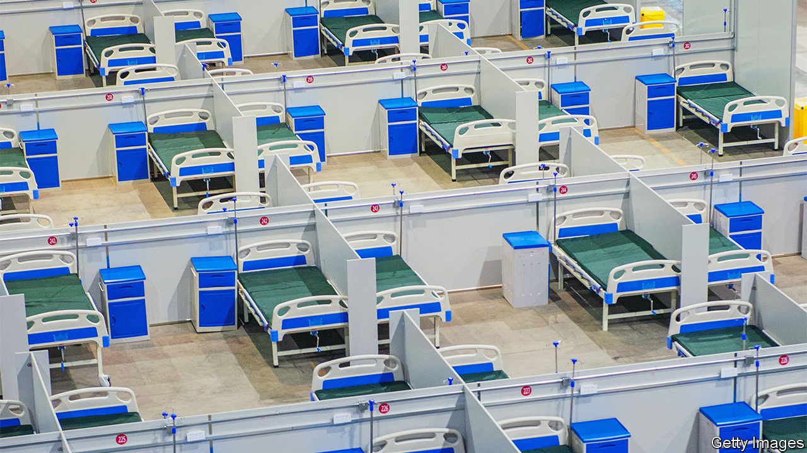

###### The value of zero

# What next for China’s covid-industrial complex? 

##### Relaxation of the rules is a threat to pandemic profits 

 

> Dec 8th 2022 

The harsher China’s zero-covid regime, the bigger its covid-industrial complex. The zero-covid mantra was to test as many people as possible and then to quarantine not only the infected but their contacts and even the contacts of those contacts. In many cases the occupants of entire residential buildings were carted away to isolation wards—called  in Chinese—after the discovery of a single case in an area. As leaders in Beijing fought to keep the virus from spreading across the country, many firms cashed in. 

Theses firms now face a reversal of their fortunes. Sentiment towards zero-covid has shifted rapidly over the past two weeks. On December 7th the central government announced t and allowed quarantining at home for asymptomatic cases after protests against prolonged, heavy-handed restrictions broke out in cities across the country. The policy shift is the most dramatic since China closed to international travel in early 2020. 

It will deal a heavy blow to a once-lucrative business model. The biggest beneficiaries were firms making covid tests. Many saw their share prices soar several times over in the early days of the pandemic. But a number of city governments also sought recently to turn quarantine facilities into sustainable businesses that would attract investors and generate income. 

Since early 2020 hundreds of  hospitals have been set up across the country to accommodate the growing number of covid cases. Some are converted community centres, others are made up of vast rows of shipping containers. In many places they are merely cells constructed in whatever buildings are available. Despite the new rules China is still secluding people who have come in contact with an infected person. Many people fear being locked up more than the virus itself.

Local governments have struggled to pay for testing equipment and quarantine facilities. Analysts put the cost of national mass testing at around 1.7trn yuan ($243bn) a year, or 1.5% of gdp. To pay for the quarantine halls, cities in Shandong, a north-eastern province, coaxed investors to stump up cash. City governments issued some 15bn yuan in bonds to help build about 85 facilities. Some Chinese media reckoned revenues might have been three times that of investment over the lifespan of a project.  bonds offered a dark vision of China’s future. Prospectuses noted that the “covid period” would last for the next five years and that quarantining could become a part of normal life. 

The prospectuses of some  bonds also spelt out how the facilities would generate returns. Admission has been compulsory for anyone suspected of infection. Checking out early was, in most cases, illegal and most people were not charged for their stays. To start bringing in income, a hospital in Yantai, a port city in Shandong, said that it would start charging patients fees to park. Cash from food bills might have brought in around 50 yuan a day per patient. And the plan was that when covid cases eased in the future, the units might be converted into warehouses or even homes for the elderly. 

These schemes now look uncertain, exposing investors to big losses. Many  hospitals are still admitting infected people. But further rule changes could render them obsolete in 2023, despite many of the facilities already being under construction or fully built.

Companies that relied on China’s plans for long-term mass testing in cities are also now struggling. Daan Gene, which make testing devices, has seen its share price fall by about 7% over the past week; Dian Diagnostics, another large testing company, has suffered a similar decline. Some firms have also been attacked online for profiting from the country’s misfortunes. 

Still, some health-care firms are now reaping a grim bonanza. While the prognosis for testing businesses is poor, shares in health-care and treatment companies have shot up in anticipation of a massive wave of cases as covid rules are relaxed. Those of Yuyue Medical, a ventilator-maker, for example, rose by 25% in the first half of November. In a macabre reminder of fears of widespread illness, the value of Fu Shou Yuan, a funeral operator listed in Hong Kong, has jumped by about 50% since the beginning of November.■


