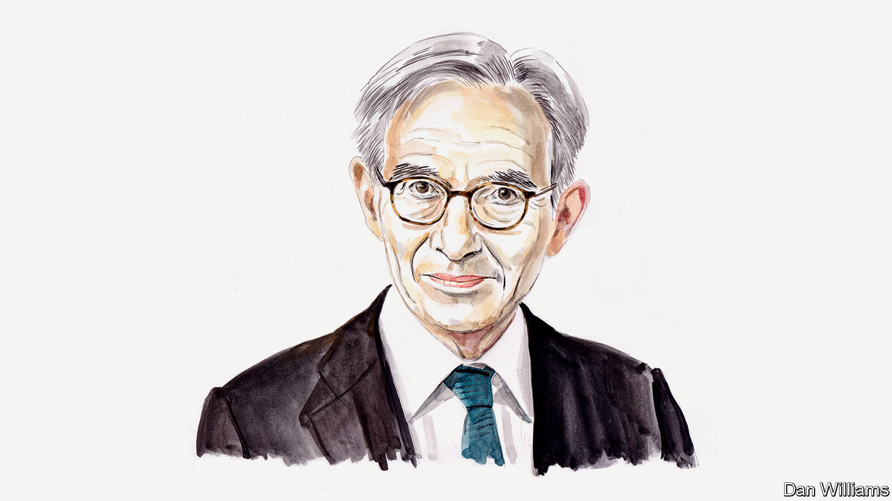

###### Russia and Ukraine

# A former French ambassador on the paradox unveiled by the war in Ukraine 

##### Michel Duclos explains its significance for the West’s liberal order 

 

> Dec 7th 2022 

THE WAR in Ukraine has unveiled a paradox. On the one hand, it shows that the Western international order, created after the second world war and rebranded at the end of the cold war, is crumbling. On the other, the West has shown itself to be more cohesive and robust in its response than might have been expected. It is a paradox that Emmanuel Macron and Joe Biden probably discussed when they met in Washington this month.

The war marks the end of the illusion that there is a truly global liberal order. Many countries in the global South are reluctant to oppose Russia despite the fact that principles of non-aggression, sovereignty and territorial integrity are at stake. Resentment towards the West, aggravated by slow vaccine distribution in the covid-19 pandemic, is driving this disturbing disaffection for the basic tenets of the UN charter.

At the same time, the war also signals that epitaphs for the end of the international liberal order were based on illusory assumptions. The West has shown itself capable both of fighting back and of dominating international financial networks and high-tech exports to Russia. The threat of secondary American sanctions against leading Chinese companies has prevented China from providing Russia with significant military or economic support. And the superiority of armaments from America, Britain, France and elsewhere, in the hands of Ukraine’s highly motivated soldiers, has made all the difference on the battlefield. American HIMARS launchers and French CAESAR howitzers show as much.

Yet Western leaders must harbour no delusions. Most of the conditions which led Vladimir Putin to expect a weak Western response to his invasion will continue to exist. First, liberal democracy has taken a beating in America and in Europe. Second, the relative decline of Western military, diplomatic and political power will continue in relation to China and other rising powers, such as India or Indonesia. Third, the economic clout of the G7 countries will shrink further. And fourth, the resentment of the global South against developed countries will not disappear.

Western leaders, starting with the French and American presidents, should draw one major lesson from the paradox I have highlighted. The West will prevail in its  confrontation with Mr Putin. But that will not mean a restoration of the old Western-controlled world order. The time has come for the West to offer a new vision to its friends elsewhere. 

Restoring a degree of trust between the North and the South should be a priority. The UN climate talks last month, at COP27 in Sharm el-Sheikh, were a missed opportunity. The squabbling over funding for the loss and damage caused by climate change (which eventually led to an agreement) distracted attention from other pressing issues, such as the acceleration of decarbonisation efforts. The West must be able to join with the global South in broad coalitions to tackle climate change, promote health, fight corruption, boost education and aid development more generally. Mr Macron laid out a possible plan for such co-operation in his recent speech to the UN’s General Assembly. He challenged attempts to divide the world over the Ukraine war and stated that a “shared responsibility” exists to help the most vulnerable, including in Pakistan and Somalia. 

The West must also focus more on its relationships with “middle powers”, such as Turkey, Saudi Arabia and, most importantly, India. The weight they have acquired in a globalised world has allowed them to develop their own economic ties with Russia—without incurring American or European retaliation. Think of oil purchases by India, the hosting of Russian financial capital in Turkey, and Saudi Arabia irking America by supporting the OPEC+ decision to reduce oil-production quotas. The three have helped to protract the war by reducing Russia’s isolation. But they can also be useful intermediaries to the Kremlin, as seen at the G20 summit in Bali last month. The West should work with middle powers to rein in Mr Putin; those powers must accept their important role in the new geopolitical order. 

Western countries should also put their own houses in order. They should seek to restore respect for the principle of non-aggression, as embodied in the UN Charter. Many in the global South tend to tolerate Russia’s aggression because they see hypocrisy in the West’s outcries (see the military interventions in Iraq, Libya and so on). America should join France and Britain in being open to an enlargement of the UN Security Council. The three should commit themselves not to abuse their own veto rights in the way that Russia does routinely. 

To signal their new approach, the leaders of America, Britain, France and other Western countries should release a joint statement clarifying their aims for the war in Ukraine. They should support Ukraine and its government in its efforts to re-establish its territorial integrity and commit to helping the country preserve its security even after the end of the war. And the West should find ways to make sure that the Russian invasion of Ukraine is properly prosecuted in an international court. Establishing new forms of principled international co-operation is the only way the West can reconcile the paradox the war has unveiled. ■

_______________


