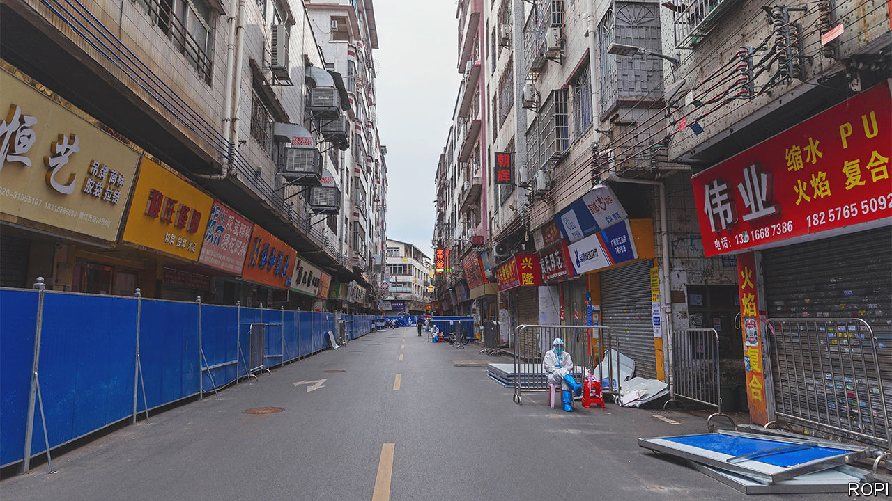

###### Loosening up

# China is dismantling its zero-covid machine 

##### Even as the virus appears to be spreading 

 

> Dec 6th 2022 

According to the official data, the latest outbreak of covid-19 is waning in China. The number of new cases has fallen recently, to fewer than 30,000 a day, from a peak of more than 40,000 in November. But fewer people are being tested. Anecdotal evidence suggests that, actually, more Chinese are catching the disease, raising fears of a big wave. 

Far from locking down, though, China is largely ditching its “zero-covid” policy. That effort relied on three main mechanisms to contain outbreaks. On December 7th the government announced that all of them are being dismantled.

The first mechanism was mass testing, which aimed to find infections fast. People were shocked to see testing booths being removed from city streets recently. A negative test is no longer required to travel within China. If the new guidelines are followed, only care homes, schools and hospitals would still seek proof of a result. Some cities are even discouraging people from getting tested unless they are in professions such as medical work.

The second mechanism, centralised quarantine, strived to isolate the infected and their close contacts. Until recently these unfortunate souls were dragged off to state-run centres. Buying a self-testing kit would have triggered a call from authorities. Now, though, people with mild symptoms and their close contacts can isolate at home and test themselves. They no longer need to regularly log their location on government apps either. 

Lockdowns were the final and perhaps harshest mechanism. They, too, are slowly being lifted. Nomura, a bank, estimates that on December 5th some 452.5m people were affected by various lockdown measures. That is still a big chunk of China’s population (1.4bn), but it is down by 760,000 from the previous week. Large cities are leading the way. Guangzhou, a metropolis in the south, has lifted many restrictions, despite being in the middle of an outbreak. Residential compounds in Beijing, which just weeks ago were putting up steel barriers, are now open. The new rules say that if lockdowns are deemed necessary, they should be imposed on buildings or smaller units, not compounds, neighbourhoods or cities.

China’s propaganda is changing to match the new policies. The virus was long portrayed in state media as a terrifying illness, each case a threat to public health. Until late November, the nightly news devoted regular segments to the devastation covid had wreaked on America, which has recorded over 1m deaths from the virus. Long covid, the drawn-out symptoms of the disease, was “tearing apart American society”, newsreaders claimed.

Few, if any, such segments have aired this month. Instead state media are saying that the Omicron variant is not so scary after all, pointing to the low number of deaths and severe cases it has caused so far in China. State newspapers have begun publishing interviews with doctors who say there is “no evidence” that long covid exists. A well-known nationalist commentator, Hu Xijin, said on social media that he is “mentally prepared” to catch the disease within a month.

Why is this all happening now? During the first two years of the pandemic, the zero-covid policy kept the economy growing by allowing most of the population to live normal, virus-free lives. But the spread of Omicron means more people have been caught in the zero-covid web. The economy has slowed as a result. Everyone is frustrated, from migrant labourers to middle-class city-dwellers. Last month there were rare, politically charged  in several cities.

Still, the timing has puzzled observers. China’s undervaccinated elderly population is vulnerable (see next story). Hospitals will soon be under strain from the flu. And in the coming weeks millions of Chinese will travel home for the lunar new year, potentially spreading the virus into rural areas with threadbare medical systems. Given China’s current state of preparedness,  suggests that if the virus spread unencumbered, hundreds of thousands of people would die.

Anger and angst

Some people are angry at the government’s brazen about-face. “They’ll do whatever they want. The so-called ‘relaxation’ could be reversed tomorrow,” says a resident of Shanghai who took part in the protests. “Even if our resistance made them change policy, they don’t think that they did anything wrong. It’s absurd.”

Others are concerned. “We’ve been under pressure for so long…everyone is still a little worried and unsteady,” says Long Ye, a café owner in the city of Chongqing, which recently lifted restrictions despite logging thousands of new cases a day. Mr Long expects cases to surge. “It is fear of the unknown,” he says, adding that he is uneasy about the health of his elderly relatives.

Rather than enjoying their new freedoms, many people are preparing for a wave of infections. In Beijing, streets and malls are still fairly empty. People out in public now favour tightly fitting N95 masks, rather than flimsier surgical masks. The price of a herbal medicine used against covid (with doubtful effectiveness) has shot up in some pharmacies.

It will take time for local governments to unwind restrictions. In some places, such as those with weaker hospitals, officials may drag their feet. The authorities in some big cities, like Beijing, are keeping testing requirements that the central government called for scrapping. 

Elsewhere in the capital, the focus is on messaging. Big policy changes might imply that the Communist Party got something wrong. Changing zero-covid is especially tricky, as it is one of President Xi Jinping’s trademark policies. So the shift is being portrayed as building on past victories. “Practice has fully proved that the guidelines and policies for epidemic prevention and control…were correct, scientific and effective,” said a recent commentary published by the official Xinhua news agency. “The most difficult period has passed.” That remains to be seen. ■


