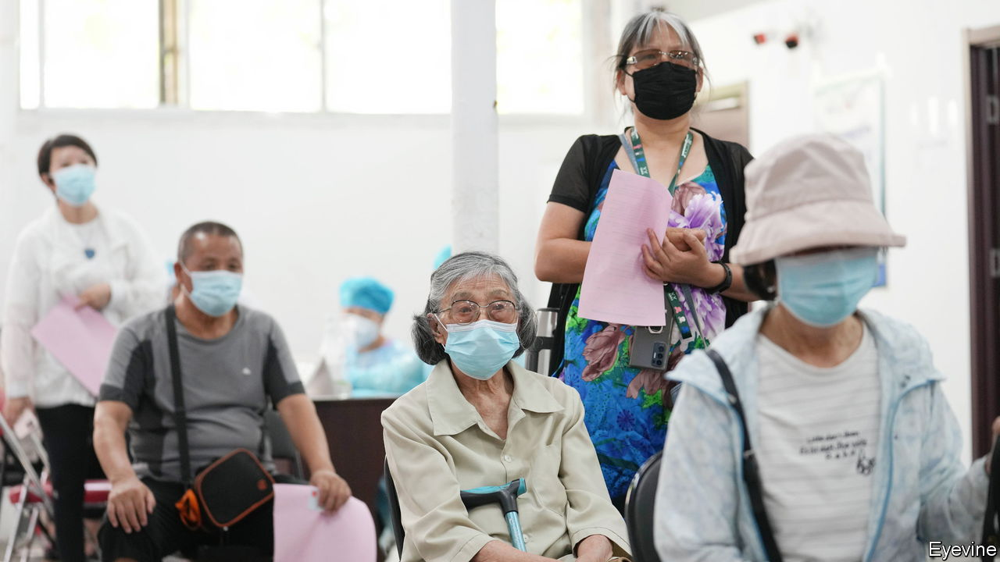
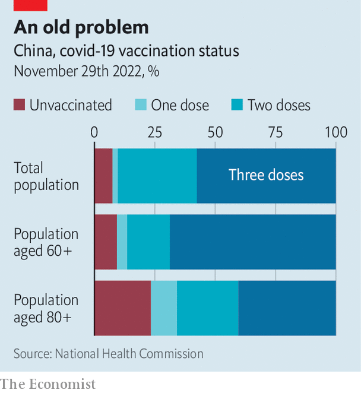

###### Obstinate elders

# Getting China’s old people vaccinated has been slow work 

##### It needs to speed up, fast 

 

> Dec 8th 2022 

When other countries set about vaccinating their populations against covid-19, they began with those most likely to die from the disease. China did the opposite. Instead of focusing on the elderly and people with medical conditions that made them more vulnerable, it started with healthy working-age groups. When officials began paying more attention to getting older people jabbed, they were cautious, fearing side-effects. Now, belatedly, they see the urgency of the task.

 


As China drops many of its harshest pandemic-related controls, infections will surge. Ensuring that older people are fully vaccinated and up to date with booster shots will be critical to keeping deaths to a minimum. The country is still far from achieving the level of protection it needs. Of about 260m people over the age of 60, 86% have been vaccinated with at least two doses and 69% with three (see chart). But in many cases, those jabs were given months ago, and their effects are wearing off. The numbers look even more alarming among people over 80. Only 40% have had three shots. In England, by contrast, about 80% of people over 80 have had a booster within the past three months. 

Only in the past few days has China’s government begun showing signs of alarm about this. On November 29th the National Health Commission issued a directive calling on officials to “speed up” vaccination work among the elderly, especially those over 80. It said the gap between the second and third jabs should be shortened from six months to three. The “whole of society” should be mobilised to ensure that the elderly get their shots, it urged. , a magazine in Beijing, says officials have been told to ensure that 90% of people over 80 have had at least one shot by the end of January, up from 77% in late November.

It will be a hard slog. When the government launched its vaccination drive in 2021, doctors often advised old people that it would be too risky to get jabbed if they had common ailments such as high blood pressure or diabetes. This hesitancy was caused by a lack of data at the time about possible side-effects among the elderly of Chinese-made vaccines (mainland China does not allow foreign ones to be used). Older people had been underrepresented in trials. Although such fears have dissipated among experts, they have persisted among the elderly. It may not help that the state still suggests not getting jabbed if underlying health conditions display “acute” symptoms—a term not defined. 

Most older people in China have had little experience with vaccines since childhood. They have to pay for seasonal flu jabs. Most do not bother getting them. China’s woolly statistics  that result. For treating and preventing disease, many prefer traditional remedies using natural ingredients, even though the effects of these are unproven. The government hails them as proof of ancient Chinese wisdom. It lists several such concoctions among its approved treatments for covid symptoms. When Hong Kong suffered a surge of covid early this year, mainland officials sent care packets to the city’s residents. They included one of the authorised medicines, containing the roots of liquorice and rhubarb. 

Hong Kong’s experience of that surge showed the risks that the rest of China now faces. Like the mainland, the territory had been trying—with much success—to crush covid rather than find ways of living with it. Then came the highly infectious Omicron variant, the same one that the mainland is now struggling with. Thousands of people, mostly elderly citizens who had not been fully vaccinated, were killed by the disease. Hong Kong’s death rate from covid became one of the world’s highest. 

As it winds down its zero-covid policy, China may find that rising infections encourage more of its elderly to get jabbed. By stopping large-scale lockdowns, mass testing and obligatory segregation in state facilities of infected people and their contacts, the country should be able to redeploy its armies of pandemic personnel to the mission of delivering vaccines. But the attitudes of officials and the public alike may prove hard to change. On December 7th the Communist Party mouthpiece, the , published an article about how sufferers of chronic diseases should respond to infection with covid. It did not mention the importance of getting vaccinated before that happens. ■


