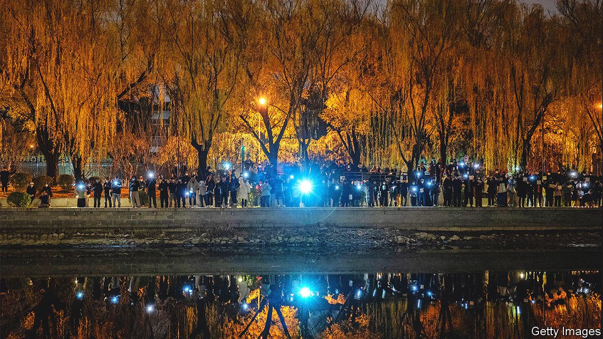

###### Dissidents v censors

# How Chinese netizens breached the great firewall 

##### And what the government is doing to keep it from happening again 

 

> Dec 8th 2022 

In April a young Chinese painter in Italy began using Twitter to publish content forwarded by censor-wary netizens in China. For much of the previous year, he had done the same on Weibo, a Chinese social-media platform. But he moved to Twitter after Chinese authorities closed his Weibo accounts. For the first few months, his posts were not widely read. Twitter is blocked in China. And he tweets in Chinese, limiting his foreign audience. 

Yet his account, “Teacher Li Is Not Your Teacher”, became a critical conduit for information about the protests against covid-19 restrictions that erupted across China last month (one is pictured). Participants and spectators sent him loads of images and eyewitness accounts by direct message. By reposting many, he played an important role in conveying the scale of the unrest to others, in China and abroad. He also gained almost 600,000 new followers and 387m visits to his Twitter profile in November alone. 

Teacher Li’s account was just one manifestation of the biggest breach in China’s internet controls since they began in the late 1990s. Public anger has flared online before, but never coalesced into widespread physical protests. Now cyber administrators are scrambling to plug holes in the “great firewall”, lest a new surge of covid leads to more digital dissent.

One reason for last month’s breach was the sheer volume of people involved. The great firewall automatically blocks politically sensitive terms and many foreign sites, including news outlets, search engines and social media. China also mandates domestic technology firms to employ armies of censors who screen user-generated content using frequently updated lists of restricted words and images. 

But the deluge of information posted in late November—featuring different activities and slogans—appears to have overwhelmed both algorithms and human censors. Many people in China learned of the protests from local messaging apps, where images and comments were often copied or downloaded before censors could delete them, and then reposted multiple times. 

Eric Liu, a former Weibo censor, says that China’s bureaucracy is so centralised that when unfamiliar threats arise, sensitive information can spread widely while censors await official orders. “With this level of protest every bureaucrat is afraid to make a decision for himself,” he says. 

Other industry insiders suggest that some Chinese tech companies’ spending on in-house censorship has been constrained by financial difficulties since a crackdown on the sector began in 2020. Chinese authorities have now ordered them to boost their censor cohorts and pay closer attention to protest-related content, the  reported.

Chinese netizens are becoming more inventive, too, posting political messages on dating sites or in the comments section of otherwise uncontroversial content. Artificial intelligence does not spot sarcasm easily, so under official posts on social media, many left messages simply repeating the Chinese word for “good”. Others posted images of blank white sheets of paper.

Then there are foreign social-media accounts like Teacher Li’s, which aggregate and amplify information sent from China. While Chinese authorities and their proxies cite that as evidence of “foreign forces” fomenting unrest, researchers suggest it is driven more by Chinese nationals abroad, especially students, and people within China who use virtual private networks (VPNs) to circumvent the great firewall.

China lets businesses use licensed domestic VPNs. But many Chinese have illicit ones and, though numbers are hard to measure, researchers cite a recent uptick in demand (not least from students studying at home). Xiao Qiang of the University of California, Berkeley, estimates that 10m people are using VPNs daily in China, up from about 2m at the pandemic’s outset. 

There are also signs of more Chinese joining Twitter (using VPNs) but communicating only via direct message. Twitter does not share the number of users in China, but Zachary Steinert-Threlkeld of the University of California, Los Angeles, estimates it rose by around 10% in early 2020 as people sought covid news. He also noted an increase in Twitter downloads during the protests. “If I had to bet, I would say more people are using Twitter now than two months ago, but they are being very cautious with their behaviour,” he says.

Chinese authorities appear alarmed, particularly by what they call the “backflow” of information from abroad. On November 28th the government’s internet watchdog declared a “Level 1 Internet Emergency Response”, requiring the highest level of content management. It ordered Chinese e-commerce sites to curb sales of censorship-circumvention tools, including VPNs and foreign Apple accounts (which enable downloads of apps forbidden in China). It also instructed Chinese tech firms to scrub user-generated advice on “jumping” the great firewall. 

At the same time, Chinese authorities are using more intrusive methods that span the digital and physical worlds. Police have searched handsets for banned apps or protest-related images and contacted protesters identified via mobile-phone location data. Teacher Li says police have visited his parents in China several times, presenting them with a list of his tweets as “criminal evidence” and threatening to block them from sending him money. “The psychological pressure is great,” he says. “But this account isn’t just about our family. It’s about the well-being of countless Chinese people. So I won’t stop.” ■


