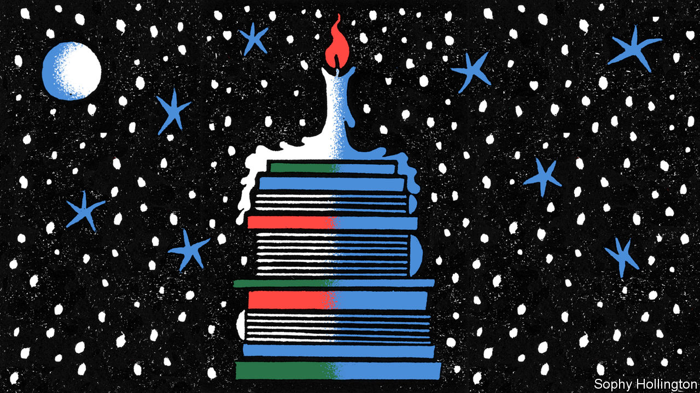

###### Books by our writers

# Our correspondents wrote about polling, sanctions and economics 

##### As well as management fads and the history of money 

 

> Dec 8th 2022 

By Philip Coggan. 

Our former Bartleby columnist takes a wry look at the changing world of work, covering everything from automation to presenteeism. He skewers corporate jargon and a range of management fads, and proposes various —such as “80% of the time of 80% of people in a meeting is wasted”, and “jargon abhors a vacuum”. 

 By Agathe Demarais. 

A look at the ripple effects of American sanctions by the global forecasting director of the Economist Intelligence Unit, who used to work for the French Treasury in Russia and Lebanon. It highlights sanctions’ unexpected side-effects—and their potential to backfire, as in the case of recent  on semiconductor exports to China. “Illuminating”, reckoned ; “balanced, fast-paced and often surprising”, said the .

 By Gavin Jackson. 

One of our economics and finance correspondents answers the important questions on the nature of money and the ways it shapes the world. The book draws on historical examples to dispel myths and show how societies and their citizens have always been entwined with matters of lucre. “A lucid and at times very funny history of money”, concluded the 

By G. Elliott Morris. 

One of our data journalists , showing how they not only predict the outcomes of elections but improve democracy. Polling, he argues, is a way for citizens to have influence they otherwise would not. “A short, valuable guide”, said the . “Political junkies and policy analysts will savour this informative deep dive,” thought .

Edited by Tom Standage. 

A compendium of the extraordinary quandaries and conundrums, bizarre facts and head-scratchers featured in our popular “” series of articles. The editor of our future-gazing annual, “The World Ahead”, collects the mind-stretching answers our journalists wrote to questions such as: How do footballers get their shirt numbers? How do you move a horse from one country to another? What counts as a journey into space?


