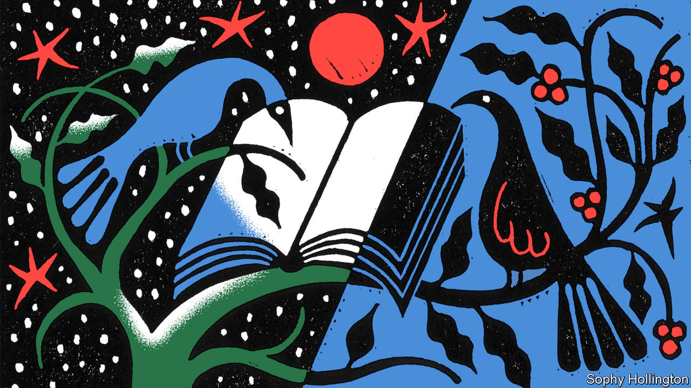
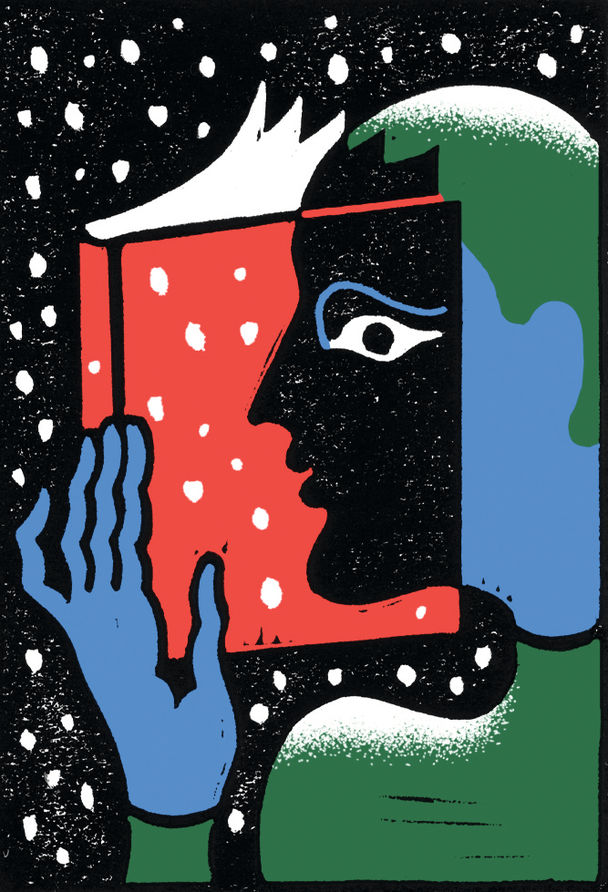
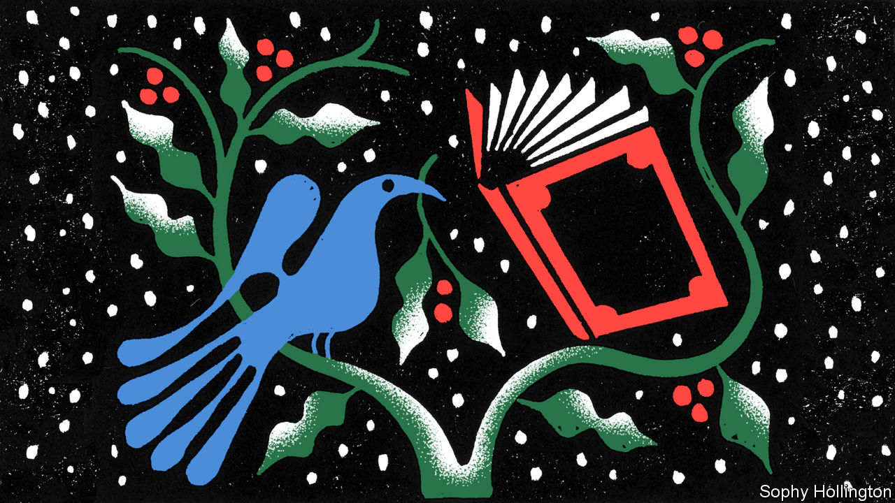

###### Our books of the year

# These are The Economist’s best books of 2022 

##### Their subjects include financial scandals, a witness to the Holocaust and cell theory 

 

> Dec 6th 2022 


Politics and current affairs

By Karen Cheung. 

An illuminating and  of how Hong Kong descended into the mass street unrest of 2019, and of the pandemic-abetted repression that has crushed it since. The author speaks powerfully for a desperate generation of young Hong Kongers conscious that their home city has lost what made it home.

By Jessie Singer. 

A look at why Americans are so much more likely to suffer violent “accidents” than people in other rich countries. The author shows how poor road design, rather than bad driving, explains the persistence of car crashes and how factories use rule books and disciplinary procedures as a cheap substitute for real safety improvements. 

By Maggie Haberman

A chronicle of the life and lies of the 45th president of the United States, from outer-borough brat to White House bully.  of a master scammer is by a journalist who covered Donald Trump for decades. He learned early, she notes, that celebrity was power. 

By Matt Easton.

A  of the efforts to bring to justice the killers of Munir, a prominent Indonesian human-rights activist murdered in 2004. It reads like an enthralling legal-procedural whodunnit, as evidence is slowly unearthed from telephone records, lost documents are retrieved from deleted computer files and intriguing new witnesses emerge. 

 By Matthieu Aikins. 

In 2016 the author, a Canadian journalist, went undercover to accompany an Afghan friend on his perilous journey to a new life in Europe—always knowing that, if push came to shove, he could fall back on his Western citizenship, while his friend would have to rely on his luck. The result is a  into the refugee crisis. 

By Gideon Rachman. 

It is striking how many of today’s leaders , notes a columnist for the(formerly of ). His subjects, including Xi Jinping and Prince Muhammad bin Salman, are a threat not only to the well-being of their own countries, he says, but to a world order in which liberal ideas are increasingly embattled. 

 By Nicholas Mulder. 

A fortuitously timed history of the use of economic sanctions during the interwar period of the 20th century. Their mixed success cautions against hoping that the West’s sanctions against Russia can bring about an end to war in Ukraine. 


Business and economics

By Dan McCrum. 

The  of the demise of Wirecard, once one of Europe’s brightest tech stars. The author, a journalist at the , was one of a small band of sceptics who believed the firm was a giant fraud. Faced with a vicious counter-attack from the company and its spies, and the German establishment’s reluctance to accept a national champion could be a sham, they had a long wait for vindication.

 By Chris Miller. 

Semiconductors are central to modern life—they power everything from advanced weapons systems to toasters—but the supply chain is alarmingly fragile. Many countries see chips as a strategic asset.  shows how economic, geopolitical and technological forces shaped an essential industry.

By Matthew Campbell and Kit Chellel. 

Books about merchant shipping are rarely so gripping, but this one looks at what really happened when pirates attacked the  in the Gulf of Aden in 2011. A  and impunity.

 By Sebastian Mallaby. 

Venture capitalists are often accused of prioritising growth at all costs, so feeding a recklessly aggressive capitalist culture. In this  a former journalist at —and husband of the current editor-in-chief—acknowledges the industry’s shortcomings but eloquently defends its achievements.

 By William Magnuson.

A  of corporations, stretching from the  of ancient Rome, through Renaissance Florence, the Age of Discovery and the might of American industrial capitalism to Silicon Valley. Private enterprises have produced some of humankind’s greatest achievements. But often the most dazzling overstep the mark, leaving a trail of debris and distrust behind them. 

By Oliver Bullough. 

After making a decision to attract footloose international capital after the second world war, Britain went on to roll out the welcome mat for plutocrats and oligarchs. This is an  of the lawyers, pr firms and others who help siphon dirty money through London’s banks and property market. 

 By J. Bradford DeLong. 

Written with wit, style and a formidable command of detail, this book places the  in their economic context. In doing so, it provides insights into how things have gone wrong in more recent years—and what must go right if catastrophe is to be avoided in the current century. 

By William Cohan.

A  of the firm founded in 1892 as the General Electric Company. Its story makes clear how important brilliant people are to business success—and how their brilliance can sometimes become a dangerous vulnerability. 

Biography and memoir

 By Jonathan Freedland.  

In 1944 Rudolf Vrba escaped from Auschwitz and helped produce a report on its genocidal horrors. Reluctant as some were to face the truth of the death camps, his bravery and tenacity saved many lives.  is told with pace and verve, and is an important addition to Holocaust historiography. 

 


By Lindsey Fitzharris.

An account of the pioneering work done by Harold Gillies in the early 20th century at specialist maxillofacial units in Britain.  of a masterful plastic surgeon, it is also a heartening tribute to medical progress.

 By Lucy Worsley. 

On December 3rd 1926 the famous novelist left her husband and young daughter and went missing for 11 days. That mysterious disappearance is at the heart of this , which pieces together what really happened that winter. 

. By Alison Bashford

Julian Huxley and Thomas Henry Huxley, his grandfather, were both acolytes of Darwinism. They shared a scientific genius, an appetite for culture (both were keen poets) and a tragic tint of mental instability. Both lives are painstakingly illuminated in this . 

By Alec Nevala-Lee. 

Buckminster Fuller was a path-breaking American architect and engineer.  as a stunningly original thinker and prophet of technology. He comes alive as a visionary who rose above his imperfections to labour for the benefit of humankind.

By Bruce Caldwell and Hansjoerg Klausinger. 

An elegant account of  in 20th-century economics. It is packed with great anecdotes and punctures myths about the Austrian-British economist. Mostly it confirms the view that he was a rather strange man, and not always a very nice one. 

History

By Victor Sebestyen. 

Forever caught between East and West, the capital of Hungary encapsulates the drama of central Europe in its wonders and horrors. The author, who left the city as a child after the uprising against communist rule in 1956, excels in describing Budapest’s Habsburg heyday, the historical role of its Jewish population and the hubris and humiliations that have helped shape the city. 

. By Jessie Childs.

The broad subject of  is what happens to people during civil war: how quickly and imperceptibly order becomes chaos and decency yields to cruelty. In other words, how close to inhumanity humanity always is. The focus is on an episode in the English civil war, but the story is timeless. 

 By Marius Kociejowski. 

To write about Naples, you really need to be a poet—or, even better, an antiquarian bookseller. This author is both and has produced  that is as eclectic, labyrinthine, ironic and shocking as the great Italian city itself.

By Keith Fisher.

A sprawling,  from the Palaeolithic era to the first world war. Black gold has been as much a curse as a blessing for the people on whose land it has been found. A compelling read and an immensely valuable guide to a great and terrible industry.

By Simon Sebag Montefiore. 

Don’t be put off by the doorstopper length: this history of the world, told through the stories of eminent families, is a riveting page-turner. The author brings his cast of dynastic titans, rogues and psychopaths to life with pithy, witty pen portraits, ladling on the sex and violence. An epic that both entertains and informs. 

Fiction

By Jennifer Egan. 

A novel about what humans lose in offering up their private lives to algorithms that mine them for profit. For all its fluency in the languages of gaming, addiction and tech, this is a social novel with numerous characters and perspectives; a kind of .

By Lavie Tidhar. 

Corruption, drugs and assassination feature in this wildly ambitious saga set over four decades in Israel from the early 1970s. It is loosely organised around a series of murders on a coastal road and the career of a crooked cop, but takes detours to Lebanon, Los Angeles, Colombia and Cancún. A caustic alternative history of the dream and development of Israel.

 


By Guadalupe Nettel. Translated by Rosalind Harvey. 

A novel about the choices women make over whether to have children, and what happens if their offspring turn out differently from how they expected. An unsentimental and . 

By Percival Everett. 

Someone is murdering white people in Money, Mississippi. A mutilated black body is found at the crime scenes but keeps disappearing. At first the victims are connected to the lynching of Emmett Till in the neighbourhood in 1955; but then the circle of comeuppance widens. Two wisecracking detectives head down to investigate. A bitingly funny, boldly satirical, deadly serious tale of racism and the legacy of injustice.

By Claire Keegan. 

In the lead-up to Christmas in 1985, Bill Furlong, a coal and timber merchant, is making deliveries in his small Irish town. His mind is on his unsettled childhood and festive arrangements for his own offspring—until he comes across a distressed girl, locked up in one of the country’s Magdalene laundries (ie, homes for “fallen women”). A haunting short book with a quiet, ordinary hero at its heart.

By Ayanna Lloyd Banwo. 

Set in Trinidad, this debut novel tells of the separate struggles and twinned destinies of two characters from contrasting walks of life. What looks set to be a simple tale of boy meets girl soon develops into a thoroughly original and emotionally rich .

Culture and ideas

 By Richard Reeves. 

In some ways the world remains male-dominated, yet many men are falling behind, says the author. Boys do worse than girls in school in many countries, and are more likely everywhere to end up in prison or kill themselves. He suggests practical, incremental reforms, such as having boys start school a year later. 

By Kieran Setiya. 

A professor of philosophy at MIT argues that suffering  or spoil a good life. Living well and hardship can go together, he says; clear thinking is the key. A humane, consoling guide to this vale of tears, with a glimmer of hope.

By Megan Walsh. 

China’s modern literary landscape teems with corruption exposés, homoerotic fantasy, emotive migrant-worker poetry, time-travelling entrepreneurs and desolately radical science fiction. The author  for Anglophone readers who want to understand China to look past the headlines and turn to books.

By Irene Vallejo. Translated by Charlotte Whittle. 

A  in the ancient world. The committing of words and stories to papyrus scrolls was, the author says, as disruptive as the internet.

By Andrea Wulf. 

An arresting group biography of the “Jena Set”, a gang of young German intellectuals who played an outsize part in the movement that . It reads as if Iris Murdoch had set a novel during an especially muddy phase of German metaphysics.

Science and technology

By Siddhartha Mukherjee.

A , by a clinical oncologist and professor of that subject at Columbia University. Cases from the author’s own career illustrate the results of both cellular understanding and the lack of it. The result is part history lesson, part biology lesson and part reminder of how science itself actually proceeds.

 By Frank Close. 

A compelling account of the : its existence was predicted in 1964, but it did not show its face to the world until 2012. This is also a biography of Peter Higgs, the shy physicist after whom the particle was named. 

 By Ed Yong. 

Human senses can only perceive a fraction of the energy and information moving through the world. Animals manage much more: some birds can sense magnetic fields, bees can see ultraviolet light and bats perceive their surroundings using sound waves. By examining how such creatures sense their environments, this book lifts the shroud on previously invisible dimensions of the world itself. 

By James Vincent. 

Humans are list-makers, this  of measurement argues. From Aristotle’s “Categories” to the Linnaean taxonomy of biology, people are splitters, not lumpers, forever seeking to parse and quantify the world.

By Orly Lobel. 

This author agrees with those who fear artificial intelligence can be biased. But, in a brilliant act of intellectual jiu-jitsu, she argues that the answer is not to slow the technology,  to solve those defects and achieve social progress. 

By Andrew Doig. 

A biochemist at the University of Manchester provides a —and points to medical marvels that may lie ahead. An empowering story of human ingenuity. ■


