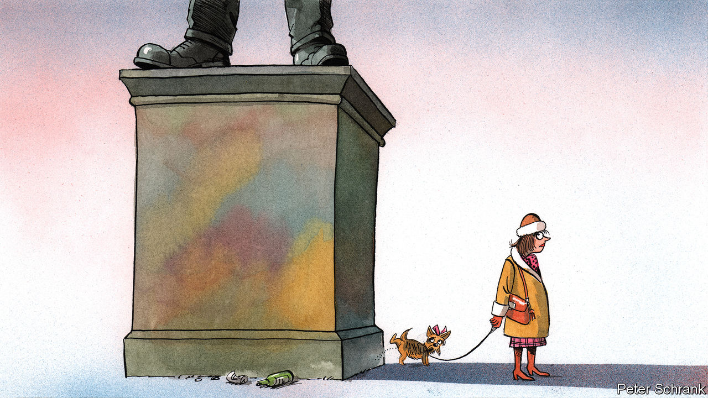

###### Charlemagne

# Europe is grappling with its dodgy memorials, a plinth at a time 

##### The war in Ukraine has led to purges in Soviet-era statues 

 

> Dec 8th 2022 

Memento Park, in Budapest’s southern suburbs, offers a glimpse of the glorious future communists once promised. Statues of muscular workers lunge confidently forward, the better to crush capitalism; unsuccessfully as it turned out. Dozens of likenesses of Lenin, Marx and their Hungarian ideological enforcers stare into the distance. These monuments dotted the Hungarian capital before central Europe shook off the Soviet yoke in 1989. The open-air museum, inaugurated a few years later, was an elegant solution to an intractable problem: how to place public displays of tyranny out of sight without resorting to the destruction of heritage of the sort tyrants themselves favour. As if to underline the rout of socialism, a “Red Star” gift shop offers joke USSR tin mugs, and visitors can recreate the experience of East German motoring by pushing a beaten-up Trabant around.

The old continent has a lot of history. Some of the figures it  are people it now no longer wants to celebrate. Dictators, colonisers and other previously exalted villains are being shunted off their pedestals. In eastern Europe, the Russian invasion of Ukraine has rekindled a campaign to purge any remaining tributes to Soviet “heroes”. Farther west, attitudes to the past are evolving at a slower pace.

An almost totalitarian purge of Soviet memorabilia is under way. The Baltics, once part of the Soviet Union and now among Ukraine’s most vocal supporters within the European one, are at the forefront. In August authorities in Latvia theatrically toppled an 80-metre monument celebrating the Red Army, to cheering crowds. A week earlier Estonia had carted off a Soviet T-34 tank from its pedestal in the town of Narva to a museum. (A similar model serving as a Soviet memorial in Lysychansk in eastern Ukraine was hauled off its own display, then deployed as a road block to hamper advancing Russian troops.) Raseiniai, a city in Lithuania, covered up a 70-year-old monument to Red Army soldiers in the spring—before removing it a few weeks later. Historical commissions are at work to see what else ought to be taken away. In Estonia alone, some 244 Soviet monuments are to be expunged.

Across eastern Europe old statues of Lenin and hunky Soviet workers disappeared long ago. Poland passed a “de-communisation” law in 2016, decried by critics as an attempt by the state to reshape historical memory. What usually remains are war memorials, which local authorities have been queasier about dismantling. A number of sites have become the subject of bilateral accords with Russia to ensure their preservation. Russian-speaking minorities, for example in Latvia, have defended the monuments. Protests from Moscow that razing monuments is akin to a “war against history” have fallen on scornful ears. Ukraine, which speeded up a purge of Russian symbols after 2014, has found more to do: on November 30th Odessa’s city council voted to remove a prominent statue of Catherine the Great. Though she founded the place, as empress of Russia she is no longer welcome.

Germany stands as an outlier. It has over 1,000 Soviet monuments, largely in the formerly communist east. Yet there is no discernible call to do anything about them. That is not to do with the supposed complaisance of politicians in Berlin towards Russia. Rather, broader forces of history and identity are in play. The routing of the Nazis in 1945, and thus Germany’s rehabilitation after the war, start with the Red Army. Some 80,000 Soviet troops died in the liberation of the capital and more than 10,000 are buried there. Even though the Russians outstayed their welcome by decades, denial of the Red Army’s role in ending the war would open a can of historical worms: erase the Russians from the wartime narrative, and other chapters may need to be rewritten. Best not start. In that spirit the graffiti of young Russians as they captured the Reichstag in 1945 are preserved to this day. Reminders of other dark chapters of German history are fair game: on December 2nd a Berlin square long named after a 19th-century coloniser of west Africa, Gustav Nachtigal, was rechristened after two of his victims.

Other bits of western Europe have their own demons. Germany never tolerated anything resembling a glorification of its Nazi era. Italy has proved more tolerant of its home-grown fascist, Benito Mussolini, for whom Italy’s new prime minister, Giorgia Meloni, has in the past expressed admiration. Last month a research institute in Milan unveiled a list of 1,400 monuments, street names and plaques that glorify the fascist regime in power from 1922. Some monuments are hardly difficult to pinpoint, including a 36-metre obelisk in Rome with the inscription “Mussolini Dux”. The grand Palazzo della Civiltà Italiana, also in the capital, is adorned with a quote from . Far from being consigned to history, today it serves as the headquarters for Fendi, a fashion house.

Spain has been tackling its own dodgy monuments. In October a “Law of Democratic Memory” was passed. Among other things it aims to “redefine” the Valley of the Fallen, a giant memorial to its civil war in the 1930s which had come to serve as a final resting place for Francisco Franco and his fascist acolytes. Built outside Madrid using slave labour, the monument long served as a rallying point for Franco’s enduring fans. The man himself was exhumed from there in 2019, and other graves are now being moved. The right-wing opposition has vowed to reverse the law once in power. 

How the mighty have fallen

The moving of statues, let alone their destruction, opens up debates about the role of the state in remembering. There are other solutions. In Budapest, not every artefact could be moved to Memento Park. In the centre of town, an imposing monument lauding Soviet troops that liberated the city endures. For that, a novel plan was hatched: in 2011 it was ideologically neutralised by the erection nearby of a statue of Ronald Reagan. As if America’s communist-basher-in-chief needed reinforcement in his final stare-down, a likeness of George H.W. Bush was added two years ago. ■


