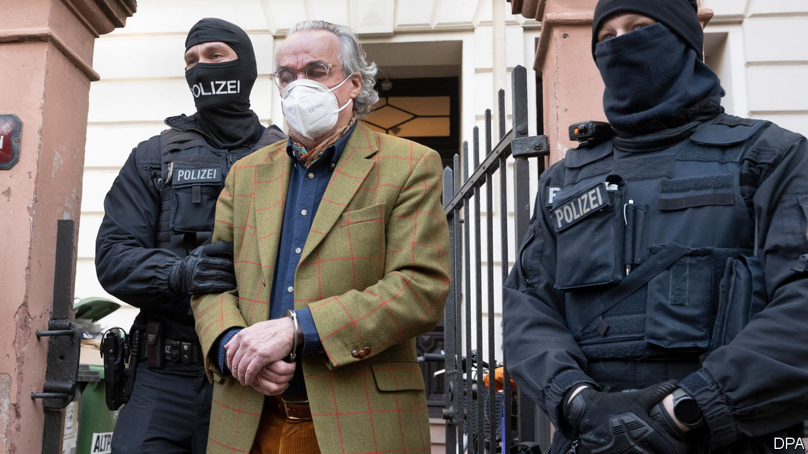

###### The unhappy prince

# German police arrest two dozen alleged conspirators in a hare-brained plot to overthrow the government 

##### Investigators say a coup d’état was being planned 

 

> Dec 7th 2022 

IT COULD HAVE been an episode of “Babylon Berlin”, a TV drama in which the , a cabal of far-right military officers, plots a coup against the Weimar Republic to bring back the monarchy. At the crack of dawn on December 7th some 3,000 police and special-forces officers carried out raids in 11 states across Germany to arrest 25 suspected members of a group that was allegedly planning to topple the “deep state” the plotters believe is ruling the country. Even some of the characters involved resembled “Babylon Berlin” ones: there is a prince, a judge and a former commander of a special unit of the armed forces.

The prosecutor’s office said that those arrested “aimed to overthrow the existing state system and replace it with their own form of state of which fundamental features are already prepared.” They know, it went on, that “they can only achieve their aims with military means and violence against representatives of the state. This includes murder.” The plotters were said to be united by a rejection of the federal republic’s liberal-democratic constitution, and made “concrete preparations” for its violent overthrow. 

According to the prosecutor the group, formed in 2021, wanted to install as the new head of state and leader of a ruling council “Prince” Heinrich XIII of Reuss, the 71-year-old descendant of a family that ruled its principality in eastern Germany until 1918. The Reuss family is said to have strongly distanced itself from Heinrich XIII because of his reported involvement with the far-right Reichsbürger, or Citizens of the Reich, who espouse anti-Semitism and racism and reject the legitimacy of the federal republic in favour of the German Reich of 1871. Birgit Malsack-Winkemann, a judge in Berlin and former member of parliament of the far-right Alternative for Germany, was, according to the prosecutor, to be justice minister in the planned new Reich. (Ms Malsack-Winkemann left her judgeship following her arrest.) A Russian citizen, whom the prosecutor identifies as “Vitalia B”, was allegedly trying to foster contacts with the Russian government. Prosecutors are now investigating whether an armed group that is said to be part of the conspiracy was planning to storm the Bundestag, Germany’s parliament in Berlin.

Over the past three years Thomas Haldenwang, the head of Germany’s domestic-intelligence agency, has frequently called  the biggest threat to Germany’s democracy. Some commentators have dismissed such people as crackpots on the fringe of society, but Mr Haldewang insists that they are a real and present danger. His service has intensified its monitoring of far-right groupings such as the Third Way, the National Democratic Party and Die Rechte. It believes that around 34,000 right-wing extremists are at large, of whom it deems 13,500 to be potentially violent. In 2021 right-wing extremists committed 20,201 criminal offences (or 55 a day), including physical attacks on foreigners, a little lower than in the previous year, but still high.

The alleged far-right conspiracy to topple the government may not have come as a surprise to Mr Haldenwang and other security experts who have warned for a while about plots such as a plan in April to kidnap Karl Lauterbach, the minister of health; but most Germans watched the day’s events unfold in amazement. Whereas Americans are familiar with the spread of QAnon-style conspiracies, Germans tend to believe that in their country such views were confined to loony loners rather than an organised grouping with an actual plan. 

Media attention is focused on Heinrich XIII, who has perhaps channelled his frustration about the German government’s refusal to restitute his land and castles in eastern Germany after reunification into violent conspiracy theories. In his tweed jacket and corduroy trousers he cut a somewhat pathetic picture when he was being led away by police officers in handcuffs in the morning hours. Yet such appearances can be deceptive, as prosecutors believe him to be the figurehead of a potentially well-armed and violent group. ■

