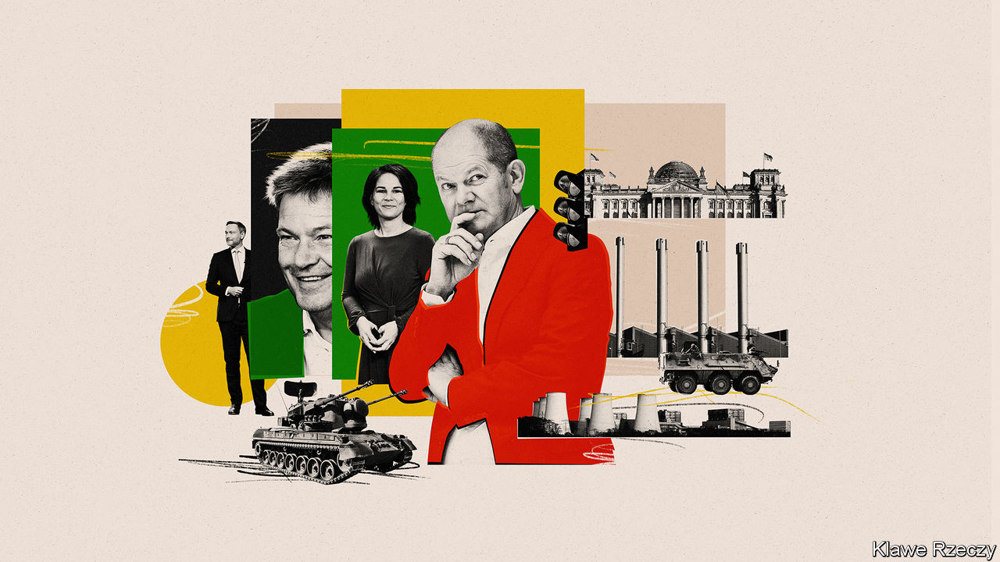
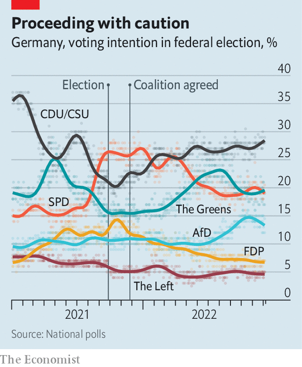

###### The traffic-light at one

# Germany’s ruling coalition marks its first anniversary 

##### Despite war, inflation, recession and a gas-strapped winter, it is faring rather well 

 

> Dec 7th 2022 

Angela Merkel’s 16-year run as Germany’s chancellor was always going to be a hard act to follow. But her triumphant exit was not the sole reason why the  that clomped onto the stage last December 8th looked bound to put up a poor show. Germans had dubbed the wobbly-looking coalition , the traffic-light. This referred to the colours of its component parties—red Social Democrats (spd), yellow Free Democrats (FDP) and the Greens. Yet it also hinted at mixed signals and policy jams. It was no help that the Ampel’s leading man was Olaf Scholz, a dry Social Democrat whose electoral success owed less to his charms than to his opponents’ gaffes. And then, weeks into the Ampel’s opening run, Vladimir Putin, the president of Russia, set the theatre on fire. 

Yet Mr Scholz’s ensemble has weathered and even emerged stronger from a turbulent first year. Not only has the Ampel steered Europe’s richest, most populous country through a crisis as challenging as any that faced Mrs Merkel. It has also set Germany—so far gingerly rather than firmly, it is true—on a course towards potentially far-reaching reform. The coalition has shown it can be supple when needed, with each of its parts bending towards compromise. And Mr Scholz has proved an abler leader than many expected of a weaned-on-a-pickle former mayor of Hamburg. “I think Scholz has the coalition quite well in his grip,” says Jana Puglierin of the European Council on Foreign Relations, a think-tank. “He’s made it clear that he is the one calling the shots.” 

It may sound a small thing for a powerful country’s top elected officer simply to show his own team who is boss. But German federalism sharply curbs executive power. Not only must Mr Scholz keep his party loyal and coalition partners happy. He must also play politics across 16 very different states, all but one of which are currently ruled by coalitions, and several of which in any given year will pass a verdict on his party at the polls. The chancellor must meanwhile balance the demands of Germany’s grumpiness-prone public and sensation-driven press against the tight constraints of its European Union and NATO alliances. Because of its dark past and current weight, even Germany’s friends are quick to blame its leaders for doing too much or too little.

Mrs Merkel handled these competing pressures masterfully. Aside from toughness and intelligence, the four-term chancellor’s favoured tool was patience. Her tendency to withhold comment until others had spent their arguments even spawned a verb,  meaning to sit things out. Mr Scholz has clearly studied the master closely. His election campaign last year stressed competence and pragmatism; in Ms Puglierin’s words, he presented himself as “Merkel in a suit”. In office, Mr Scholz has let younger, telegenic ministers thrash out differences, intervening only at a statesman-like last minute. 

The clash within the coalition over energy policy is one example. When Mr Putin’s invasion of Ukraine exposed how dangerously dependent Germany had grown on Russian fuel, the Ampel raced to find alternatives. This required the Greens to concede on restarting coal-fed power plants and on speed-building terminals to import LNG, even as the liberal FDP grudgingly allowed more spending (and Social Democrats sheepishly confessed they had been wrong about Russia). 

But Robert Habeck, the Green deputy chancellor in charge of energy, for months dug in his heels over whether to prolong the life of Germany’s last three nuclear-power plants, which Mrs Merkel long ago pledged to close by the end of this month. Not until October did Mr Scholz dictate a compromise, allowing the plants to keep running until next spring.

As under Mrs Merkel, such strategic patience has helped entrench the coalition and strengthen Mr Scholz’s own hold. It has helped the Ampel push through needed policies, such as reform of unemployment benefits and soon-to-come tweaks to immigration laws, freeing manpower-short German businesses to seek imported talent. Yet Mr Scholz’s quiet, tactical politics are perhaps better suited to peacetime than to the current global crisis. 

What feels like political wisdom in the Berlin chancellery can look to others like foot-dragging or, occasionally, selfish parochialism. European allies were furious when, at the end of September, the Ampel abruptly  from raging energy costs. German diplomats were left explaining that no, this huge sum would not undermine joint EU policies because it was, in fact, only a rough number, other countries are doing similar things, and it is to be spread over many years.

Some Germans are unforgiving, too. Dieter Pogel, an accountant enjoying a bustling Christmas market in the port city of Bremen, takes a swig of mulled wine before saying what he thinks about the chancellor. “The Scholzomat talks a lot, but he doesn’t do a lot.” That is a view shared, if expressed differently, by big chunks of the policy establishment in Berlin. The delight felt when, three days after Russia invaded Ukraine, Mr Scholz declared a , a historic turning point that would see Germany assert itself not just as a political and economic leader, but a military one, has for many turned to disappointment. 

The Ampel has indeed stood up for principle over Ukraine, providing lots of money and weapons as well as refuge to 1m Ukrainians. But the €100bn boost pledged to Germany’s own long-shrunken defence spending has proved, after months of dither, to mean a rise this year of just 0.2% as a proportion of GDP, and not enough more next year to reach even the modest 2% of GDP that Mrs Merkel had committed, but failed, to spend all the way back in 2014. The defence minister recently admitted that despite nine months of crisis her ministry has failed to order extra ammunition; estimates suggest that under war conditions the German army would run out within days. 

Perhaps, taking another cue from Mrs Merkel, Mr Scholz is thinking of the longer term. Sustained for five years, the defence hike will begin to make a difference. By then, the energy transition Mr Habeck dreams of may take hold, too, with Germany’s huge investment in emissions-free hydrogen starting to pay off. Current economic woes, including the highest inflation in seven decades (and the sharpest drop in real wages), along with an expected recession in 2023, could also be history.

 


Ms Puglierin warns of possible downsides. Another surge of refugees, plus prolonged economic doldrums, could bust the budget and push voters towards fringe parties, especially on the far right. Polling already shows a slow slide in support for the Social Democrats and the liberals, though the Greens have more than held their own. Henning Hoff, who edits , a global-affairs quarterly, thinks however that the centre will hold, the coalition partners clinging together to survive and the mainstream opposition, led by the right-of-centre Christian Democratic Union, failing to offer attractive alternatives. “This government looks fragile but is actually quite stable,” judges Mr Hoff. “It is condemned to success.” ■

