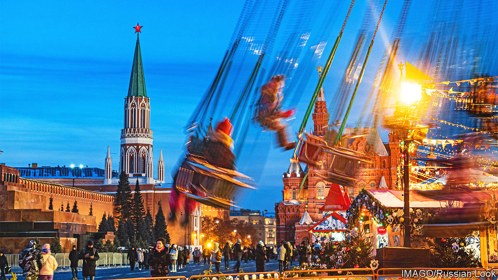

###### The silence of the Russians

# In Moscow, all dissent is muzzled 

##### As in Soviet times, Russians are embracing doublethink 

 

> Dec 8th 2022 

“Have the dogs turned up yet?” asked 75-year-old Larisa Solodovnikova. The former space engineer is one of a small crowd queuing to hear Ilya Yashin, an opposition politician, make a final plea at Moscow’s Meshchansky court. The criminal trial is the most prominent of several dozen being conducted against the few Russians who have dared to challenge the wartime censorship machine. Mr Yashin was accused of spreading “fake news” on YouTube about the Russian army’s actions in Bucha, a suburb north of Kyiv where many people died brutal deaths under its brief occupation. Within 40 minutes of the start, a bomb squad had arrived with sniffer dogs to evacuate the courtroom because of a supposed bomb threat, manhandling the unresisting crowd and Ms Solodovnikova onto the frosty street. Mr Yashin faces a nine-year prison sentence. 

The world order has been upturned since Vladimir Putin’s unprovoked invasion of Ukraine. But if you were to visit the country’s capital, you would be forgiven for not noticing it.

Moscow is, as it always is, a challenge to the senses: a mix of brutalism and conspicuous consumption; neo-Soviet and high-tech; Switzerland and North Korea. A few buildings are emblazoned with war murals or the “Z” sign, the brand of Mr Putin’s war. Squares in front of stations and the bus terminals in southern Moscow, where minibuses arrive from Crimea, are peppered with grim-faced soldiers, some of them missing arms or legs. Fewer cars are on the road, a reflection of the hundreds of thousands of mobile Russians who have fled. But in the main, the visual changes are unremarkable, helped by a degree of economic stability that comes from high hydrocarbon profits. The government has been largely successful in isolating the capital from the war. 

The heart of that isolation is information. The Kremlin once tolerated niche media. Since February it has built great walls around the truth, . Twitter, Facebook and Instagram are now blocked, accessible only via VPN proxies. Laws ban discrediting the Russian army (punishable by fines) or publishing “fake news” (punishable by prison). A list, updated on December 1st, criminalises any discussion of over 60 sensitive subjects, from the numbers of Russians killed in action to the country’s mobilisation campaign. Anyone who wants an alternative view has to search hard for it. It is difficult to find a VPN that the security services haven’t already blocked. The Russian media simply serve up tales of the army “defending” the people of the Donbas.

According to Lev Gudkov, who heads the Levada Centre, Russia’s most trustworthy pollsters—considered “foreign agents” by the Kremlin—only about one in five Russians now consume news beyond state propaganda. That figure broadly corresponds to those who are strongly against the war. But there is a spectrum of ignorance. There are the true believers in the war and those who believe it to be an outrage. Most Russians, Mr Gudkov says, are in the middle, choosing to distance themselves and retreat into family life. 

As in Soviet times, people are embracing doublethink. Levada’s more recent polls have detected a shift in feeling, with a majority now in favour of peace talks. Few respondents feel any responsibility for the war. “People don’t want war, but they submissively agree to it because it would cause a serious internal dissonance with their inner self, which still identifies strongly with the state,” Mr Gudkov says. 

That is an answer those looking on from Ukraine would find infuriating. Yury Saprykin, a prominent Russian editor and journalist, sympathises with Ukrainian frustration. Russian society, he says, never consolidated as Ukrainian society was able to. Now it finds itself atomised and collectively depressed, and in some part reliant on the state. “Totalitarianism makes people very weak. When you add tanks and rockets into the mix, society never stood a chance”, he says. Maria Eismont, a lawyer and formerly a journalist for the now-neutered newspaper, who is representing Ilya Yashin in the trial, says the Kremlin had long worked to destroy horizontal links. “Treason, set-ups, prison, intimidation, creating divisions and buying loyalty, the authorities did everything to ensure there was no self-organisation.” 

In his final statement in court on December 5th, her client Mr Yashin called on his supporters to resist. “Stand up for each other,” he asked them. “There are many more of us than it seems.” Whatever the truth of that assertion, Mr Yashin’s strong public stand against the war is for the moment very much a fringe concern. Those Russians who do protest against it are doing so only privately. 

The mix of repression and relative economic resilience means that the Kremlin’s manufactured consensus is likely to hold for some time to come. “Russians are hostages,” said Ms Eismont. “It shouldn’t be a surprise that many of them are ready to negotiate with the terrorists.” ■


