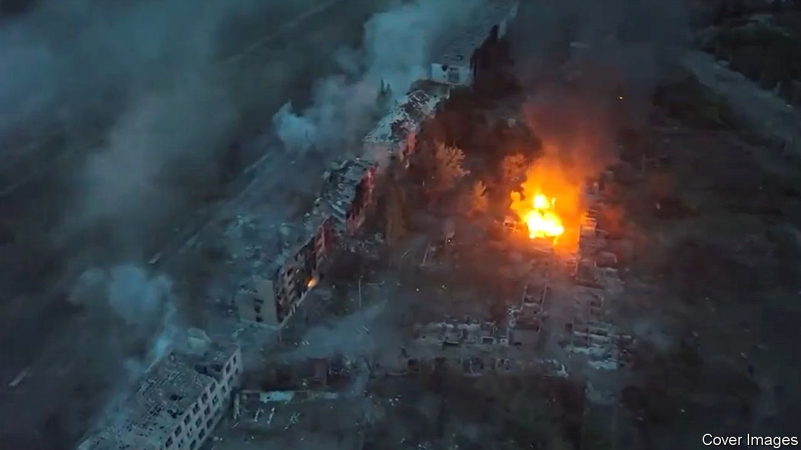
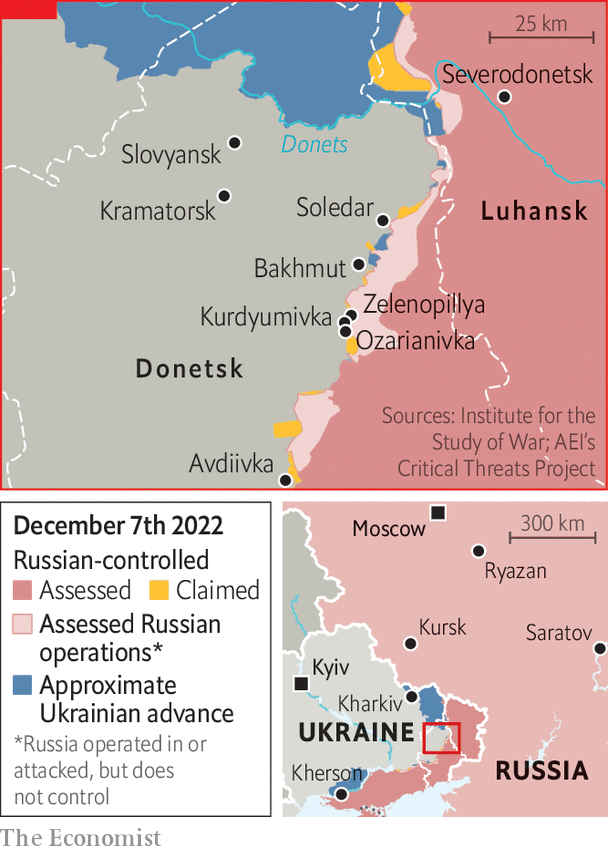

###### Ukraine’s Somme

# Russia is hurling troops at the tiny Ukrainian town of Bakhmut 

##### But the battle is bloody and pointless 

 

> Dec 6th 2022 

LIKE MANY places in eastern Europe, Bakhmut bears the scars of history. In the 18th century Cossack rebels seized the town and held it for three years. In 1919 it was contested in the Russian civil war. In 1942 Nazis killed 3,000 Jews in Artyomovsk, as the town was then known. And it slipped briefly into the hands of separatists when Russia fomented a war in eastern Ukraine in 2014, before being recaptured. Now the latest struggle for Bakhmut is turning into one of the bloodiest battles of the current war.

Ukrainian offensives in  in September and  last month have put Russia on the defensive along vast front lines. The exception is Bakhmut, along with Avdiivka to the south. Virtually all of Russia’s remaining offensive power—which is not much—has been thrown at the town since August. That was originally because it anchors the southern end of a defensive line shielding the bigger cities of Slovyansk and Kramatorsk. But the attacks now seem to be animated more by stubbornness than strategy. Even before the war, the town’s population was not much over 70,000.

The offensive has been led by the Wagner Group, a mercenary outfit, and supported by air power, copious artillery and waves of hapless infantry, reinforced in recent weeks by troops withdrawn from Kherson and by . The regular army fights during the day. Wagner units, better funded and equipped with the latest tanks, come out at night. Elite airborne forces have joined in. For all that, the front lines have hardly budged.

 


In early December Russia captured three villages (Kurdyumivka, Ozarianivka and Zelenopillya) to the south of Bakhmut, with the aim of severing its supply lines to the west. But attacks to the north towards Soledar have proved fruitless. Russian progress has also come at eye-watering cost. Ukrainian artillery, starved of ammunition in the summer but now , has pounded the Russian attackers. Rochan Consulting, a firm that monitors the war, says that the urban terrain and Ukraine’s use of anti-tank squads has deterred Russia from employing tanks in the town, leaving infantry dangerously exposed.

On December 4th Serhiy Cherevaty, a spokesperson for Ukraine’s eastern group of military forces, claimed that 50-100 Russian soldiers were dying every day in the battle, with about the same number wounded. Ukrainian forces in the area face similarly grim conditions. Images published by a Ukrainian soldier show trenches filled with thick ankle-deep mud and trees defoliated by shelling, lending the battle the feel of the first world war. Drone footage of Bakhmut shows a city that looks as if it has been struck by a nuclear bomb, with only the husks of buildings remaining. 

In many ways, the battle is a microcosm of the war and its politics. Bakhmut is not a strategic town. If Russia were to conquer it, it would not have the manpower to breach further lines of defence to the west. But Vladimir Putin, Russia’s president, is desperate for his first victory in almost six months—the last one being Severodonetsk in late June—and happy to feed mobilised men into the meat grinder. , the ambitious head of Wagner, is thought to have promised Mr Putin that his forces can succeed where the regular army has failed. Mr Prigozhin’s personal and political fortunes may hinge on his ability to deliver. 

As winter approaches, with boggy ground and sub-zero temperatures increasingly common, fighting is likely to slow down. Ukrainian counter-attacks around Bakhmut in recent days have fizzled out. “We’re seeing a kind of a reduced tempo,” noted Avril Haines, America’s director of national intelligence, on December 3rd. At the same time, the air war is hotting up.

On December 5th Russia launched another wave of missile attacks on Kyiv and other cities. Ukraine claimed to have shot down more than 60 out of 70 incoming missiles, but Ukrainian officials say they are deeply concerned by the small number that continue to get through, leaving the country’s energy infrastructure on its knees. 

The air war is no longer a one-way affair, though. On the same day as the Russian barrage, Russia said that Ukraine had used low-flying Soviet-era drones to strike two air bases, at Ryazan and Saratov, more than 450km (280 miles) over the border, killing three people and damaging long-range bombers. That was no fluke. On December 6th another strike occurred at Khalino air base near Kursk, home to Su-30SM fighter jets. Not since the second world war have air raids struck so deep into Russia. ■


