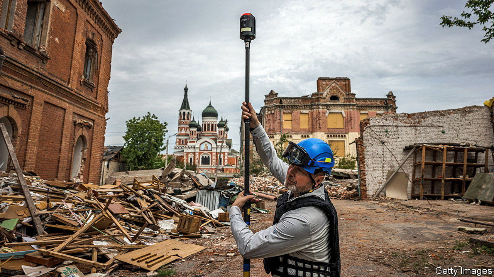

###### Damage mapping

# Ukraine is using foreign tech to mitigate Russian destruction 

##### The war is a testing-ground for new applications 

 

> Dec 8th 2022 

Much of Ukraine is dark. Russian missiles have ensured that . Even so, technology is helping Ukraine survive the present and prepare for the future, thanks to its own efforts and those of friends. Nearly 2,000 miles (3,200km) from Kyiv, a map of Ukraine is a pattern of colourful dots, each marking a place where war damage has occurred. The live tracker at the Scottish headquarters of HALO Trust, a de-mining charity, charts Russian bombings of Ukraine within hours of each incident. Live information about damage, and the ordnance that caused it, used to be near-impossible to obtain. But recent advances make it possible to gain nearly real-time access to data that may prove useful for defence now and rebuilding later. 

Before Vladimir Putin invaded Ukraine, the country had a thriving digital economy and tech sector. It is putting it to good use. Volodymyr Zelensky, Ukraine’s president, has also been appealing to foreign tech firms to help out. In June he appeared, via hologram, at a series of European tech conferences, urging brainy types to help now, and enjoy investment opportunities in the country later. This has given Ukraine access to a range of innovations. 

Foreign IT whizzes minded to help Ukraine are invited to come to Diia City. It cannot be found on a map, though. Diia (meaning “action”) is a virtual city, launched by Mr Zelensky earlier this year to attract foreign talent. It has its own legal and tax regime. Virtual residency offers many perks, including tax rebates.

Not all Ukraine’s digital helpers are seeking to turn a profit. California-based ESRI, a firm specialising in geographical-information software, has been especially generous. It is supporting HALO in monitoring the damage done by Russian ammunition, and the kind of weapons used. 

Usually clean-ups after war are risky and expensive. Knowing what was used, and where, means fewer resources are needed to make territory safe, and that fewer de-miners are injured or killed. Conventional ordnance mapping is rarely possible during active conflict, but HALO is using social media to locate explosions and spots that are contaminated with explosive remnants from, say, cluster bombs. Facebook posts, Instagram images and tweets can all become geotags, which are then pinned to the nearest settlement, using ESRI’s software to produce detailed maps. 

A second form of damage-mapping is of heritage and cultural sites. Groups such as Skieron, Backup Ukraine and Pixelated Realities are making 3D scans of precious sites and objects, to preserve Ukraine’s history. UNESCO has already reported 224 heritage sites in Ukraine as damaged or destroyed. After the war, scans could be used to guide restoration efforts. 

3D scans of bombed places may also serve as evidence for the future prosecution of members of Russia’s regime. In August, Artec, a Luxembourg-based 3D-product firm, announced a collaboration with the Human Rights Conduct Department of the Ukrainian National Police to expand such evidence-gathering. 

Scanning efforts are not limited to bombed sites, however. The Ukrainian National Police has deployed software that uses an AI programme considered controversial in some quarters. Clearview AI, a New York-based firm, waived its fee for use in Ukraine, and its facial-recognition software is now being put to work to identify dead and captive Russian soldiers. In these and other ways—from the 3D printing of buildings to the use of auto-transfusion devices in hospitals—Ukraine is emerging as a hub for trying out some of the latest tech in extreme conditions. ■


